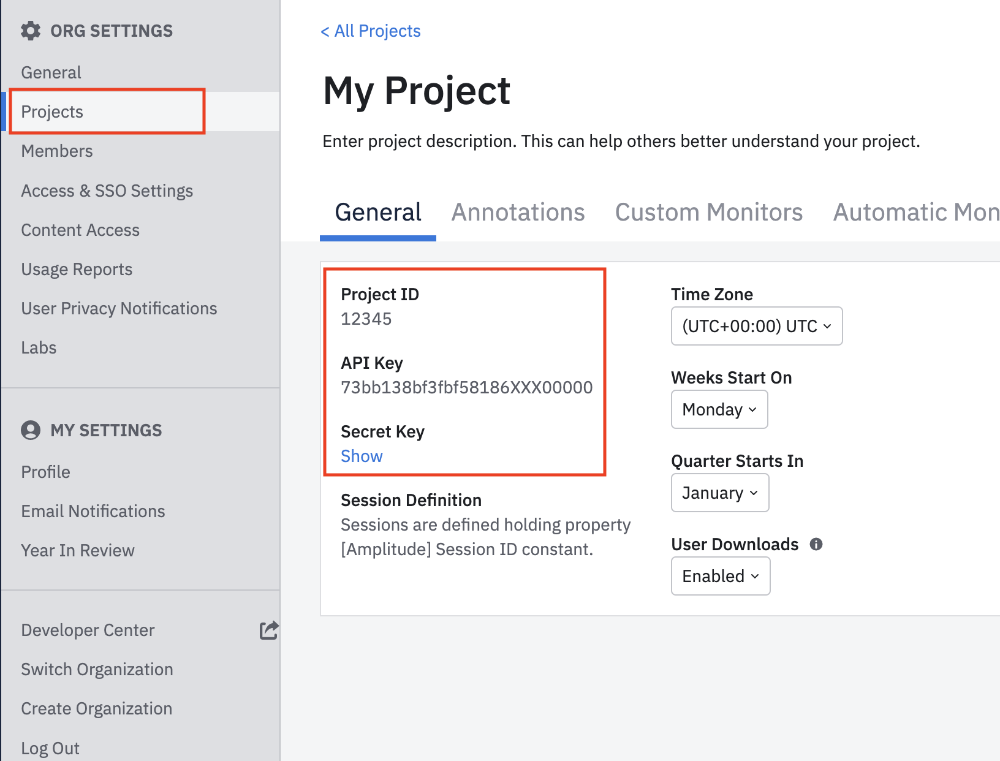

To find your Amplitude project's unique API key and secret key, follow these steps. 

1. In the Amplitude Analytics web app, click **Settings** in the lower left navigation. 
2. Click **Projects**, then find your target project. 
3. On the General tab, copy your API key and secret key. 

