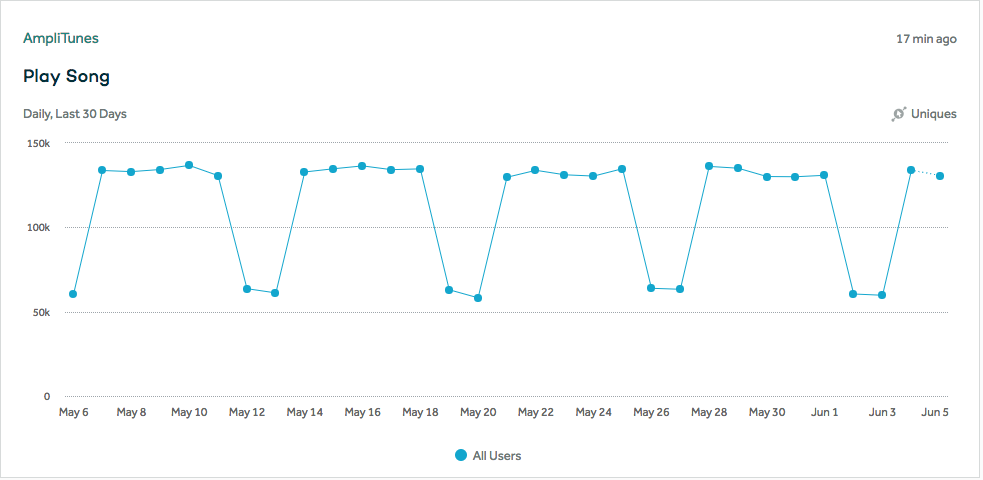
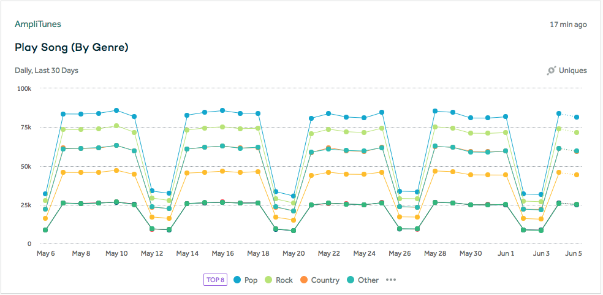
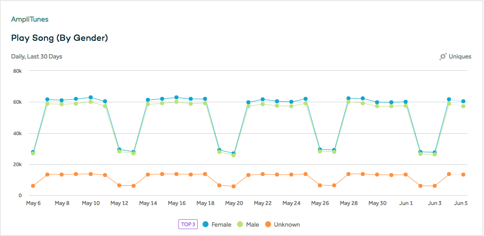

To understand how Amplitude works, let’s walk through a hypothetical example.

Tunes is a standard music player for mobile devices that has common actions like playing a song, skipping a song, shuffling play, and sharing a song.

Using Amplitude, you can track all the actions your users make in detail and better understand what’s working and what’s not.

### What to track

Amplitude gives you the power to decide what actions you want to track. You can choose to track anything and everything.

For example, in Tunes, you could track the music control buttons the users presses or the number of songs each user has listened to in their sessions.

#### Events represent actions users have taken

Every time an action happens that you wish to keep track of, you send an Event to Amplitude. Events can be as easy as choosing the text string that defines them.
For example, in Tunes, you could send an “Play Song” event every time a user presses the Play button.

=== "JavaScript"

    ```js
    amplitude.getInstance().logEvent(‘play song’);
    ```

=== "iOS"

    ```swift
    [[Amplitude instance] logEvent:@"play song"];
    ```

=== "Android"

    ```kotlin
    Amplitude.getInstance().logEvent("play song");
    ```

=== "Unity"

    ```C#
    Amplitude.Instance.logEvent("play song");
    ```

Here is a chart with the number of songs played on each day:



#### Event properties give context

Event Properties give you context about events, like where in your app they occur or what state the app is in when it occurred.
For example, in Tunes, when someone presses the “Play Song” event, you can use event properties to track the
 title of the song, the artist, the genre, and more. Any detail related to the event can be an event property.

=== "JavaScript"

    ```js
    amplitude.getInstance().logEvent('play song',
    { title: 'Here comes the Sun',
      artist: 'The Beatles', genre: 'Rock'});
    ```

=== "iOS"

    ```swift
    NSMutableDictionary *songProperties = [NSMutableDictionary dictionary];
    [songProperties setValue:@"title" forKey:@"Here comes the Sun"];
    [songProperties setValue:@"artist" forKey:@"The Beatles"];
    [songProperties setValue:@"genre" forKey:@"Rock"];
    [[Amplitude instance] logEvent:@"play song" withEventProperties:songProperties];
    ```

=== "Android"

    ```kotlin
    JSONObject songProperties = new JSONObject();
    try {
        songProperties.put("title", "Here comes the Sun");
        songProperties.put("artist", "The Beatles");
        songProperties.put("genre", "Rock");
    } catch (JSONException exception) {
    }
    Amplitude.getInstance().logEvent("play song", songProperties);
    ```

=== "Unity"

    ```c#
    Dictionary<string, object> songProperties = new Dictionary<string, object>() {
      {"title" , "Here comes the Sun" },
      {"artist" , "The Beatles"},
      {"genre" , "Rock"}
    };
    Amplitude.Instance.logEvent("play song", songProperties);
    ```

Here is a chart with the songs played per day in each genre:



#### User Sessions are a series of Events in a single visit

User Sessions let you track series of events performed in a single visit or interaction with your application.

Most often, Amplitude keeps track of session automatically for you. If you are using the HTTP API, you must handle sessions manually.

#### User Properties are details about your User

User Properties help understand your User at the time they performed actions within your application.
 What state they were in, their preferences, or their device details, are all examples of common user properties.

For example, in Tunes, you could keep track of whether a user was on a paid or free plan.
 This lets you to segment these users by this property, and compare paid vs free users (to consider just the behavior of paying users).

=== "JavaScript"

    ```js
    var identify = new amplitude.Identify().set('plan', 'premium');
    amplitude.getInstance().identify(identify);
    ```

=== "iOS"

    ```swift
    AMPIdentify *identify = [[[AMPIdentify identify] set:@"plan" value:@"premium"]];
    [[Amplitude instance] identify:identify];
    ```

=== "Android"

    ```kotlin
    Identify identify = new Identify().set("plan", "premium");
    Amplitude.getInstance().identify(identify);
    ```

=== "Unity"

    ```c#
    Amplitude.Instance.setUserProperty("plan", "premium");
    ```

Here is an example of a chart segmented on the user property "gender":

