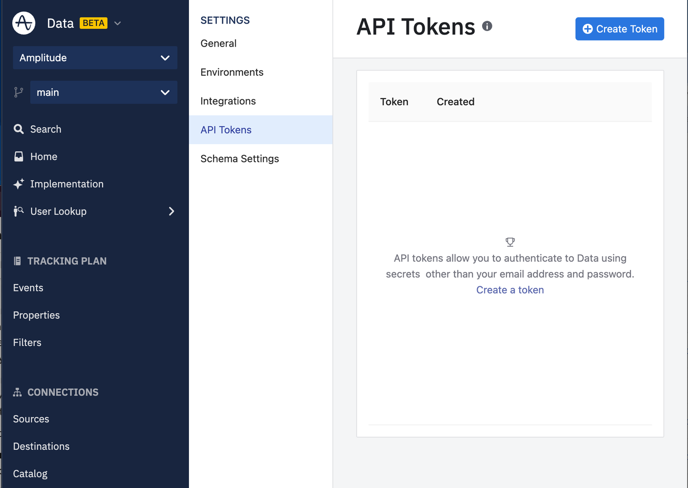
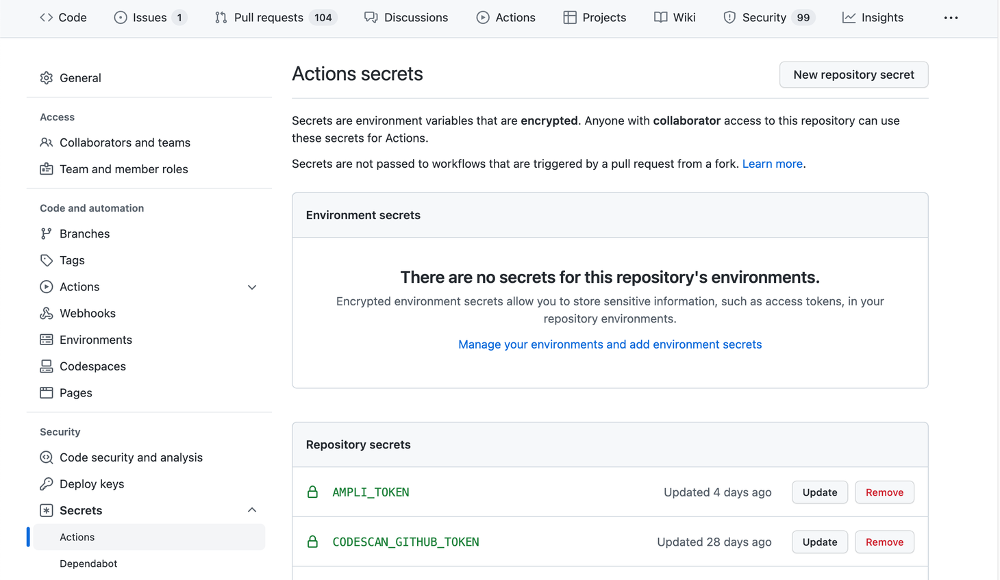
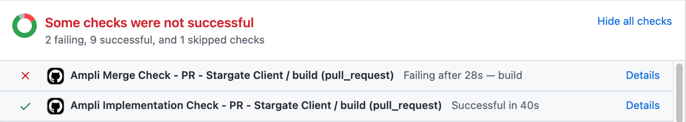
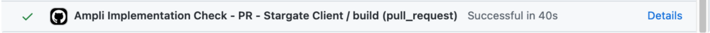

!!!info

    This workflow requires [Ampli CLI 1.9.0+](./cli)

Larger organizations with multiple teams usually need to make changes to their tracking plan and analytics implementations in parallel.

This page covers how you can use branches in Ampli with source control systems such as Git.

## Workflow summary

When you need to update the tracking plan:

<div class="annotate" markdown>
1. Create a branch in Amplitude Data. Make tracking plan updates.
2. Create a branch in Git.(1)
3. Pull the latest generated code for your Data branch into your Git branch with `ampli pull`.
4. Implement the changes using the Ampli Wrapper in your code on your Git branch
5. Check implementation status with `ampli status`.
6. Merge the Data branch.
7. Check merge status with `ampli status --is-merged`.
8. Merge the Git branch.
</div>

1. Amplitude recommends using the same name for both the Git branch and Amplitude Data branch, but it's not required.

## Branches in Ampli

### Ampli CLI

The Ampli CLI is able to pull down generated Ampli Wrapper code for Sources and Branches you have created in Data.

The first time you run `ampli pull` you're prompted to select a Source and Branch from your tracking plan.
This creates an `ampli.json` file to store your configuration for future development.

<!--vale off-->
```bash
ampli pull
Ampli project is not initialized. No existing 'ampli.json' configuration found.
? Create a new Ampli project here? Yes
Organization: Amplitude Website (Portfolio)
? Select a workspace: Data
? Select a source: browser
Source: browser
Runtime: Browser/TypeScript
? Select a branch: feature-branch-name
✔ Pulling version 74 (latest)
```
<!--vale on-->
If later you would like to change branches you have a couple of options.

#### `ampli checkout [my-branch-name]`

The provided branch is pulled down from Data to your Ampli Wrapper. If you don't provide a branch name, you're prompted
to select one from a list of active branches in your tracking plan.

```bash
ampli checkout
? Select a branch
  feature-branch-name (current)
  add-products-to-cart
❯ remove-old-forms
  new-registration-metrics
(Move up and down to reveal more choices)
```

#### `ampli pull -b my-branch-name`

The `--branch` flag on `ampli pull` sets the tracking plan to use for the generated source code.

```bash
ampli checkout feature-branch-name
Source: browser
Runtime: Browser/TypeScript
Branch: feature-branch-name
✔ Pulling version 74 (latest)
All events are up to date.
```

### ampli.json

The `ampli.json` file contains configuration information for the Ampli CLI. This includes information about the current
branch and version. Running `ampli pull` and `ampli checkout` updates the `ampli.json` based on the selected tracking plan.

```json title="ampli.json"
{
  "OrgId": "12345",
  "WorkspaceId": "my-workspace-id",
  "SourceId": "my-source-id",
  "Runtime": "node.js:typescript-ampli"
  "Path": "./path/to/ampli",
  "Branch": "main",
  "Version": "1.0.0",
}
```

!!!info
    This file is managed by the Ampli CLI and isn't meant to be modified by hand. That said it is mostly human readable to make any potential merge conflicts easier to understand.

## Coordination and enforcement

The Ampli CLI provides checks to help teams coordinate development across branches.

### `ampli status`

In addition to verifying implementation status of the tracking plan in your source code, the status command has some other checks specifically for branching functionality.

### Example branch structure

```bash
b1           1 -> 2 -> 3
            /            \
main       1      ->      2    ->   3
           \ \                     /
b2          \ 1 -> 2 -> 3 -> 4 -> 5
             \
b3            1 -> 2 -> 3 -> 4
```

### Check if current Ampli branch is merged

`ampli status --is-merged`

```bash
ampli status --is-merged
✔ Verifying event tracking implementation in source code
  ✔ Event A (1 location)
  ✔ Event B (1 location)
✔ All events tracked 2 found, 2 total
⚠ WARNING The current branch branch-mapping version 74 has already been merged into main. Verified implementation against main version 75.
We recommend running ampli pull to update to the latest tracking plan.
✔ Branch branch-mapping version 74 is merged.
```

The `--is-merged` flag checks the current Branch and Version in your `ampli.json`. If the exact Version of the Branch was merged into Ampli main it succeeds, otherwise it exits with error code 1. It always return success for the Ampli `main` branch.

For the example branch structure, `is-merged` would return success for `b1@3`, `b2@5`, `main@3`, `main@2`, `main@1`.

### Check if current Ampli branch is on the latest version

`ampli status --is-latest`

```bash
ampli status --is-latest
✔ Verifying event tracking implementation in source code
  ✔ Event A (1 location)
  ✔ Event B (1 location)
✔ All events tracked 2 found, 2 total
✔ You are on the latest version of feature-branch-name
```

The `--is-latest` flag checks the Branch and Version in the `ampli.json`. If the Version is the last one published for the Branch it succeeds, otherwise it exits with error code 1.

For the branch structure in the example, `is-latest` would return success for `b2@5`, `b3@4`, `main@3`.

!!!note

    Notice that `b1@3` doesn't pass the `is-latest` check. This is because it maps to an outdated version of `main@2`.

    For merged branches `is-latest` will be successful only if it contains the exact version that corresponds to the latest version of `main`.

The `--is-latest-if-not-on-default-branch` works the same as `is-latest` but also returns success for any version of the Ampli `main` branch. This is useful for CI integrations where you don't want to enforce using the latest version on the main branch.

For the branch structure above, `is-latest-if-not-on-default-branch` would return success for `b2@5` , `b3@4`, `main@3`, `main@2`, `main@1`.

### Combine checks

When you combine multiple checks `ampli status` returns success only if all checks pass. A failure in any check results in an error exit code.

When multiple checks run the status of each is output on a separate line with individual Errors and Warnings.

### Common errors and solutions
<!-- vale off-->

```bash
ampli status --is-merged --is-latest
✘ Verifying event tracking implementation in source code
  ✘ Event A
  ✘ Event B
✘ ERROR Event tracking incomplete 2 missed, 2 total
✘ ERROR Branch feature-branch-name version 73 is not merged.
✘ ERROR Branch feature-branch-name latest version is 74. You are on 73. Run ampli pull to update.
```
<!--vale on-->
Here are some common errors and solutions for the ampli status command.

#### Event tracking implementation error

* This means you haven't correctly instrumented all events in your tracking plan.
* Implement the missing events in your project using the Ampli Wrapper.

#### `is-merged` error

* This means you are currently on an un-merged Ampli branch.
* Log into Data and check your tracking plan has been reviewed and approved.
* You may need to "Refresh" your Data branch before being able to merge. If so make sure to run `ampli pull` again to
get the latest updates.
* Merge your Data branch.

#### `is-latest` error

* This means you aren't on the latest version of your Data branch.
* Run `ampli pull` to update your local project.

### Enforcing branch coordination

`ampli status --is-merged --is-latest`

```bash
ampli status --is-merged --is-latest
✔ Verifying event tracking implementation in source code
  ✔ Event A (1 location)
  ✔ Event B (1 location)
✔ All events tracked 2 found, 2 total
⚠ WARNING The current branch feature-branch-name version 74 has already been merged into main. Verified implementation against main version 75.
We recommend running ampli pull to update to the latest tracking plan.
✔ Branch feature-branch-name version 74 is merged.
✔ You are on the latest version of feature-branch-name
```

You can ensure that your Ampli and Git branches stay in sync with the ampli status command.

Before merging your Git branch with implementation changes you should verify that both is-merged and is-latest checks pass successfully. This can be done as a single command `ampli status --is-merged --is-latest`.

!!!info

    We recommend merging your Git branch immediately after you merge your Data branch. This ensures other teams will have your implementation of the new events.

## CI workflows

Branch status checks can be added in CI to ensure the best practices are enforced.

Amplitude recommends adding new status checks to all your PR workflows. In addition to `ampli status -u`* you should add also add a call to `ampli status --is-merged`.

You can combine these into a single command, but for CI it can be useful to keep them separate to see if the implementation checks succeed independently from the branch checks.

* In PR workflows Amplitude recommends using `--skip-update-on-default-branch` when calling `--update` or `-u`.

### Using `is-latest` in CI

Using `is-latest` in CI workflows isn't necessary but can be used for stricter enforcement.

If `is-latest` is used in a multi-team environment or on a tracking plan with multiple Sources it can require additional steps to keep the merge checks in a passing state. Changes merged into to the `main` tracking plan by other teams or on other Sources cause future runs of `is-latest` to fail in your project as it's no longer on the latest version.

In this case you can explicitly "lock" the tracking plan to a specific version on the `main` branch and using `--is-latest-if-not-on-default-branch`.

This means any time an "external" change happens to the tracking plan you must follow these steps:

1. Run `ampli pull` to update the `ampli.json` to be on the `main` Branch.
2. Commit changes to Git branch.

After the `ampli.json` is on the `main` branch future calls to `--is-latest-if-not-on-default-branch` pass. This is useful you want to keep the current version fixed regardless of new tracking plan changes.

!!!info

    If you run `ampli pull` on a merged version it will update the `ampli.json` and Ampli Wrapper to contain the associated version main that was created by the merged branch. If you want to get the latest version of `main` you can run `ampli pull` a second time.

## GitHub Actions

### Initial Setup

1. Add `ampli-implementation-check.yml` and `ampli-merge-check.yml` to your `.github/workflows` directory.

    ```yaml title="ampli-implementation-check.yml"
    name: Ampli Implementation Check
    on: pull_request

    jobs:
      build:
        runs-on: ubuntu-latest
        container:
          image: amplitudeinc/ampli

        steps:
          - name: Checkout repo
            uses: actions/checkout@v2

          - name: Verify analytics implementation and update status in Data
            run: ampli status -u --skip-update-on-default-branch -t ${{secrets.AMPLI_TOKEN}}
    ```

    ```yaml title="ampli-merge-check.yml"
    name: Ampli Merge Check
    on: pull_request

    jobs:
      build:
        runs-on: ubuntu-latest
        container:
          image: amplitudeinc/ampli

        steps:
          - name: Checkout repo
            uses: actions/checkout@v2

          - name: Check the Data branch is merged before merging the Git branch
            run: ampli status --is-merged -t ${{secrets.AMPLI_TOKEN}}
    ```

2. If your Ampli project is in a subdirectory, you may need to set the correct working-directory in your Actions. See GitHub documentation [here](https://docs.github.com/en/actions/using-workflows/workflow-syntax-for-github-actions#jobsjob_idstepsrun).

3. Create a API token in Data. This can be done from `Settings => API Tokens => Create Token`

    

4. Add the API token to your Repository secrets as `AMPLI_TOKEN`. This can be done from
`Settings => Secrets => Actions => New repository secret`

    

5. Commit the workflows to your repo and you're all set. On each PR Ampli checks both the implementation status and merge status of the current branch in your tracking plan.

### PR workflow

1. During development the "Ampli Merge Check" in GitHub fails continuously until the corresponding branch is merged in Data. This is expected and ensures that your code stays in sync with the tracking plan.
    

2. Start by implementing the latest changes to your tracking plan. This is verified by the "Ampli Implementation Check".

    

3. After all other checks have passed except the "Ampli Merge Check", you are ready to get approval in GitHub.
4. After your GitHub PR is approved, you can go to <https://data.amplitude.com> and merge your Data branch. This is done under "Home" after selecting the branch in the left-hand dropdown.

    !!!caution
        If your Data branch is out of date with the main tracking plan you may need to "Refresh" before you can merge. This applies the latest changes from main to your Data branch. If you "Refresh" your branch it's important to also pull the latest changes in both Git and Ampli.
  
    !!!note
        You may need to get the approval before merging the Data branch. See more about approval workflows here.
    
5. After the branch is merged in Data, you can re-run the "Ampli Merge Check" in GitHub.

    * Click "Details" next to the failed "Ampli Merge Check - PR" job
    * Click "Re-run jobs" => "Re-run failed jobs"

6. After the "Ampli Merge Check" runs successfully, you can merge your Git branch feeling confident about your analytics implementation.

## Bitbucket Pipelines, Circle CI, and other CI/CD systems

You can add merge and implementation checks to many different CI workflows, all it takes is the Ampli CLI. The easiest
way to integrate is to use the [Ampli CLI Docker containers](https://hub.docker.com/u/amplitudeinc) which are already
configured to run the Ampli CLI commands.

Follow the high-level setup to add merge and implementation checks to your CI workflows. 

High-level setup:

1. Use a Ampli CLI Docker image to run Ampli CLI commands.
2. Create an API token in Data.
3. Add the API token as a repository / workflow secret.
4. Add Ampli implementation check to run on PR.
5. Add Ampli merge check to run on PR.

See the [GitHub Actions](#github-actions) instructions for inspiration.

## FAQs

### Should the Ampli generated code and the ampli.json file be checked into git?

Yes, the generated code from Ampli as well as ampli.json should be checked into your source control. With the ampli.json file checked in, the source code is always pinned to a certain point in time of the Tracking Plan and the Ampli CLI configuration is automatically shared within your team. The Ampli generated file is also checked in to git just like any other code in your project.

### Do I need to manually resolve git conflicts in the Ampli generated code and ampli.json?

No, if you have git conflicts in any Ampli related files (Ampli generated code or ampli.json), run `ampli pull` and the Ampli CLI takes care of resolving the conflicts automatically.

### The ampli.json on my git main branch is pointing to an Ampli branch that has already been merged, is that expected?

Yes, that's expected! The Ampli CLI uses this information to verify that the Ampli branch has been merged, for example when automatically resolving git merge conflicts. It's also a documentation for which version of the Tracking Plan was used for the most recent tracking plan implementation for this source. The Ampli CLI takes care of automatically updating ampli.json on next ampli pull, pinning it to the new Ampli branch you're pulling from.

### Do I need to run ampli pull -b main before merging my Git branch?

Not anymore! If you were using an earlier version of Ampli make sure to update to Ampli CLI 1.9.0+ and pull the latest version of your Ampli Wrapper. After that you'll never need to run ampli pull -b main again.
