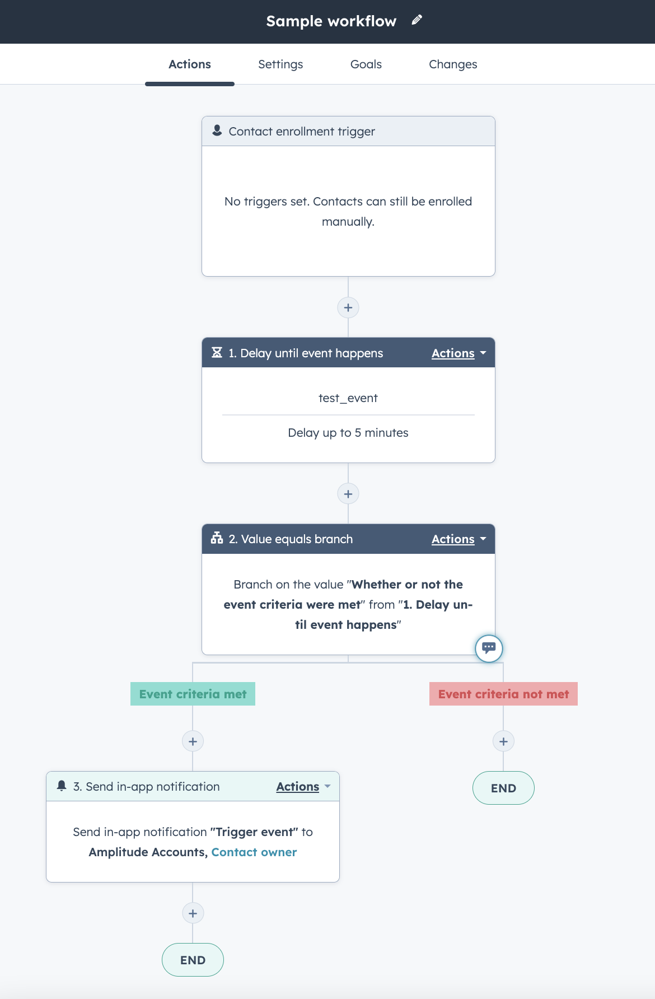

!!!beta

    This feature is in open beta and is in active development. Contact your Amplitude support team for support with this integration.

[HubSpot](https://www.hubspot.com/) is an easy to use and powerful CRM platform that enables scaling companies to sell, market and provide customer service from a unified UI. 

Amplitude CDP's HubSpot streaming integration enables you to forward your Amplitude events and event properties straight to HubSpot with just a few clicks.

## Considerations

Keep these things in mind when sending events to Hubspot:

- You must enable this integration in each Amplitude project you want to use it in.
- Events from Amplitude will appear as Custom Behavioral Events in HubSpot.
- A HubSpot Enterprise Marketing Hub account is required to send Custom Behavioral Events.
- Relevant limits for Hubspot events are:
    - HubSpot enforces strict API rate limits. You can find more information about these limits [here](https://developers.hubspot.com/docs/api/usage-details).
    - HubSpot allows up to 50 properties for each custom behavior event.
- Types of data you can forward to HubSpot:
    - Amplitude sends selected event properties along with the event.
    - Amplitude does not perform an identity call for this integration. This means Amplitude does not send any user properties information directly to HubSpot.
- Latency considerations:
    - Amplitude targets an end-to-end p95 latency of 60s. This means 95% of Events streamed will be delivered to HubSpot within 60s or less. We have internal processes, monitors, and alerts in place to monitor and maintain this target.   

## Setup

### HubSpot setup

1. Please create the custom behavioral events and note down their internal name and add event properties that you want to forward to HubSpot. Please include a string property named `event_type` in the behavior custom event, which will indicate the specific type of event within Amplitude. Learn how you create the event and event property in HubSpot [here](https://knowledge.hubspot.com/analytics-tools/create-custom-behavioral-events-with-the-code-wizard). 

### Amplitude setup

1. In Amplitude Data, click **Catalog** and select the **Destinations** tab.
2. In the Event Streaming section, click **HubSpot**.
3. Enter a sync name, then click **Create Sync**.
4. Choose a HubSpot Account ID or authenticate with HubSpot
5. Enter the HubSpot Event Name created by HubSpot
6. Toggle the **Send events** filter to select the events to send. HubSpot recommends choosing the events that are most important to your use case. 
7. Click on the **Select & filter events** option to choose the event type of the events you would like to send.
8. Click on **Map properties to destination** to specify the identity mapping between Amplitude and HubSpot. Please note that HubSpot requires the identifier to be at least one of the following: utk, email, or object ID.
9. Click on **Select additional properties** to specify the event properties you wish to forward to HubSpot. By default, the event properties only include the **event_type** property, which indicates the type of event for a particular event in Amplitude.
10. When finished, enable the destination and **Save**.

## Use Custom Behavioral Event data in Hubspot
- Click here to learn more about how you can [analyze custom behavioral events](https://knowledge.hubspot.com/analytics-tools/analyze-custom-behavioral-events) in HubSpot.

### View event completions
1. In your HubSpot account, navigate to **Reports > Analytics Tools**.
2. Click **Custom Behavioral Events**.
3. Click the **Analyze** tab.
4. To filter the data for a specific time range and frequency, click the Date range and Frequency dropdown menus.
5. To view chart data for specific events in the chart, select the **checkboxes** next to those events in the table.
6. To view more detail for an event, including completions, unique visitors, and the properties associated with the event, click the name of the **event** in the table.

### Report on custom behavioral events
1. In your HubSpot account, navigate to **Reports > Reports**.
2. In the upper right, click **Create custom report**.
3. In the left sidebar, select **Custom Report Builder**.
4. To use custom behavioral events as your primary data source, click the **Primary data source** dropdown menu, then select **Custom behavioral events**.
5. If you want to use custom behavioral events as a non-primary source, you can select **Custom behavioral events** from the Other section. 
6. Continue [building your report](https://knowledge.hubspot.com/reports/create-reports-with-the-custom-report-builder). To specify which event you want to report on, in the left sidebar, click the **Browse** dropdown menu, then select **Custom behavioral events**. Then, under Custom behavioral events, select the **event** you want to report on.

### Custom behavioral events in workflows
1. In your HubSpot account, navigate to **Automation > Workflows**.
2. Click the **name** of a workflow. Or, learn how to create a new workflow.
3. In the workflow editor, click the **+ plus icon** to add a workflow action.
4. In the right panel, select **Delay until the event happens**.
5. Configure the delay:
    - Click the **Event** dropdown menu, then select a **custom behavioral event**.
    - Then, select the **event property** that you want to delay on.
    - Select the **filter** for the event property.
    - Click **Apply filter**.
    - Select the **maximum wait time**, or select the **Delay as long as possible checkbox**.
6. Click **Save**.

    

## Use cases
1. **Personalized Marketing:** With the ability to track user behavior and capture user and event properties in Amplitude, businesses can create highly personalized and targeted marketing campaigns in HubSpot. This can lead to increased engagement, conversions, and customer loyalty.
2. **Lead Scoring and Nurturing:** By tracking user behavior and capturing user and event properties in Amplitude, businesses can score and prioritize leads based on their level of engagement and interests. This can help businesses to optimize their lead nurturing efforts and increase their chances of closing deals.
3. **Customer Retention:** By tracking user behavior and capturing user and event properties in Amplitude, businesses can identify customers who are at risk of churning and take proactive steps to retain them. For instance, businesses can trigger personalized emails or ads to offer discounts or incentives to encourage customers to stay engaged with the product or service.

