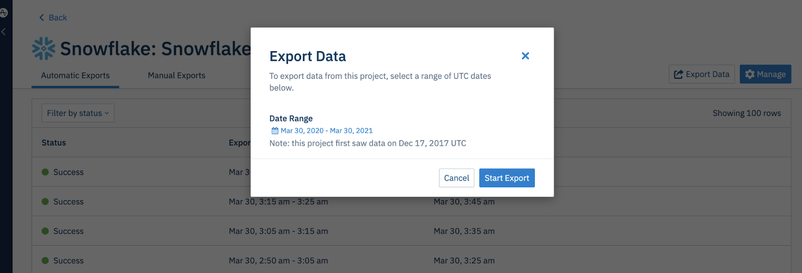

Load your Amplitude event data into your Snowflake account. You can set up recurring syncs through the Amplitude UI, as well as manually start a sync of your historical data.

--8<-- "includes/editions-all-editions.md"

!!!note "Other Amplitude + Snowflake integrations"

    This integration sends Amplitude data to Snowflake. Amplitude offers other integrations with Snowflake: 

    - [Import Snowflake Data](/data/sources/snowflake)

## Set up a recurring data export to Snowflake

Creating a recurring data export is a simple, three-step process you can handle yourself. Each sync completes within five to ten minutes, though often it's much closer to real time. 
This method also lets you watch jobs.

To set up a recurring export of your Amplitude data to Snowflake, follow these steps:

!!!info "Required user permissions

    You need admin privileges in Amplitude, as well as a role that allows you to enable resources in Snowflake.

1. Navigate to **Data Destinations**.
2. Click **Snowflake - Raw Events**. 
3. Under *Export Data to Snowflake*, choose which data you'd like to include in this export: *Export events ingested today and moving forward*, *Export all merged Amplitude IDs*, or export both.
4. Review the Event table and Merge IDs table schemas and click **Next**.
5. In the *Snowflake Credentials For Amplitude* section, enter the following information:

      - **Account Name**: This is the account name on your Snowflake account. It's the first part of your Snowflake URL, before 'snowflakecomputing.com'
      - **Warehouse**: The warehouse Amplitude uses to load the data. Ideally, this should be a warehouse dedicated to loading Amplitude data to prevent other Snowflake operations aren't disrupted.
      - **Database**: The database where the data should be stored. Similarly, this database should also be dedicated specifically to Amplitude data.
      - **Username**: The username Amplitude uses to connect to the Snowflake account.
      - **Password**: The password associate with the username

    !!!warning

        These credentials are case-sensitive, so keep that in mind.
        
6. Click **Next**. Amplitude attempts to upload test data using the credentials you entered. If the upload is successful, click **Finish**.

All future events are automatically be sent to Snowflake.

From here, Amplitude generates micro-batch files at five-minute intervals and loads them to customer-owned Snowflake accounts directly every 10 minutes. 
You are able to see the data in your Snowflake accounts within 20 minutes after Amplitude receives the events.

## Export historical Amplitude data to Snowflake

To export your historical data from Amplitude into Snowflake, navigate to the integration, then click **Export Data** and select a date range.

This process can take anywhere from a single day to several weeks, depending on your data volume, warehouse size, cluster count, network bandwidth, and number of concurrent historical data exports you 
currently have, among other factors.

## Reducing your Snowflake computation costs

If you are looking to reduce the Snowflake computation costs when receiving data from Amplitude, try these methods:

!!!note

    The effectiveness of these recommendations will depend on the frequency with which you export to your Snowflake instance.

- Modify warehouse **size** and **number of clusters**. For shorter export cadences (15 to 30 minutes), try starting with xsmall or small. Then upgrade as needed.
- When backfilling data into Snowflake, start with a small warehouse and upgrade as needed.
- You can also try reducing the auto suspend time to 60s. This option might not be available within the Snowflake UI, but can be manually set via direct Snowflake query.

## Snowflake export format

### Event table schema

The **Event** table schema includes the following columns:

| 
Column
| Type | Description |
|---|---|---|
| `Adid` | String | (Android) Google Play Services advertising ID (ADID). Example: AEBE52E7-03EE-455A-B3C4-E57283966239 |
| `amplitude_event_type` | VARCHAR(1677721) | Amplitude specific identifiers based on events Amplitude generates. This is a legacy field so event_type should suffice for all queries  |
| `amplitude_id` | BIGNUMERIC | The original Amplitude ID for the user. Use this field to automatically handle merged users. Example: 2234540891 |
| `app` | INT64 | Project ID found in your project's Settings page. Example: 123456 |
| `city` | STRING | City. Example: “San Francisco” |
| `client_event_time` | TIMESTAMP | Local timestamp (UTC) of when the device logged the event. Example: `2015-08-10T12:00:00.000000` |
| `client_upload_time` | TIMESTAMP | The local timestamp (UTC) of when the device uploaded the event. Example: `2015-08-10T12:00:00.000000` |
| `country` | STRING | Country. Example: "United States" |
| `data` | VARIANT | Dictionary where certain fields such as first_event and merged_amplitude_id are stored |   |
| `device_brand` | STRING | Device brand. Example: Apple |
| `device_carrier` | STRING | Device Carrier. Example: Verizon |
| `device_family` | STRING | Device family. Example: Apple iPhone |
| `device_id` | STRING | The device specific identifier. Example: C8F9E604-F01A-4BD9-95C6-8E5357DF265D |
| `device_manufacturer` | STRING | Device manufacturer. Example: Apple |
| `device_model` | STRING | Device model. Example: iPad Mini |
| `device_type` | STRING | Device type. Example: Apple iPhone 5s |
| `dma` | STRING | Designated marketing area (DMA). Example; San Francisco-Oakland-San Jose, CA |
| `event_id` | INT64 | A counter that distinguishes events. Example: 1 |
| `event_properties` | VARIANT |    |
| `event_time` | TIMESTAMP | Amplitude timestamp (UTC) which is the `client_event_time` adjusted by the difference between `server_received_time` and `client_upload_time`, specifically: `event_time` = `client_event_time` + (`server_received_time` - `client_upload_time`)   Amplitude uses this timestamp is used to organize events on Amplitude charts. NOTE: If the difference between server_received_time and client_upload_time is less than 60 seconds, the `event_time` isn't adjusted and equals the `client_event_time`. Example: `2015-08-10T12:00:00.000000` |
| `followed_an_identify` | BOOL | True if there was an identify event between this current SDK event and the last SDK event seen. Example: `True` |
| `group_properties` | VARIANT |    |
| `groups` | VARIANT | Group types. See the Accounts documentation for more information.   |
| `idfa` | STRING | (iOS) Identifier for Advertiser. Example: AEBE52E7-03EE-455A-B3C4-E57283966239 |
| `ip_address` | STRING | IP address. Example: "123.11.111.11" |
| `is_attribution_event` | BOOL |     |
| `language` | STRING |     |
| `library` | STRING |     |
| `location_lat` | FLOAT64 | Latitude. Example: 12.3456789 |
| `location_lng` | FLOAT64 | Longitude. Example: -123.4567890 |
| `os_name` | STRING | OS name. Example: ios |
| `os_version` | STRING | OS version. | 1.0 |
| `paying` | STRING | True if the user has ever logged any revenue, otherwise (none).   Note: The property value can be modified via the Identify API. Example: true |
| `platform` | STRING |    |
| `processed_time` | TIMESTAMP |    |
| `region` | STRING | Region. Example: California |
| `sample_rate` | BIGNUMERIC |    |
| `server_received_time` | TIMESTAMP |    |
| `server_upload_time` | TIMESTAMP | Amplitude timestamp (UTC) of when Amplitude servers received the event. Example:  `2015-08-10T12:00:00.000000` |
| `session_id` | BIGNUMERIC | The session start time in milliseconds since epoch. Example: 1396381378123 |
| `start_version` | STRING | App version the user was first tracked on. Example: 1.0.0 |
| `user_creation_time` | TIMESTAMP | Event_time (UTC) of the user's first event. Example: `2015-08-10T12:00:00.000000` |
| `user_id` | STRING | A readable ID specified by you. Should be something that doesn't change; for that reason, using the user's email address isn't recommended.  |
| `user_properties` | VARIANT |    |
| `uuid` | STRING | A unique identifier per row (event sent). Example: bf0b9b2a-304d-11e6-934f-22000b56058f |
| `version_name` | STRING | The app version. Example: 1.0.0 |

### Merged User table schema

The Merged User table schema contains the following:  

| 
Column
 |Type| Description  |
|---|---|---|
| `amplitude_id`| NUMBER(38,0) | The Amplitude ID being merged into a user's original Amplitude ID.  |
| `merge_event_time` |TIMESTAMP | The time of the event a user's new Amplitude ID was associated with their original Amplitude ID.  |
| `merge_server_time` | TIMESTAMP | The server time of the event when a user's new Amplitude ID was associated with their original Amplitude ID. |
| `merged_amplitude_id` | NUMBER(38,0) | The originally assigned Amplitude ID when the user is first created.  |
