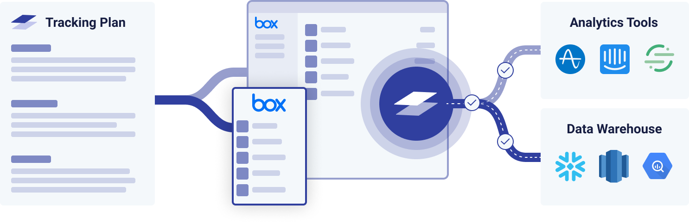

Welcome to Iteratively's documentation! This will get you up to speed on the product and show you how to start instrumenting your application.

 

## Iteratively Overview

Iteratively helps companies define, track, and verify their product analytics. It ensures analytics events are captured correctly and consistently across all teams and platforms, and enables teams to use their analytics with no need for cleanup or worrying about data integrity and trustworthiness. 

For PMs, data analysts, and other data consumers, Iteratively provides an always up-to-date Tracking Plan for the entire company. It replaces ad-hoc spreadsheets and wiki pages with one centralized Tracking Plan app. It minimizes turnaround time with engineering when adding and changing events, and enforces taxonomy standards and conventions across all teams.

For developers, Iteratively provides a toolkit that simplifies and accelerates the process of instrumenting analytics across one or more products. It automatically generates a type-safe tracking library according to the latest spec, lints code to make sure analytics events are tracked correctly, and exposes a unified API that removes the need to understand the ins and outs of each analytics provider.

Iteratively works with all popular [analytics providers](/using-the-tracking-library#destinations) (e.g. Segment, Amplitude, Custom Destinations), all popular [developer platforms](/using-the-tracking-library#sources) (e.g. JavaScript, TypeScript, Java, Python, Ruby, Objective C, Swift, Kotlin, C#) and requires no infrastructure changes to your analytics pipeline.

## Documentation Overview

We've broken out our documentation into the following sections to help you get started.

### Overview
- [What Is A Tracking Plan?](/what-is-a-tracking-plan) - Learn why a tracking plan is key to your analytics strategy.
- [Creating Your Tracking Plan](/creating-your-tracking-plan) - How to get started creating your tracking plan with Iteratively.
- [Working with Property Groups](/working-with-templates) - Define groups of properties that can be applied to events or sources. 
- [Identifying Users and Groups](/identifying-users-and-groups) - Record traits about a user and the group they're in.
- [Tracking Page Views](/tracking-page-views) - Record traits whenever a user sees a page of your website.
- [Best Practices](/best-practices) - Tips on how to get the most out of your analytics tracking.
- [Working with Branches](/working-with-branches) - Branches in Iteratively make it easy to collaborate across teams.
- [Typical Workflow](/typical-workflow) - Learn how to integrate Iteratively into your teams workflow.
- [Event Validation with Observe](/observe) - Monitor your event tracking continuously, no code changes required.
- [Granular Event Destinations](/granular-event-destinations) - Control what data ends up in what downstream destination.

### Integration
- [Using the Ampli CLI](/using-the-ampli-cli) - How to install to quickly and correctly instrument tracking code in your apps.
- [Using the Tracking Library](/using-the-tracking-library) - How to configure the SDK for your specific platform and language. 
- [Integrating with CI](/integrating-with-ci) - Verify your analytics by running alongside your existing test suite.
- [Unit Testing](/unit-testing) - Verify your analytics by running alongside your existing test suite.
- [Debugging with User Lookup](/user-lookup) - Build confidence during development by verifying your analytics.
- [Iglu API](/iglu-api) - How to configure Iteratively to work as an Iglu compatible schema registry.

### Resources
- [Managing Your Account](/managing-your-account) - Available options to configure for your account.
- [Importing a Tracking Plan](/import) - Import your existing tracking plan into Iteratively to get started.
- [Integrating Other Tools](/integrations) - Integrating Iteratively with your existing tools to streamline your workflow.
- [Migration Guide](/migration-guide) - How to migrate your existing tracking over to Iteratively.

Glad to have you onboard!

### Need support? 

Have any questions or need help? [Get in touch](https://support.amplitude.com/)!

