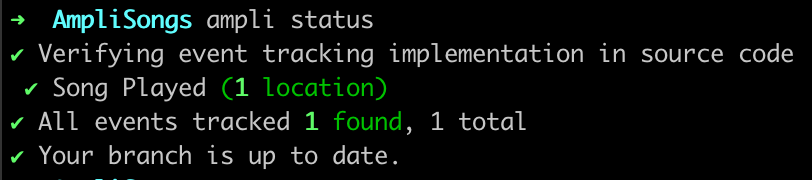

## Overview

**Ampli** dynamically generates a light-weight wrapper for the **Amplitude SDK** based on your analytics tracking plan in **Amplitude Data** making event tracking easier and less error-prone.

This document provides a high-level overview of Ampli. A [video demo is also available below](#video-tutorial) and in [Amplitude Academy](https://academy.amplitude.com/instrumenting-events-with-amplitude-data-and-the-ampli-cli).

<figure markdown>
  
  <figcaption>How Ampli fits into your workflow</figcaption>
</figure>

The **Ampli Wrapper** provides types and methods that prevent human error by strictly enforcing event names and property values. The wrapper code enables autocompletion for all events and properties in your tracking plan, as well as static type checks at development and compile time.

```typescript
import { ampli, SongPlayed } from './ampli';

ampli.songPlayed({ title: 'Happy Birthday' });
ampli.track(new SongPlayed({ title: 'Song 2' }));
// => These 2 events are tracked as expected

ampli.songPlayed({ name: 'I Knew You Were Trouble' }));
// => Error: Event 'Song Played' is missing required property 'title'

ampli.songPlayed({ title: true }));
// => Error: Property 'title' received 'boolean' expected type 'String'
```

Compare this to the general purpose **Amplitude SDK**. Sending events with hand entered values can create data quality issues and require close coordination between data governors and engineers.

```typescript
import * as amplitude from '@amplitude/analytics-browser';

amplitude.track('Song Played', { title: 'Happy Birthday'});
amplitude.track({
  event_type: 'Song Played',
  event_properties: { title: 'Song 2'}
);
// => These 2 events are tracked as expected

amplitude.track('Song Played', { name: 'I Knew You Were Trouble' })
// => Event will be tracked but is difficult to include in charts and other analysis

amplitude.track('sonG Playd', { title: true })
// => Typos and property errors are easy to create, and hard to find & fix
```

The **Ampli CLI** generates the **Ampli Wrapper** and can verify the instrumentation status of your events. This makes it easy to know if you missed any event tracking calls giving you confidence that you successfully completed your implementation.

```shell
➜ ampli status
✔ Verifying event tracking implementation in source code
  ✔ Song Played (1 location)
✔ All events tracked: 1 found, 1 total
```

## Amplitude Data

### Create a tracking plan for your events

**Amplitude Data** allows you to plan your analytics by defining the events and properties you want to track in your application. **Ampli** requires a tracking plan in **Amplitude Data** with events added to an **SDK source**.

The following examples will reference this tracking plan.

- Browser SDK source named `web`
- Event `Song Played` with required property `title` of type `String`
- Event `Song Played` is added to source `web`
- Environment named `production`

<figure markdown>
  { width="300" }
  <figcaption>Create a Source for your desired platform</figcaption>
</figure>

<figure markdown>
  { width="300" }
  <figcaption>Create Events in your tracking plan</figcaption>
</figure>

<figure markdown>
  { width="300" }
  <figcaption>View Source settings and instructions</figcaption>
</figure>

## Ampli CLI

The Ampli CLI connects to Amplitude Data and uses the schema information for a given Source to generate and verify the Ampli Wrapper in your project.

<figure markdown>
  { width="300" }
  <figcaption>ampli pull</figcaption>
</figure>

<figure markdown>
  { width="300", align=center }
  <figcaption>ampli status</figcaption>
</figure>

### Install the Ampli CLI

NPM and Homebrew are supported.

```shell
npm install -g @amplitude/ampli
```

### Generate the Ampli Wrapper with `ampli pull`

Running ampli pull connects to Amplitude Data and downloads the Ampli Wrapper for your tracking plan.

```shell
ampli pull [source-name] [--path ./path/for/generated/ampli/wrapper]
```

The Ampli Wrapper is associated to a specific Source in Amplitude Data. You can optionally provide the desired Source name as a parameter, if not you will be prompted to select one.

```shell
? Select a Source: web
```

The first time you run ampli pull on a source you will be asked to select a development language and an underlying Amplitude SDK. If you want to change the Source configuration later you can run ampli configure to select a different platform, language, or Amplitude SDK.

```shell
? Select a platform: Browser
? Select a language: TypeScript
? Select a SDK: @amplitude/analytics-browser@^1.0 (recommended)
```

The generated Ampli Wrapper will then be available in the provided path. If no path was provided, the Ampli CLI provides a sensible default based on the platform of your Source.

```shell
✔ Tracking library generated successfully.
  ↳ Path: ./ampli
```

### Verify event instrumentation in your project with `ampli status`

Running `ampli status` scans the source code in your project directory and checks for event tracking calls e.g. `ampli.songPlayed({ ... })`. It will output the number of times each event is detected.

```shell
➜ ampli status
✔ Verifying event tracking implementation in source code
  ✔ Song Played (1 location)
✔ All events tracked: 1 found, 1 total
```

If there are events in your tracking plan that are not implemented ampli status will return an error. For example, if you were to add a new event `Song Favorited` to the tracking plan but not instrument it in the project.

```shell
➜ ampli status
✔ Verifying event tracking implementation in source code
  ✔ Song Played (1 location)
  ✘ Song Favorited
✘ ERROR Event tracking incomplete: 1 missed, 2 total
```

## Ampli Wrapper

### A generated SDK for your tracking plan

The **Ampli Wrapper** is a thin facade over the **Amplitude SDK** that provides convenience methods e.g. `ampli.songPlayed()` and classes e.g. `new SongPlayed()` for all events in your tracking plan. Additionally, `ampli.load()` allows selecting different environments defined in Amplitude Data by name rather than needing to keep track of API keys.

```typescript
import { ampli, SongPlayed } from './ampli';

ampli.load({ environment: 'production' });

ampli.client.setUserId('ampli@amplitude.com');

ampli.songPlayed({ title: 'Happy Birthday' }));

ampli.track(new SongPlayed({ title: 'Song 2'}));

ampli.flush();
```

### Wrapping the Amplitude SDK

The **Ampli Wrapper** provides access to all methods of the underlying **Amplitude SDK** instance via `ampli.client`.  It is possible to configure the instance directly or provide an existing one. If none is provided a default instance of the Amplitude SDK is used.

```typescript
import * as amplitude from '@amplitude/analytics-browser';
import { ampli } from './ampli';
import { CustomPlugin } from './plugins';

amplitude.init('my-api-key');
ampli.load({ client: { instance: amplitude }})
assertEqual(ampli.client, amplitude);

ampli.client.add(CustomPlugin);
ampli.client.setUserId('ampli@amplitude.com');
ampli.client.setGroup('team', 'awesome');
```

### Add the Ampli Wrapper to your project and track events

Use the **Ampli CLI** to download the **Ampli Wrapper**.

```shell
ampli pull [--path ./ampli]
```

The downloaded source code in `path` and `ampli.json` should be added to your repository and source control.

```shell
git add ./ampli ampli.json
git commit -m "Added Ampli wrapper"
```

Depending on the **Amplitude SDK** selected for your Source your will need to install the corresponding dependency.

```shell
npm install @amplitude/analytics-browser
```

Once the **Ampli Wrapper** has been downloaded with `ampli pull` and dependencies installed you can start using it to track events in your code.

```typescript
import { ampli, SongPlayed } from './ampli';

ampli.load({ environment: 'production' });
ampli.songPlayed({ title: 'Happy Birthday' }));
ampli.flush();
```

Use the **Ampli CLI** to verify instrumentation status of the **Ampli Wrapper** in your project.

```shell
ampli status
```

## Video Tutorial

<script src="https://fast.wistia.com/embed/medias/4f8ufh6les.jsonp" async></script><script src="https://fast.wistia.com/assets/external/E-v1.js" async></script><div class="wistia_responsive_padding" style="padding:56.25% 0 0 0;position:relative;"><div class="wistia_responsive_wrapper" style="height:100%;left:0;position:absolute;top:0;width:100%;"><div class="wistia_embed wistia_async_4f8ufh6les videoFoam=true" style="height:100%;position:relative;width:100%"><div class="wistia_swatch" style="height:100%;left:0;opacity:0;overflow:hidden;position:absolute;top:0;transition:opacity 200ms;width:100%;"></div></div></div></div>
