# All SDKs comparision 

This article provides a comparison between different SDKs across platforms. This overview offers key insights for developers to make informed decisions when selecting the appropriate SDK.

!!!note

    While there are multiple versions of our SDK available, we highly recommend using the latest version rather than maintenance SDKs. Maintenance versions only provide support and will eventually be deprecated. The [latest SDK](./sdk-architecture.md) adopts an aligned architecture, with no extra dependencies, and offers enhanced stability for optimal performance.

## Browser

| Feature| 
 [Latest Browser SDK](../typescript-browser/) 
| 
[Latest Browser SDK < v1.9](../typescript-browser/)
|  
 [Marketing analytics Browser](../marketing-analytics-browser/) 
 |  
 [Mantiance Browser SDK](../javascript/) 
 |
| --- | --- | --- | --- | --- |
| Default Event Tracking | Supported. Includes page view event(`[Ampliutde] Page viewed`), sessions events(`[Amplitude] Session Start`, `[Amplitude] Session End`), form interactions events(`[Amplitude] Form Started`, `[Amplitude] Form Submitted`, `[Amplitude] Form Downloaded`) with [configuration](../typescript-browser/#tracking-default-events). You can use [Enrichment Plugin](../typescript-browser/#plugins) to customize the default events name. |  Supported. Includes page view event(`Page View`) with configuration. You can use [Enrichment Plugin]((../typescript-browser/#plugins) ) to customize the default events name.| Supported. `Page view`. Automatic. | Not support. |
| Web Attribution | Enable by default. Auto added `webAttributionPlugin` internally. The SDK track web attribution on init with a new session by default and  **NOT** configurable. This SDK tracks attribution on init with a new campaign is disable by default and configurable with `configuration.trackNewCampaigns = true`. If tracking web attribution on init with a new campaign is enable, the campaign will be unset (set to none) if that attribution not included. Default value for all `init` attribution is `Empty` and configurable. If reset session ID on new session is configurable. Collect all latest ClickIds. | Enable by default. You are able to choose if use default web attribution or use the `webAttributionPlugin` instead. If using default web attribution, the behavior will be the same as the latest browser SDK. If you disable the default web attribution and manually add `webAttributionPlugin`. The behavior will be overwritten and will be the same as Marketing analytics Browser SDK. | Enable by default. Auto added `webAttributionPlugin`. This SDK tracks attribution on init with a new campaign no matter if a new session or during a session and **NOT** configurable. Others are the same as the latest Browser SDK. | Configuration required. Only support Gclid, Fbclid. Tracking campaign change only at session start by default but configurable. The existing referrer and utm_parameter values will be carried through each new session by defualt. Configuration supported for reseting new campaign during a session. |
| Configuration | Configuration is implemented by Configuration object during initialize amplitude. [More configurations](../typescript-browser/#configuration). Check [here](../typescript-browser/migration) for migration guide from the Maintenance SDK to the latest SDK.| Same as latest Browser(TS) | Same as latest Browser(TS) | Support explicity setter methods. [More configurations](../javascript/#configuration).|
| logger provider | Amplitude Logger by Default. Fully customizable. | Same as latest Browser SDK |  Same as latest Browser SDK  | Same as latest Browser SDK | Amplitude Logger by default. Not customizable. |
| storage Provider | LocalStorage by default. Fully customizable. | Same as latest Browser SDK | Same as latest Browser SDK | Limited storage - cookies, localStorage, sessionStorage, or none available. Not able to be customized. |
| Customization | Plugins | Plugins | Plugins | Not Support.  (Middleware is supported in Ampli JS)|
| Bundle Size | Tree shaking for optimization. |  Same as latest Browser SDK. |  Same as latest Browser SDK. | NO Optimization. |
| Server Endpoint | HTTP V2 API | HTTP V2 API | HTTP V2 API| HTTP V1 API |
| Batch API| Suported, with configuration. | Same as latest Browser SDK | Same as latest Browser SDK | Not support. |

### Default Web Attribution tracking behavior vs using webAttributionPlugin

In order to not having a breaking change, even we are using different way to implement web attribution tracking in Browser SDK (default tracking behavior or using webAttributionPlugins in the latest version), we keeps the behavior the same unless you disable the default web attribution behavior. 
The following two charts are showing the different web attribution workflow. 

|   |   |
|:--------------------------------------------------------------------------------------------------------------:|:--------------------------------------------------------------------------------------------------------------:|
|                 Web Attribution Workflow in Browser SDK (default web attribution enabled)                     |                 Web Attribution Workflow in Marketing Analytics                     |

## Android

| 
Feature
 | [Android Kotlin](../android-kotlin/) | [Android Android](../android/) |
| --- | --- | --- |
| Package| [com.amplitude:analytics-android](https://mvnrepository.com/artifact/com.amplitude/analytics-android)| [com.amplitude:android-sdk](https://mvnrepository.com/artifact/com.amplitude/android-sdk)|
| SSL Pinning | TBD | Supported. Check [here](./android/#) for the setup. |
| Configuration | Configuration is implemented by the configuration object. Configurationes need to be passed into Amplitude Object during initialization. [More configurations](../android-kotlin/#configuration). Support explicity setter methods. [More configurations](../javascript/#configuration).|
| logger provider | ConsoleLoggerProvider() by default. Fully customizable. | Amplitude Logger.  Not customizable. |
| storage Provider | InMemoryStorageProvider() by default. File storage. Fully customizable. | SQLite Database. ｜
| Customization | Plugins | Middelware |
| Server Endpoint | HTTP V2 API | HTTP V1 API |
| Batch API| Supported, with configuration. | Not support. |

## iOS

| 
Feature
 | [Latest iOS SDK](../ios/) | [Maintenance iOS SDK](../ios-swift/) |
| --- | --- | --- |
| Package| AmplitudeSwift | [Amplitude](https://cocoapods.org/pods/Amplitude-iOS)|
| Configuration | Configuration is implemented by the configuration object. Configurationes need to be passed into Amplitude Object during initialization. [More configurations](../ios/#configuration). Latest iOS SDK support more configurations. Check [here](../ios-swift/migration/#configuration) for more details. | Support explicity setter methods. [More configurations](../ios/#configuration)|
| logger Provider | ConsoleLogger() by default. Fully customizable. | AMPLITUDE_LOG, config throught marcro. ｜
| storage Provider | PersistentStorage() by default. File storage and iOS user’s defaults database. Fully customizable. | SQLite Database. ｜
| Customization | Plugins | Middleware |
| Server Endpoint | HTTP V2 API | HTTP V1 API |
| Batch API| Yes, with configuration. | Not support. |

## Node.JS

| 
Feature
 | [Latest iOS SDK](../typescript-node/) | [Maintenance iOS SDK](../node/) |
| --- | --- | --- |
| Package| [@amplitude/analytics-node](https://www.npmjs.com/package/@amplitude/analytics-node) | [@amplitude/node](https://www.npmjs.com/package/@amplitude/node)|
| Configuration | Configuration is implemented by Configuration object during initialize amplitude. [More configurations](../typescript-node/#configuration). | Support explicity setter methods. [More configurations](../node/#configuration)|
| logger Provider | Amplitude Logger.  Fully customizable. | Amplitude Logger.  Not customizable. |
| storage Provider | LocalStorage by default. Fully customizable. | Local Storage. ｜
| Customization | Plugins | Middleware |
| Retry | Regular retry. | Regular retry by default. Also provide offline retry. You are able to customize your retry logic. Fully customizible. |
| Server Endpoint | HTTP V2 API |  HTTP V2 API |
| Batch API| Supported, with configuration. | Not support. |

## React Native

| 
Feature
 | [Latest iOS SDK](../typescript-react-native/) | [Maintenance iOS SDK](../react-native/) |
| --- | --- | --- |
| Package| [@amplitude/analytics-react-native](https://www.npmjs.com/package/@amplitude/analytics-react-native) | [@amplitude/react-native](@amplitude/react-native)|
| Structure | Mobile platforms (Android & iOS) utilize native app context modules for accessing system info, async storage for persistence. | Wrapper of the iOS and Android SDK and Amplitude JavaScript SDK.  Providing mappings from React Native to native SDK functions. |
| Supported platform| iOS, Android, Web and Expo. | iOS, Android, Web. |
| Configuration | Configuration is implemented by Configuration object during initialize amplitude. [More configurations](../typescript-react-native/#configuration). | Support explicity setter methods. [More configurations](../react-native/#configuration)|
| storage Provider | LocalStorage() by default, if not enabled, use MemoryStrogate(). Fully configurable. | Depened on the Maintenance iOS, Maintenance Android and Maintenance Browser SDK storage. ｜
| logger provider | Amplitude Logger. Fully customizable. | Depened on the native iOS, Android, Amplitude JavaScript logger provider. |
| Customization | Plugins | Middleware |
| Server Endpoint | HTTP V2 API |  HTTP V1 API |