# All SDKs comparision 

This article provides a comparison between different SDKs across platforms. This overview offers key insights for developers to make informed decisions when selecting the appropriate SDK.

!!!note

    While there are multiple versions of our SDK available, please use the latest version of the SDKs rather than maintenance SDKs. Maintenance versions only provide support and will eventually be deprecated. The [latest SDK](./sdk-architecture.md) adopts an aligned architecture, with no extra dependencies, and offers enhanced stability for optimal performance.

## Browser

| Feature| 
 [Latest Browser SDK](../typescript-browser/) 
 | 
 [Marketing analytics Browser](../marketing-analytics-browser/) 
 | [Mantiance Browser SDK](../javascript)|
| --- | --- | --- | --- |
| Package | [@amplitude/analytics-browser](https://www.npmjs.com/package/@amplitude/analytics-browser) | [@amplitude/marketing-analytics-browser](https://www.npmjs.com/package/@amplitude/marketing-analytics-browser) | [amplitude-js](https://www.npmjs.com/package/amplitude-js) |
| Web Attribution | Auto added `webAttributionPlugin` internally. Use [**Web Attribution V1**](./#web-attribution-v1-vs-web-attribution-v2-vs-maintenance-web-attribution). The behavior will be the same as [**Web Attribution V2**](./#web-attribution-v1-vs-web-attribution-v2-vs-maintenance-web-attribution) if you set `config.attribution.disabled = false`. (1) { .annotate } | Auto added `webAttributionPlugin` internally. [**Web Attribution V2**](./#web-attribution-v1-vs-web-attribution-v2-vs-maintenance-web-attribution). | Configuration required. Use [**Maintenance Web Attribution**](./#web-attribution-v1-vs-web-attribution-v2-vs-maintenance-web-attribution). |
| Default Event Tracking |  [**Defalut Event Tracking V1**](./#defalut-event-tracking-v1-vs-defalut-event-tracking-v2) (2) { .annotate } | [**Defalut Event Tracking V2**](./#defalut-event-tracking-v1-vs-defalut-event-tracking-v2) |  Not supported. |
| Configuration | Configuration is implemented by Configuration object during initialize amplitude. [More configurations](../typescript-browser/#configuration). Check [here](../typescript-browser/migration) for migration guide from the Maintenance SDK to the latest SDK. | The same as latest Browser SDK.  | Support explicity setter methods. [More configurations](../javascript/#configuration). |
| Logger provider | Amplitude Logger by Default. Fully customizable. | The same as latest Browser SDK. | Amplitude Logger by default. Not customizable. |
| Storage Provider | LocalStorage by default. Fully customizable. | The same as latest Browser SDK. | Limited storage - cookies, localStorage, sessionStorage, or none available. Not able to be customized. |
| Customization | Plugins | Plugins | Not supported.  (Middleware is supported in Ampli JS) |
| Bundle Size | Tree shaking for optimization. | The same as latest Browser SDK.  |  No Optimization. |
| Server Endpoint | HTTP V2 API | The same as latest Browser SDK. | HTTP V1 API |
| Batch API| Suported, with configuration. | The same as latest Browser SDK. | Not supported. |

1. Note: For SDK version lower than 1.9, you are able to choose if use Web Attribution V1 or use Web Attribution V2. For using Web Attribution V2 you need to disable the Web Attribution V1 by setting `config.attribution.disabled = false` and install the `@amplitude/plugin-web-attribution-browser` and manually add `webAttributionPlugin` plugin, which lead the behavior the same as using Marketing Analytics SDK.
2. Note: For SDK version lower than 1.9, you need install the `npm install @amplitude/plugin-page-view-tracking-browser` and manually add `pageViewTrackingPlugin()` plugin, which lead the behavior the same as using Marketing Analytics SDK.

### Defalut Event Tracking V1 vs Defalut Event Tracking V2

| Feature| 
 Defalut Event Tracking V1 
 | 
 Defalut Event Tracking V2 
 |
| --- | --- | --- |
| Configurable | Yes. Enable by setting `config.defaultTracking` configuration. [More Details](../typescript-browser/#tracking-default-eventsr/#page-view). | Yes. Enable by setting `config.pageViewTracking` configuration. [More Details](../marketing-analytics-browser/#page-view). |
| Events | Includes with [configuration](../typescript-browser/#tracking-default-events) <ul><li>page view event(`[Amplitude] Page viewed`)</li> <li>sessions events(`[Amplitude] Session Start`, `[Amplitude] Session End`)</li> <li>form interactions events(`[Amplitude] Form Started`, `[Amplitude] Form Submitted`, `[Amplitude] Form Downloaded`)</li></ul>  | Includes with [configuration](../marketing-analytics-browser/#page-view) <ul><li> page view event (`Page view`)</li> </ul>  </li></ul>|
| Archtecture | Implemented through different plugins. | Implemented through `pageViewTrackingPlugin` plugin. |  
| Customizable | Yes. Through [Enrichment Plugin](../typescript-browser/#plugins). | Yes. Through [Enrichment Plugin](../typescript-browser/#plugins). |

### Web Attribution V1 vs Web Attribution V2 vs Maintenance Web Attribution

#### Configurable

| 
 Web Attribution V1 
 | 
 Web Attribution V2 
 | 
 Maintenance Web Attribution 
|
| --- | --- | --- |
| Yes. | No. | Yes. |

#### Behavior 

| 
 Web Attribution V1 
 | 
 Web Attribution V2 
 | Maintenance Web Attribution |
| --- | --- | --- |
|  <ul><li>Enable by default.</li> <li> The SDK track web attribution on init with a new session by default. This SDK tracks attribution on init with a new campaign is disable by default and configurable with `config.trackNewCampaigns = true`. If tracking web attribution on init with a new campaign is enable, the campaign will be unset (set to none) if that attribution not included. </li> <li>Default value for all `init` attribution is `Empty` and configurable.</li> <li>If reset session ID on new campaign is configurable. </li> <li>Collect all latest ClickIds. </li>| <ul><li>Enable by default.</li> <li>This SDK tracks attribution on init with a new campaign no matter if a new session or during a session and **NOT** configurable.</li> <li>Default value for all `init` attribution is `Empty` and configurable.</li> <li>If reset session ID on new campaign is configurable. </li> <li> Collect all latest ClickIds.</li></ul> | <ul><li>Disable by default.</li> <li>This SDK tracks attribution on init with a new session by default. This SDK tracks attribution on init during a session is disable by default and configurable with `config.saveParamsReferrerOncePerSession = false`. By default the existing web attribution values will be carried through each new session. Unless you set `config.unsetParamsReferrerOnNewSession = true`, web attribution will be set to `null` upon instantiating a new session.</li> <li> It only track the `init` attribution which has value. </li> <li> Cannot set session ID on campaign. </li><li>Only collect `gclid` and `fbclid` ClickIds.</li></ul>|

unsetParamsReferrerOnNewSession

#### Workflow 

|                 Web Attribution V1                     |                Web Attribution V2                     |Maintenance Web Attribution|
|:--------------------------------------------------------------------------------------------------------------:| :--------------------------------------------------------------------------------------------------------------:|:--------------------------------------------------------------------------------------------------------------:|
|   |   |   |

#### Archtecture

| 
  Web Attribution V1 
 | 
 Web Attribution V2 
 | 
  Maintenance Web Attribution 
|
| --- | --- | --- |
| Implemented through `webAttributionPlugin` Plugin. The behavior will be the same if you set `config.trackNewCampaigns = false`.  | Implemented through `webAttributionPlugin` Plugin. | Build in logic. |

## Android

| 
Feature
 | [Android Kotlin](../android-kotlin/) | [Android Android](../android/) |
| --- | --- | --- |
| Package | [com.amplitude:analytics-android](https://mvnrepository.com/artifact/com.amplitude/analytics-android) | [com.amplitude:android-sdk](https://mvnrepository.com/artifact/com.amplitude/android-sdk) |
| SSL Pinning | TBD | Supported. Check [here](../android/#ssl-pinning) for the setup. |
| Configuration | Configuration is implemented by the configuration object. Configurations need to be passed into Amplitude Object during initialization. [More configurations](../android-kotlin/#configuration). | Support explicity setter methods. [More configurations](../android/#configuration). |
| Logger provider | ConsoleLoggerProvider() by default. Fully customizable. | Amplitude Logger. Not customizable. |
| Storage Provider | InMemoryStorageProvider() by default. File storage. Fully customizable. | SQLite Database. |       
| Customization | Plugins | Middelware |
| Server Endpoint | HTTP V2 API | HTTP V1 API |
| Batch API| Supported, with configuration. | Not supported.|

## iOS

| 
Feature
 | [Latest iOS SDK](../ios/) | [Maintenance iOS SDK](../ios-swift/) |
| --- | --- | --- |
| Package | AmplitudeSwift | [Amplitude](https://cocoapods.org/pods/Amplitude-iOS) |
| Configuration | Configuration is implemented by the configuration object. Configurations need to be passed into Amplitude Object during initialization. [More configurations](../ios/#configuration). Latest iOS SDK support more configurations. Check [here](../ios-swift/migration/#configuration) for more details. | Support explicity setter methods. [More configurations](../ios/#configuration) |
| Logger Provider | ConsoleLogger() by default. Fully customizable. | AMPLITUDE_LOG, config throught marcro. |
| Storage Provider | PersistentStorage() by default. File storage and iOS user’s defaults database. Fully customizable. | SQLite Database. |
| Customization | Plugins | Middleware |
| Server Endpoint | HTTP V2 API | HTTP V1 API |
| Batch API| Yes, with configuration. | Not supported. |

## Node.JS

| 
Feature
 | [Latest Node SDK](../typescript-node/) | [Maintenance Node SDK](../node/) |
| --- | --- | --- |
| Package | [@amplitude/analytics-node](https://www.npmjs.com/package/@amplitude/analytics-node) | [@amplitude/node](https://www.npmjs.com/package/@amplitude/node)|
| Configuration | Configuration is implemented by Configuration object during initialize amplitude. [More configurations](../typescript-node/#configuration). | Support explicity setter methods. [More configurations](../node/#configuration).|
| Logger Provider | Amplitude Logger. Fully customizable. | Amplitude Logger.  Not customizable. |
| Storage Provider | LocalStorage by default. Fully customizable. | Local Storage. |
| Customization | Plugins | Middleware |
| Retry | Regular retry. | Regular retry by default. Also provide offline retry. You are able to customize your retry logic. Fully customizible. |
| Server Endpoint | HTTP V2 API |  HTTP V2 API |
| Batch API | Supported, with configuration. | Not supported. |

## React Native

| 
Feature
 | [Latest React Native SDK](../typescript-react-native/) | [Maintenance React Native SDK](../react-native/) |
| --- | --- | --- |
| Package | [@amplitude/analytics-react-native](https://www.npmjs.com/package/@amplitude/analytics-react-native) | [@amplitude/react-native](https://www.npmjs.com/package/@amplitude/react-native) |
| Structure | Mobile platforms (Android & iOS) utilize native app context modules for accessing system info, async storage for persistence. | Wrapper of the iOS and Android SDK and Amplitude JavaScript SDK.  Providing mappings from React Native to native SDK functions. |
| Supported platform | iOS, Android, Web and Expo. | iOS, Android, Web. |
| Configuration | Configuration is implemented by Configuration object during initialize amplitude. [More configurations](../typescript-react-native/#configuration). | Support explicity setter methods. [More configurations](../react-native/#configuration). |
| Storage Provider | LocalStorage() by default, if not enabled, use MemoryStrogate(). Fully configurable. | Depened on the Maintenance iOS, Maintenance Android and Maintenance Browser SDK storage. |
| Logger provider | Amplitude Logger. Fully customizable. | Depened on the native iOS, Android, Amplitude JavaScript logger provider. |
| Customization | Plugins | Middleware |
| Server Endpoint | HTTP V2 API |  HTTP V1 API |