Amplitude Browser SDK 1.0 (`@amplitude/analytics-browser`) features a plugin architecture, built-in type definition and broader support for front-end frameworks. Browser SDK 1.0 isn't backwards compatible with `amplitude-js`. 

To migrate to `@amplitude/analytics-browser`, update your dependencies and instrumentation.

!!!info "Browser SDK 2.0 is now available"
    An improved version of Amplitude Browser SDK is now available. Amplitude Browser SDK 2.0 features default event tracking, improved marketing attribution tracking, simplified interface and a lighter weight package. Amplitude recommends the Browser SDK 2.0 for both product analytics and marketing analytics use cases. Upgrade to the latest [Browser SDK 2.0](../browser-2/index.md). See the [Migration Guide](../browser-2/migration.md) for more help.

### Terminology

* `amplitude-js`: Maintenance Browser SDK
* `@amplitude/analytics-browser`: Browser SDK 1.0

## Dependency

For snippet installation, update your project's [snippet loader](https://github.com/amplitude/Amplitude-TypeScript/tree/v1.x/packages/analytics-browser#using-script-loader).

For Node projects, update your dependency list in package.json.

=== "amplitude-js"

    ```json
    {
      "dependencies": {
        "amplitude-js": "^8"
      }
    }
    ```

=== "@amplitude/analytics-browser"

    ```json
    {
      "dependencies": {
        "@amplitude/analytics-browser": "^1"
      }
    }
    ```

## Instrumentation

Browser SDK 1.0 offers an API to instrument events. To migrate to the Browser SDK 1.0, you need to update a few calls. The following sections detail which calls have changed.

### Initialization

Like all other calls, `getInstance()` has been removed. To initialize the SDK, call `init()`, with the same parameters. However, `config` comes in a different shape. See [Configuration](#configuration).

=== "amplitude-js"

    ```javascript
    import amplitude from "amplitude-js"

    amplitude.getInstance().init(API_KEY, OPTIONAL_USER_ID, config)
    ```

=== "@amplitude/analytics-browser"

    ```typescript
    import * as amplitude from "@amplitude/analytics-browser"

    amplitude.init(API_KEY, OPTIONAL_USER_ID, config)
    ```

### Configuration

The new Browser SDK configuration comes in a different shape. The configurations are simpler and more consistent across runtimes. Some configurations are no longer supported.

|amplitude-js|@amplitude/analytics-browser|
|-|-|
|`config.apiEndpoint`|`config.serverUrl`|
|`config.batchEvents`|`config.flushQueueSize`|
|`config.cookieExpiration`|`config.cookieExpiration`|
|`config.cookieName`|NOT SUPPORTED|
|`config.sameSiteCookie`|`config.cookieSameSite`|
|`config.cookieForceUpgrade`|NOT SUPPORTED|
|`config.deferInitialization`|NOT SUPPORTED. See [Defer initialization](#defer-initialization).|
|`config.disableCookies`|`config.disableCookies`|
|`config.deviceId`|`config.deviceId`|
|`config.deviceIdFromUrlParam`|NOT SUPPORTED|
|`config.domain`|NOT SUPPORTED|
|`config.eventUploadPeriodMillis`|`config.flushIntervalMillis`|
|`config.eventUploadThreshold`|`config.flushQueueSize`|
|`config.forceHttps`|NOT SUPPORTED|
|`config.includeFbclid`|NOT SUPPORTED. See [Web attribution](#web-attribution).|
|`config.includeGclid`|NOT SUPPORTED. See [Web attribution](#web-attribution).|
|`config.includeReferrer`|NOT SUPPORTED. See [Web attribution](#web-attribution).|
|`config.includeUtm`|NOT SUPPORTED. See [Web attribution](#web-attribution).|
|`config.language`|NOT SUPPORTED. See [Plugins](#plugins).|
|`config.library`|NOT SUPPORTED. See [Plugins](#plugins).|
|`config.logLevel`|`config.logLevel`|
|`config.logAttributionCapturedEvent`|NOT SUPPORTED|
|`config.optOut`|`config.optOut`|
|`config.onError`|NOT SUPPORTED|
|`config.onExitPage`|NOT SUPPORTED. See [Flush](#flush-or-onexitpage).|
|`config.platform`|NOT SUPPORTED. See [Plugins](#plugins).|
|`config.savedMaxCount`|NOT SUPPORTED|
|`config.saveEvents`|NOT SUPPORTED|
|`config.saveParamsReferrerOncePerSession`|`config.attribution.trackNewCampaigns`. Opposite of `saveParamsReferrerOncePerSession`. See [configuration](../#configuration). |
|`config.secureCookie`|`config.cookieSecure`|
|`config.sessionTimeout`|`config.sessionTimeout`|
|`config.storage`|`config.storageProvider`|
|`config.trackingOptions`|`config.trackingOptions`|
|`config.transport`|`config.transportProvider`|
|`config.unsetParamsReferrerOnNewSession`|NOT SUPPORTED. Default behavior.|
|`config.unsentKey`|NOT SUPPORTED|
|`config.unsentIdentifyKey`|NOT SUPPORTED|
|`config.uploadBatchSize`|`config.flushQueueSize`|
|`config.headers`|NOT SUPPORTED|
|`config.serverZone`|`config.serverZone`|
|`config.useDynamicConfig`|NOT SUPPORTED|
|`config.serverZoneBasedApi`|NOT SUPPORTED|
|`config.sessionId`|`config.sessionId`|
|`config.partnerId`|`config.partnerId`|

### Tracking events

The maintenance Browser SDK offered a variety of `logEvent` APIs like `logEventWithTimestamp`, `logEventWithGroups` to override specific properties in the event payload. Amplitude has simplified all these variations into a unified `track` API in `@amplitude/analytics-browser`.

#### `logEvent()`

The `logEvent()` API maps to `track()`.

=== "amplitude-js"

    ```javascript
    const eventType = "Button Clicked"
    const eventProperties = {
      type: "primary",
    }
    amplitude.getInstance().logEvent(
      eventType,
      eventProperties,
    )
    ```

=== "@amplitude/analytics-browser"

    ```typescript
    const eventType = "Button Clicked"
    const eventProperties = {
      type: "primary",
    }
    amplitude.track(
      eventType,
      eventProperties,
    )
    ```

#### `logEventWithTimestamp()`

The `logEventWithTimestamp()` API maps to `track()`.

=== "amplitude-js"

    ```javascript
    const eventType = "Button Clicked"
    const eventProperties = {
      type: "primary",
    }
    const timestamp = Date.now()
    amplitude.getInstance().logEventWithTimestamp(
      eventType,
      eventProperties,
      timestamp,
    )
    ```

=== "@amplitude/analytics-browser"

    ```typescript
    const eventType = "Button Clicked"
    const eventProperties = {
      type: "primary",
    }
    const eventOptions = {
      time = Date.now()
    }
    amplitude.track(
      eventType,
      eventProperties,
      eventOptions
    )
    ```

#### `logEventWithGroups()`

The `logEventWithGroups()` API maps to `track()`.

=== "amplitude-js"

    ```javascript
    const eventType = "Button Clicked"
    const eventProperties = {
      type: "primary",
    }
    const groups = {
      orgId: "12345",
    }
    amplitude.getInstance().logEventWithGroups(
      eventType,
      eventProperties,
      groups,
    )
    ```

=== "@amplitude/analytics-browser"

    ```typescript
    const event_type = "Button Clicked"
    const event_properties = {
      type: "primary",
    }
    const groups = {
      orgId: "12345",
    }
    const event = {
      event_type,
      event_properties,
      groups
    }
    amplitude.track(event)
    ```

#### `sendEvents()`

The `sendEvents()` API maps to `flush()`.

=== "amplitude-js"

    ```javascript
    amplitude.getInstance().sendEvents()
    ```

=== "@amplitude/analytics-browser"

    ```typescript
    amplitude.flush()
    ```

### Set user properties

The APIs for setting user properties are the same, except for the removal of `getInstance()`. Here are code snippets to migrate APIs for user properties.

#### `setUserId()`

Setting a user ID can be invoked on `amplitude` without calling `getInstance()`.

=== "amplitude-js"

    ```javascript
    const userId = "1"
    amplitude.getInstance().setUserId(userId)
    ```

=== "@amplitude/analytics-browser"

    ```typescript
    const userId = "1"
    amplitude.setUserId(userId)
    ```

#### `setDeviceId()`

Setting a device ID can be invoked on `amplitude` without calling `getInstance()`.

=== "amplitude-js"

    ```javascript
    const deviceId = "1"
    amplitude.getInstance().setDeviceId(deviceId)
    ```

=== "@amplitude/analytics-browser"

    ```typescript
    const deviceId = "1"
    amplitude.setDeviceId(deviceId)
    ```

#### `setSessionId()`

Set a session ID on `amplitude` without calling `getInstance()`.

=== "amplitude-js"

    ```javascript
    const sessionId = Date.now()
    amplitude.getInstance().setSessionId(sessionId)
    ```

=== "@amplitude/analytics-browser"

    ```typescript
    const sessionId = Date.now()
    amplitude.setSessionId(sessionId)
    ```

#### `clearUserProperties()`

The `clearUserProperties` API has been removed, but you can now use the unified `identify` API to remove user properties. 

=== "amplitude-js"

    ```javascript
    amplitude.getInstance().clearUserProperties()
    ```

=== "@amplitude/analytics-browser"

    ```typescript
    amplitude.identify(
      new amplitude.Identify().identify.clearAll()
    )
    ```

#### `setUserProperties()`

The `setUserProperties` API has been removed, but you can now use the unified `identify` API to add user properties. 

=== "amplitude-js"

    ```javascript
    amplitude.getInstance().setUserProperties({
      membership, "paid",
      payment, "bank",
    })
    ```

=== "@amplitude/analytics-browser"

    ```typescript
    const identify = new amplitude.Identify()
    identify
      .set("membership", "paid")
      .set("payment", "bank")
    amplitude.identify(identify)
    ```

#### `identify()`

You can now make an identify call on `amplitude` without calling `getInstance()`.

=== "amplitude-js"

    ```javascript
    const identify = new amplitude.Identify()
    identify.set("membership", "paid")
    amplitude.getInstance().identify(identify)
    ```

=== "@amplitude/analytics-browser"

    ```typescript
    const identify = new amplitude.Identify()
    identify.set("membership", "paid")
    amplitude.identify(identify)
    ```

### Set group properties

### `groupIdentify()`

You can now make an identify call on `amplitude` without calling `getInstance()`.

=== "amplitude-js"

    ```javascript
    const identify = new amplitude.Identify()
    identify.set("membership", "paid")
    amplitude.getInstance().groupIdentify(identify)
    ```

=== "@amplitude/analytics-browser"

    ```typescript
    const identify = new amplitude.Identify()
    identify.set("membership", "paid")
    amplitude.groupIdentify(identify)
    ```

### Tracking revenue

#### `logRevenueV2()`

Track revenue using `revenue()` API on `amplitude` without calling `getInstance()`.

=== "amplitude-js"

    ```javascript
    const revenue = new amplitude.Revenue()
    revenue
      .setProductId("productId")
      .setPrice(10)
    amplitude.getInstance().logRevenueV2(revenue)
    ```

=== "@amplitude/analytics-browser"

    ```typescript
    const revenue = new amplitude.Revenue()
    revenue
      .setProductId("productId")
      .setPrice(10)
    amplitude.revenue(revenue)
    ```

### Patterns

#### Plugins

The configs `config.language`, `config.library`, `config.platform` were available in `amplitude-js` to allow modification of event payloads for these specific fields. Although `@amplitude/analytics-browser` doesn't support these configurations, you can add plugins to the new Browser SDK to enrich event payloads.

=== "@amplitude/analytics-browser"

    ```ts
    import { BrowserConfig, EnrichmentPlugin, Event, PluginType } from "@amplitude/analytics-types"

    export class LibraryModifierPlugin implements EnrichmentPlugin {
      name = 'library-modifier'
      type = PluginType.ENRICHMENT as const

      /**
      * setup() is called on plugin installation
      * example: client.add(new LibraryModifierPlugin());
      */
      setup(config: BrowserConfig): Promise<undefined> {
        this.config = config
      }

      /**
      * execute() is called on each event instrumented
      * example: client.track('New Event');
      */
      execute(event: Event): Promise<Event> {
        event.library = 'my-library-name/1.0.0'
        return Promise.resolve(event)
      }
    }
    ```

To install your custom plugin, use `add()` with your custom plugin as parameter.

=== "@amplitude/analytics-browser"

    ```typescript
    import { add } from "@amplitude/analytics-browser"

    add(new LibraryModifierPlugin())
    ```

#### Defer initialization

To defer initialization in `amplitude-js`, call init with `config.deferInitialization` set to `true`, and eventually call `enableTracking()` to formalize initialization and send all enqueued events.

=== "amplitude-js"

    ```javascript
    amplitude.getInstance().init(API_KEY, OPTIONAL_USER_ID, {
      deferInitialization: true,
    })

    amplitude.getInstance().logEvent("Event 1")
    amplitude.getInstance().logEvent("Event 2")
    amplitude.getInstance().logEvent("Event 3")

    amplitude.getInstance().enableTracking()
    ```

For `@amplitude/analytics-browser`, you can call `init()` at a later time than `track()`. All `track()` calls are then processed after initialization completes.

=== "@amplitude/analytics-browser"

    ```typescript
    amplitude.track("Event 1")
    amplitude.track("Event 2")
    amplitude.track("Event 3")

    amplitude.init(API_KEY, OPTIONAL_USER_ID)
    ```

#### Web attribution

In `amplitude-js`, web attribution is enabled by enabling the following configurations:

* `config.includeGclid`
* `config.includeFbclid`
* `config.includeReferrer`
* `config.includeUtm`

In `@amplitude/analytics-browser`, the web attribution is controlled by a single configuration `config.attribution.disabled` which by default is set to `false` and captures all campaign parameters. This configuration collects the same campaign parameters supported in `amplitude-js`.

#### Flush or `onExitPage`

There are certain scenarios that warrant sending events immediately, like when a user navigates away from a page. This is a common scenario when tracking button clicks that directs the user to another page while sending event payload in batches.

In `amplitude-js` do this by using `onExitPage()` callback.

=== "amplitude-js"

    ```javascript
    amplitude.getInstance().init(API_KEY, OPTIONAL_USER_ID, {
      onExitPage: () => {
        amplitude.sendEvents()
      },
    })
    ```

For `@amplitude/analytics-browser`, Amplitude recommends adding your own event listener for `pagehide` event.

=== "@amplitude/analytics-browser"

    ```javascript
    window.addEventListener('pagehide', () => {
      // Set https transport to use sendBeacon API
      amplitude.setTransport('beacon')
      // Send all pending events to server
      amplitude.flush()
    });
    ```

#### Callback

For `amplitude-js`, two separate callback functions are passed for success and error. With `@amplitude/analytics-browser` supporting Promises (and async/await), the asynchronous methods like `track()`, `identify()`, `groupIdentify()` return a custom promise interface.

=== "@amplitude/analytics-browser"

    ```javascript
    const result = await amplitude.track("Button Clicked").promise
    if (result.code === 200) {
      // success logic
    } else {
      // errr logic
    }

    ```

## Comparison 

--8<-- "includes/sdk-migration/sdk-migration-note.md"

| Feature| <div class="big-column"> [Latest Browser SDK](../) </div> | <div class="big-column"> [Marketing analytics Browser SDK](../../marketing-analytics-browser/) <div> | [Maintenance Browser SDK](../../javascript)|
| --- | --- | --- | --- |
| Package | [@amplitude/analytics-browser](https://www.npmjs.com/package/@amplitude/analytics-browser) | [@amplitude/marketing-analytics-browser](https://www.npmjs.com/package/@amplitude/marketing-analytics-browser) | [amplitude-js](https://www.npmjs.com/package/amplitude-js) |
| Web Attribution [^1] | By default, the Browser SDK includes the `web-attribution` plugin which implements [**Web Attribution V1**](./#web-attribution-v2-vs-web-attribution-v1-vs-maintenance-web-attribution). | Configuration required. Use [**Web Attribution V2**](./#web-attribution-v2-vs-web-attribution-v1-vs-maintenance-web-attribution). | Configuration required. Use [**Maintenance Web Attribution**](./#web-attribution-v2-vs-web-attribution-v1-vs-maintenance-web-attribution). |
| Default Event Tracking [^2] |  [**Default Event Tracking V2**](./#default-event-tracking-v2-vs-default-event-tracking-v1) | [**Default Event Tracking V1**](./#default-event-tracking-v2-vs-default-event-tracking-v1) |  Not supported. |
| Configuration | Configuration is implemented by Configuration object during initialize amplitude. [More configurations](../#configuration). Check [here](./) for migration guide from the Maintenance SDK to the latest SDK. | The same as latest Browser SDK.  | Support explicit  setter methods. [More configurations](../../javascript/#configuration). |
| Logger provider | Amplitude Logger by Default. Fully customizable. | The same as latest Browser SDK. | Amplitude Logger by default. Not customizable. |
| Storage Provider | LocalStorage by default. Fully customizable. | The same as latest Browser SDK. | Limited storage - cookies, localStorage, sessionStorage, or none available. Not able to be customized. |
| Customization | Plugins | Plugins | Not supported.  (Middleware is supported in Ampli JS) |
| Bundle Size | Tree shaking for optimization. | The same as latest Browser SDK.  |  No Optimization. |
| Server Endpoint | HTTP V2 API | The same as latest Browser SDK. | HTTP V1 API |
| Batch API| Supported, with configuration. | The same as latest Browser SDK. | Not supported. |

[^1]: **Web Attribution**: For Browser SDK version lower than 1.9.0, you are able to choose if use Web Attribution V1 or use Web Attribution V2. For using Web Attribution V2 you need to disable the Web Attribution V1 by setting `config.attribution.disabled = false`, install the `@amplitude/plugin-web-attribution-browser` and add `web-attribution` plugin manually, which will lead web attribution behavior the same as Marketing Analytics Browser SDK.
[^2]: **Default Event Tracking**: For Browser SDK version lower than 1.9.0, to track page view events, you need to install the `npm install @amplitude/plugin-page-view-tracking-browser` and add `page-view-tracking` plugin manually. The event name for page views, along with the event properties for page views are different than the latest default event tracking. 

### Default Event Tracking V2 vs Default Event Tracking V1

| Feature| <div class="big-column"> Default Event Tracking V2 </div> | <div class="big-column"> Default Event Tracking V1 <div> |
| --- | --- | --- |
| Configurable | Yes. Enable by setting `config.defaultTracking` configuration. [More Details](../#tracking-default-eventsr/#page-view). |  Yes. Enable by setting `config.pageViewTracking` configuration. [More Details](../../marketing-analytics-browser/#page-view). |
| Events | Includes with [configuration](./#tracking-default-events) <ul><li>page view event(`[Amplitude] Page viewed`)</li> <li>sessions events(`[Amplitude] Session Start`, `[Amplitude] Session End`)</li> <li>form interactions events(`[Amplitude] Form Started`, `[Amplitude] Form Submitted`, `[Amplitude] Form Downloaded`)</li></ul> | Includes with [configuration](../../marketing-analytics-browser/#page-view) <ul><li> page view event (`Page view`)</li> </ul>  </li></ul> | 
| Archtecture |  Implemented through different plugins. | Implemented through `page-view-tracking` plugin. |  
| Customizable | Yes. Through [Enrichment Plugin](./#plugins). | Yes. Through [Enrichment Plugin](./#plugins). |

### Web Attribution V2 vs Web Attribution V1 vs Maintenance Web Attribution

#### Configurable

| <div class="big-column"> Web Attribution V2 </div> | <div class="big-column"> Web Attribution V1 </div> | <div class="big-column"> Maintenance Web Attribution </div>|
| --- | --- | --- |
| No. | Yes. | Yes. |

#### Behavior 

| <div class="big-column"> Web Attribution V2 </div> | <div class="big-column"> Web Attribution V1 </div> | Maintenance Web Attribution |
| --- | --- | --- |
| <ul><li>Enabled by default.</li> <li>This SDK tracks attribution on init with a new campaign no matter if a new session or during a session and **NOT** configurable.</li> <li>Default value for all `init` attribution is `Empty` and configurable.</li> <li>If reset session ID on new campaign is configurable. </li> <li> Collect all latest ClickIds.</li></ul> | <ul><li>Enabled by default.</li> <li> The SDK track web attribution on init with a new session by default. This SDK tracks attribution on init with a new campaign is disable by default and configurable with `config.trackNewCampaigns = true`. If tracking web attribution on init with a new campaign is enable, the campaign will be unset (set to none) if that attribution not included. </li> <li>Default value for all `init` attribution is `Empty` and configurable.</li> <li>If reset session ID on new campaign is configurable. </li> <li>Collect all latest ClickIds. </li> | <ul><li>Disable by default.</li> <li>This SDK tracks attribution on init with a new session by default. This SDK tracks attribution on init during a session is disable by default and configurable with `config.saveParamsReferrerOncePerSession = false`. By default the existing web attribution values will be carried through each new session. Unless you set `config.unsetParamsReferrerOnNewSession = true`, web attribution will be set to `null` upon instantiating a new session.</li> <li> It only track the `init` attribution which has value. </li> <li> Cannot set session ID on campaign. </li><li>Only collect `gclid` and `fbclid` ClickIds.</li></ul>|

#### Workflow 

|                 Web Attribution V2                     |                Web Attribution V1                     |Maintenance Web Attribution|
|:--------------------------------------------------------------------------------------------------------------:| :--------------------------------------------------------------------------------------------------------------:|:--------------------------------------------------------------------------------------------------------------:|
|    |  |   |

### Architecture

| <div class="big-column">  Web Attribution V2 </div> | <div class="big-column"> Web Attribution V1 </div> | <div class="big-column">  Maintenance Web Attribution </div>|
| --- | --- | --- |
| Implemented through `web-attribution` Plugin. | Implemented through `web-attribution` Plugin. | Build in logic. |
