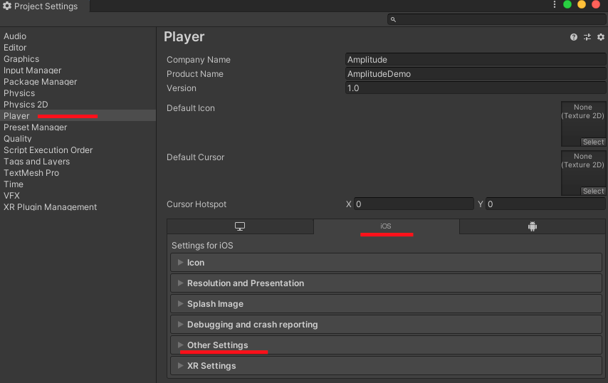
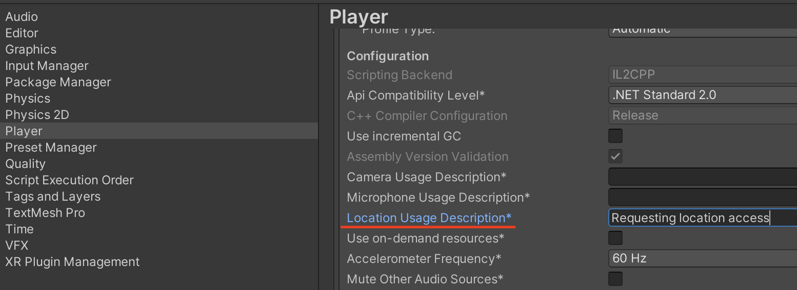
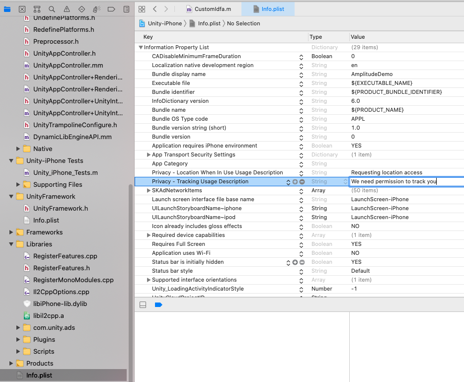

The Amplitude Analytics Unity SDK is a plugin to simplify the integration of Amplitude iOS and Android SDKs into your Unity project. This SDK works with Unity 2019.3.11 and higher.

!!!info "SDK Resources"
    - [Unity SDK Repository :material-github:](https://github.com/amplitude/unity-plugin)
    - [Unity SDK Releases :material-code-tags-check:](https://github.com/amplitude/unity-plugin/releases)

!!!note

    Unity SDK does not support pure desktop or Editor

    Remember to test your apps using the `Build Settings` for either Android or iOS, which links to their respective devices or emulators.

## Installation

### Option 1: Unity Package Manager

1. Make sure you have [Git](https://git-scm.com/) installed.
2. In Unity, click `Window > Package Manager`.
3. Click the plus **+** sign and select `Add package from Git URL`.
4. Enter `https://github.com/amplitude/unity-plugin.git?path=/Assets`, and then click **Add**.
5. The Unity editor imports the package from Git.

### Option 2: Manual download and add dependency

1. Download the latest [`amplitude-unity.unitypackage`](https://github.com/amplitude/unity-plugin/releases) from GitHub releases.
2. Double click `amplitude-unity.unitypackage` to import the package into your Unity project.

### [Android] Add obfuscation exception

Add this line in your Proguard rules file - proguard.pro.

```bash title="proguard.pro"
-keep class com.amplitude.unity.plugins.AmplitudePlugin { *; }
```

### Carrier information (optional)

Please refer to [this](https://developers.amplitude.com/docs/ios#carrier-information).

### 4. [Android] Dependencies management

Amplitude's `com.amplitude.android-sdk` is a transitive library, it doesn't include any other dependencies by itself. Other dependencies for `com.amplitude.android-sdk` are placed into `Assets/Plugins/Android`. Amplitude uses OkHttp, and the other dependencies you see are ones OkHttp depends on (for example, Okio or Jetbrain).

If by any chance you have OkHttp included in your project, feel free to choose not to include OkHttp and its related dependencies by unchecking them.

### [Android] Using `unity-jar-resolver`

Some users use `unity-jar-resolver` themselves. When they force resolve dependencies, it cleans up Amplitude-related jars. In this case, declare those dependencies in your `*Dependencies.xml` file.

Add Amplitude's native dependencies under `androidPackage` tag.

```xml title="*Dependencies.xml"
    <androidPackage spec="com.amplitude:android-sdk:2.25.2">
      <repositories>
        <repository>https://maven.google.com</repository>
      </repositories>
    </androidPackage>

    <androidPackage spec="com.squareup.okhttp3:okhttp:4.2.2">
      <repositories>
        <repository>https://maven.google.com</repository>
      </repositories>
    </androidPackage>

```

### [Android] API compatibility

Amplitude SDK depends on the OkHttp library. Since OkHttp v3.13 requires minimum version to be Android 5.0, Android Lollipop (API 21). [Read details here](https://developer.squareup.com/blog/okhttp-3-13-requires-android-5/).

Amplitude doesn't restrict which OkHttp version to use. For API 19, 20 (Android KitKat) to work, downgrade the OkHttp version to be lower than 3.13.

#### Android instructions

Change the version of OkHttp to be lower than 3.13.

#### Unity instructions

Import the library by copying the .jar file, you can downgrade OkHttp library by replacing it with a version lower than 3.13.
If you use google dependency resolver, update the dependency version for OkHttp in `*Dependency.xml` file.

### iOS Xcode troubleshooting

If Xcode doesn't let you use a simulator or device, it's because the Unity project must be configured to use either the Device SDK (real life devices) or the Simulator SDK (emulator).
 To change the settings for the build, select `Unity > Edit > Project Settings... > Player > iOS Tab`, open the dropdown menu Other Settings, scroll to **Configuration**, and select either value needed for the Target SDK field.

## Usage and examples

### Initialization

Initialization is necessary you can do instrumentation. The API key for your Amplitude project is required.

```c#
Amplitude amplitude = Amplitude.getInstance();
amplitude.setServerUrl("https://api2.amplitude.com");
amplitude.logging = true;
amplitude.trackSessionEvents(true);
amplitude.init("YOUR_API_KEY");
```

Optionally, you may send a string `instanceName` to `getInstance()`. This string is associated with all the settings of one `Amplitude` object.

```c#
Amplitude amplitude1 = Amplitude.getInstance("client_1");
Amplitude amplitude2 = Amplitude.getInstance("client_2");
//Settings changes in amplitude1 will not be reflected in amplitude2
Amplitude.getInstance("client_1") //this is the same reference as amplitude1
```

## EU data residency

Starting from version 2.4.0, you can configure the server zone after initializing the client for sending data to Amplitude's EU servers. SDK will switch and send data based on the server zone if it's set.
 The server zone configuration supports [dynamic configuration](../dynamic-configuration.md) as well.

For earlier versions, you need to configure the `serverURL` property after initializing the client.

!!!note

    For EU data residency, project need to be set up inside Amplitude EU and SDK initialized with api key from Amplitude EU first. This method won't work without proper set up first.

```c#
// For versions starting from 2.4.0
// No need to call setServerUrl for sending data to Amplitude's EU servers
amplitude.setServerZone(AmplitudeServerZone.EU);

// For earlier versions
amplitude.setServerUrl("https://api.eu.amplitude.com");
```

### Sending events

#### Basic events

Events represent how users interact with your application. For example, "Button Clicked" may be an action you want to note.

```c#
amplitude.logEvent("Button Clicked");
```

When running this in Unity, make sure that you have iOS or Android selected in the Build Settings under "Platform".

#### Events with properties

Events can also contain properties. They give context about the event taken. For example, "hover time" may be a relevant event property to "button click".

```c#
Dictionary<string, object> eventProps = new Dictionary<string, object>();
eventProps.Add("Hover Time", 10);
amplitude.logEvent("Button Clicked", eventProps);
```

### Set user properties

!!!warning  "Privacy and tracking"

    Please be sure to not track any user data that may be against your privacy terms. If you need any assistance with privacy concerns, then please reach out to our Platform team.

#### Identify

Identify is for setting the user properties of a particular user without sending any event. The Unity SDK supports the operations `setUserProperty`, `setOnce`, `add`, and `append` on individual user properties.
 Declare the operations via a provided Identify interface. Chain together multiple operations in a single Identify object. The Identify object is then passed to the Amplitude client to send to the server.

!!!info "Identify call"

    If the Identify call is sent after the event, the results of operations will be visible immediately in the dashboard user's profile area, but it will not appear in chart result until another event is sent after the Identify call. So the identify call only affects events going forward. More details [here](https://amplitude.zendesk.com/hc/en-us/articles/115002380567-User-Properties-Event-Properties#applying-user-properties-to-events).

#### Managing user identity

You can handle the identity of a user using the identify methods. Proper use of these methods can connect events to the correct user as they move across devices, browsers, and other platforms.
 Send an identify call containing those user property operation to Amplitude to tie a user's events with specific user properties.

##### `setUserProperty`

`setUserProperty` sets the value of a user property. You can also chain together multiple identify calls.

```c#
amplitude.setUserProperty("saw_page_a", true);
```

##### `setOnce`

`setOnce` sets the value of a user property only once. Subsequent calls using `setOnce` will be ignored.

```c#
amplitude.setOnceUserProperty("page_views", 50);
```

##### `add`

`add` increments a user property by some numerical value. If the user property doesn't have a value set yet, it's initialized to 0.

```c#
amplitude.addUserProperty("oranges", 5);
Dictionary<string, object> values = new Dictionary<string, object>();
values.Add("Key A", "Value A");
amplitude.addUserPropertyDict("user_facts", values);
```

### Setting multiple user properties

`logEvent()` method lets you set the user properties along with event logging. You can use `setUserProperties` as a shorthand to set multiple user properties at once. This method is a wrapper around `Identify.set`.

```c#
Dictionary<string, object> values = new Dictionary<string, object>();
values.Add("user_time", 100.5);
values.Add("engagement", true);
amplitude.setUserProperties(values);
```

#### Arrays in user properties

Arrays can be used as user properties. You can directly set arrays or use `append` to generate an array.

```c#
int[] arr = new int[] { 1, 2, 4, 8 };
amplitude.setUserProperty("user_running_times", arr);
```

##### `append`

`append` appends a value or values to a user property array. If the user property doesn't have a value set yet, it's initialized to an empty list before the new values are added.
 If the user property has an existing value and it's not a list, it will be converted into a list with the new value added.

```c#
amplitude.setUserProperty("stringArray", new string[]{"replace", "existing", "strings"});
amplitude.appendUserProperty("stringArray", new string[]{ "append", "more", "strings" });
```

##### Clearing user properties

`clearUserProperties` method is for clearing all user properties at one time.

!!!warning "Clearing user properties is irreversible"

    Amplitude will not be able to sync the user's user property values before the wipe to any future events that the user triggers as they will have been reset.

```c#
amplitude.clearUserProperties();
```

##### `unset`

`unset` unsets and removes a user property.

```c#
amplitude.unsetUserProperty("property_name_to_unset");
```

### Set user groups

--8<-- "includes/editions-growth-enterprise-with-accounts.md"

--8<-- "includes/groups-intro-paragraph.md"

!!!example

    This example shows a groupType "orgID" with a groupName of "15". The second line shows a groupType "sport" with "tennis" and "soccer" as groupNames.

    ```c#
    Amplitude.getInstance().setGroup("orgId", "15");
    Amplitude.getInstance().setGroup("sport", new JSONArray().put("tennis").put("soccer"));  // list values
    ```

You can also use `logEventWithGroups` to set event-level groups, meaning the group designation only applies for the specific event being logged and does not persist on the user unless you explicitly set it with `setGroup`:

```c#
JSONObjecteventProperties=newJSONObject().put("key", "value");
JSONObjectgroups=newJSONObject().put("orgId", 10);

Amplitude.getInstance().logEvent("initialize_game", eventProperties, groups);
```

### Track revenue

Amplitude can track revenue generated by a user. Revenue is tracked through distinct revenue objects, which have special fields that are used in Amplitude's Event Segmentation and Revenue LTV charts. This allows Amplitude to automatically display data relevant to revenue in the platform. Revenue objects support the following special properties, as well as user-defined properties through the `eventProperties` field.

Calling `logRevenue` generates up to 2 different event types in the platform:

- '[Amplitude] Revenue': This event is logged for all revenue events, regardless of whether verification is turned on.
- '[Amplitude] Revenue (Verified/Unverified)': These revenue events will contain the actual '$revenue' property.

You can't change the default names given to these client-side revenue events in the raw data but you do have the option to modify the [display name](https://help.amplitude.com/hc/en-us/articles/235649848#events). To learn more about tracking revenue, see our documentation [here](https://help.amplitude.com/hc/en-us/articles/115003116888).

| <div class="big-column">Name</div>  | Description  |
| --- | --- |
| `productId` | Optional. String. An identifier for the product. Amplitude recommends something like the "Google Play Store product ID". Defaults to `null`. |
| `quantity`| Required. Integer. The quantity of products purchased. Note: revenue = quantity * price. Defaults to 1. |
| `price` | Required. Double. The price of the products purchased, and this can be negative. Note: revenue = quantity * price. Defaults to `null`.|
| `revenueType` | Optional, but required for revenue verification. String. The type of revenue (e.g. tax, refund, income). Defaults to `null`. |
| `eventProperties`| Optional. Object. An object of event properties to include in the revenue event. Defaults to `null`. |

!!!info

    Price can be negative, which may be useful for tracking revenue lost (such as refunds or costs)

### Revenue verification

Because Unity supports both Android and iOS store, consult the proper documentation for revenue verification.
 Take a look at the [Android](https://developers.amplitude.com/docs/android) and [iOS/tvOS/macOS](https://developers.amplitude.com/docs/ios) documentation, and special instructions for the store (Android AIDL/Google Play Billing, Amazon Store, or iOS App Store).

```c#
amplitude.logRevenue(0.03);
amplitude.logRevenue("sku", 1, 1.99);
amplitude.logRevenue("sku", 1, 1.99, "cmVjZWlwdA==", null);
Dictionary<string, object> revenueProperties = new Dictionary<string, object>()
{
  {"car", "blue"},
  {"price", 12.99}
};
if (Application.platform == RuntimePlatform.IPhonePlayer) {
  amplitude.logRevenue("sku", 1, 1.99, "cmVjZWlwdA==", null, "purchase", revenueProperties);
} else if (Application.platform == RuntimePlatform.Android) {
  amplitude.logRevenue("sku", 1, 1.99, "receipt", "receiptSignature", "purchase", revenueProperties);
}
```

!!!note

    Amplitude doesn't support currency conversion. All revenue data should be normalized to your currency of choice before being sent.

### User sessions

A session on Android is a period of time that a user has the app in the foreground.

Amplitude groups events together by session. Events that are logged within the same session have the same `session_id`. Sessions are handled automatically so you don't have to manually call an API like `startSession()` or `endSession()`.

You can adjust the time window for which sessions are extended.

```c#
client.setMinTimeBetweenSessionsMillis(10000); //10 seconds
```

By default, '[Amplitude] Start Session' and '[Amplitude] End Session' events aren't sent. Even though these events aren't sent, sessions are still tracked by using `session_id`.
 To re-enable those session events, add this line before initializing the SDK.

```c#
Amplitude amplitude = Amplitude.Instance;
amplitude.trackSessionEvents(true);
amplitude.init("API_KEY");
```

You can also log events as out-of-session. Internally (in Amplitude dashboards), out-of-session events have a `session_id` of `-1` and aren't considered part of the current session, meaning they don't extend the current session.
 This might be useful if you are logging events triggered by push notifications, for example. You can log events as out-of-session by setting the input parameter `outOfSession` to true when calling `logEvent()`.

```c#
Dictionary<string, object> eventProps = new Dictionary<string, object>();
bool outOfSession = true;
client.logEvent("event out of session", eventProps, outOfSession);
```

### Advertising ID

Advertiser ID (also referred to as IDFA) is a unique identifier provided by the iOS and Google Play stores. Because it's unique to every person and not just their devices, IDFA is useful for mobile attribution. [Mobile attribution](https://www.adjust.com/blog/mobile-ad-attribution-introduction-for-beginners/) is the attribution of an installation of a mobile app to its original source (e.g. ad campaign, app store search).
 Mobile apps need permission to ask for IDFA, and apps targeted to children cannot track at all. Consider IDFV, device id, or an email login system as alternatives when IDFA is not available.

#### iOS setup

See setup instructions in [Unity iOS IDFA and GPS Setup](#ios-idfa-and-gps-setup).

#### Android setup

See setup instructions in the [Android SDK](android.md#advertising-id).

### Location Tracking

For location tracking, Amplitude converts the IP of a user event into a location (GeoIP lookup) by default. This information may be overridden by an app's own tracking solution or user data.
 Amplitude can access the Android location service (if possible) to add the specific coordinates (longitude and latitude) where an event is logged.

### Set custom user ID

If your app has its own login system that you want to track users with, you can call `setUserId` at any time.

```c#
Amplitude.Instance.setUserId("USER_ID");
```

You can also add the User ID as an argument to the init call.

```c#
Amplitude.Instance.init("API_KEY", "USER_ID");
```

Don't assign users a User ID that could change as each unique User ID is interpreted as a unique user in Amplitude.
 See [Track unique users in Amplitude](https://help.amplitude.com/hc/en-us/articles/115003135607-Track-unique-users-in-Amplitude) for more information.

## Advanced topics

### COPPA control

COPPA (Children's Online Privacy Protection Act) restrictions on IDFA, IDFV, city, IP address and location tracking can be enabled or disabled all at once.
 Remember that apps asking for information from children under 13 years of age must comply with COPPA.

```c#
client.enableCoppaControl();
```

### Opt out of tracking

Users may wish to opt out of tracking entirely, which means no events and no records of their browsing history. This API provides a way to fulfill certain users' requests for privacy.

```c#
client.setOptOut(true); //No events will be tracked for this user
```

### Dynamic configuration

Unity SDK allows users to configure their apps to use [dynamic configuration](../dynamic-configuration.md). This feature finds the best Amplitude server URL automatically based the user's location.

- If you have your own proxy server and use `setServerUrl` API, don't use dynamic configuration.
- If you have users in Mainland China, we recommend that you use dynamic configuration.
- By default, this feature is off. You must explicitly enabled it to use it.
- By default, this feature returns server URLs for Amplitude's US servers, if you need to send data to Amplitude's EU servers, please use `setServerZone` to set it to EU zone.

```c#
amplitude.setUseDynamicConfig(true);
```

## iOS IDFA and GPS setup

This section walks through the process to give Unity SDK users access to IDFA (advertiser ID) and GPS coordinate data in their logged events.

### Considerations

- This functionality wasn't included in the Unity SDK because the Apple App Store flags any app that uses IDFA code, even if the code is disabled or sourced from a third-party SDK developer like Amplitude.
- Consider alternatives to IDFA. Do not assume users will enable IDFA tracking; opt-in systems engage less. Use device id, IDFV, or pass your own app's email login system as a custom user property.
- You can edit the Objective-C iOS logic to fetch IDFA and GPS data. However, the current code was written to handle permissions, and accurately update the IDFA and GPS data within the SDK when the app user gives permissions.

### Setup

!!!note  "iOS App Store compliance"

   If an app is subject to COPPA because it is aimed toward children, the app cannot contain any IDFA or GPS tracking code whatsoever. This is why the IDFA and GPS code is packaged separately and requires this setup.

First, take the [two files](https://github.com/amplitude/unity-plugin/tree/main/IdfaIOS) `unity-plugin/IdfaIOS/CustomIdfa.m` and `unity-plugin/IdfaIOS/CustomGPS.m` and place them into `Assets/Scripts`.
 You may place the file wherever, but check all the `#import` statements lead to correct paths.

In the imports section (the top) of your `.cs` game script, add this import:

```c#
#if (UNITY_IPHONE || UNITY_TVOS)
using System.Runtime.InteropServices;
#endif
```

Inside the game class, add the following code inside your MonoBehaviour class, or any other class.

```c#
public class AmplitudeDemo : MonoBehaviour {

#if (UNITY_IPHONE || UNITY_TVOS)
    [DllImport ("__Internal")]
    private static extern void setIdfaBlock(string instanceName);
    [DllImport ("__Internal")]
    private static extern void setLocationInfoBlock(string instanceName);
#endif
```

Finally, in your game code, probably in `void Start()`, call these functions. `YOUR_INSTANCE_NAME` is a string associated with this particular instance of Amplitude. `YOUR_INSTANCE_NAME` may also be null or an empty string.

```c#
Amplitude amplitude = Amplitude.getInstance("YOUR_INSTANCE_NAME");
amplitude.init("e7177d872ff62c0356c973848c7bffba"); //API key

#if (UNITY_IPHONE || UNITY_TVOS)
    setLocationInfoBlock("YOUR_INSTANCE_NAME");
    setIdfaBlock("YOUR_INSTANCE_NAME");
#endif
```

These functions prompt the iOS user to accept or reject permissions for GPS location tracking, as well as IDFA tracking.

Furthermore, your Unity app needs two special configurations.\
For location, please navigate to `Unity > Edit > Project Settings...`. The menu in the first image below will pop up. Select `Player`, then click the `iOS` tab. Click `Other Settings`, and scroll until the field `Location Usage Description`. Type a sentence that prompts the user for GPS tracking permissions into the textbox.




!!!note "Xcode Simulator"

   IDFA tracking permissions can generally only be tested reliably on real life phones.

For IDFA, the file `Info.plist` has to be edited according to Apple's specifications. This can be done with a Unity script with [guidance from this Unity post](https://forum.unity.com/threads/how-can-you-add-items-to-the-xcode-project-targets-info-plist-using-the-xcodeapi.330574/).

Also, when the app is compiled into iOS and launches into xcode, find the top-level file `Info.plist`. Click the plus symbol next to any key value pair. Use the xcode editor to find the key `Privacy - Tracking Usage Description`, ensure the Type is String, and type a prompt to ask for tracking permission in the Value field.



## Report issues

If you have any problems with the SDK, create [create a GitHub issue](https://github.com/amplitude/unity-plugin/issues/new).

--8<-- "includes/abbreviations.md"
