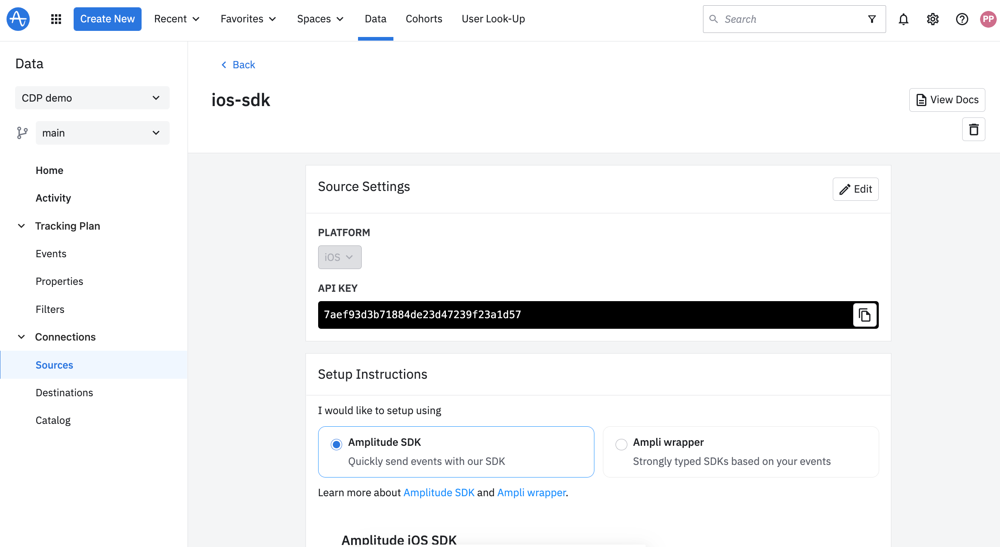

Looking to consolidate on Amplitude for both your Analytics 

This document covers the necessary steps to create a source in Amplitude and update SDK instrumentation to send events to Amplitude.

| Segment      | Amplitude |
| ----------- | ----------- |
| Connections      | Sources & Destinations |
| Personas   | Audiences |
| Protocols | Data Management |

How to migrate your Sources and Destinations from the Segment?

How to migrate your instrumentation from Segment SDK to Amplitude SDK?

# Setting up Source in Amplitude

In your Amplitude Account, navigate to Data

Pick the project in the project dropdown on the top left or create new project

Navigate to Sources → Add Source

Pick the SDK source to add. Give a name and press create.

Find the API KEY to use and setup instructions

# Updating the SDK implementation

Both Segment and Amplitude SDKs are meant to capture first party data by tracking user interactions. For the most part both work pretty similarly except some nuances around syntax. Here is high level mapping of concepts between Segment & Amplitude.

| Segment                           | Amplitude            | Notes                                                                                                                                                                                                                   |
|-----------------------------------|----------------------|-------------------------------------------------------------------------------------------------------------------------------------------------------------------------------------------------------------------------|
| write_key                         | api_key              | Unique key to validate source of the data.                                                                                                                                                                              |
| Workspace                         | Project              |                                                                                                                                                                                                                         |
| User                              | User                 | User who is performing action.                                                                                                                                                                                          |
| Identify                          | Identify             | Identify updates properties/attributes of the user without logging an event.                                                                                                                                            |
| Track, Screen, Page View          | Event                | Event in Amplitude tracks the action user is performing.                                                                                                                                                                |
| Group                             | Group                | Group is a collection of users. In Amplitude one user could belong to multiple groups. Each group can have properties/attributes that will be available to query/forward on actions performed by any user in the group. |
| Device mode, Middleware, Plug-ins | Middleware, Plug-ins | Middleware / Plug-ins lets you extend Amplitude by running a sequence of custom code on every event.                                                                                                                    |

# Browser SDK
# [Browser SDK](./sdks/typescript-browser/index)

|          | Segment                                                                                                                                                                                                            | Amplitude                                                                                                                                                                                                                                                                                                                                                                                               |
|----------|--------------------------------------------------------------------------------------------------------------------------------------------------------------------------------------------------------------------|---------------------------------------------------------------------------------------------------------------------------------------------------------------------------------------------------------------------------------------------------------------------------------------------------------------------------------------------------------------------------------------------------------|
| Identify | analytics.identify('12091906-01011992', {   name: 'Grace Hopper',   email: 'grace@usnavy.gov' });                                                                                                                  | setUserId('12091906-01011992'); const identifyObj = new Identify(); identifyObj.set('name', 'Grace Hopper'); identifyObj.set('email', 'grace@usnavy.gov'); identify(identifyObj);                                                                                                                                                                                                                       |
| Track    | analytics.track('Article Completed', {   title: 'How to Create a Tracking Plan',   course: 'Intro to Analytics', });                                                                                               | track('Article Completed', {   title: 'How to Create a Tracking Plan',   course: 'Intro to Analytics', });                                                                                                                                                                                                                                                                                              |
| Group    | analytics.group('UNIVAC Working Group', {   principles: ['Eckert', 'Mauchly'],   site: 'Eckert–Mauchly Computer Corporation',   statedGoals: 'Develop the first commercial computer',   industry: 'Technology' }); | setGroup('Working Group', 'UNIVAC'); const groupIdentifyObj = new Identify() groupIdentifyObj.set('principles', ['Eckert', 'Mauchly']); groupIdentifyObj.set('site', 'Eckert–Mauchly Computer Corporation'); groupIdentifyObj.set('statedGoals', 'Develop the first commercial computer'); groupIdentifyObj.set('industry', 'Technology'); groupIdentify('Working Group', 'UNIVAC' , groupIdentifyObj); |

# iOS SDK

|          | Segment                                                                         | Amplitude                                                                                                                                                                                                                                                          |
|----------|---------------------------------------------------------------------------------|--------------------------------------------------------------------------------------------------------------------------------------------------------------------------------------------------------------------------------------------------------------------|
| Identify | Analytics.shared().identify("abc", traits: ["email": "abc@domain.com"])         | Amplitude.instance().setUserId("abc") let identify = AMPIdentify()     .set("email", value: "female")     .set("age",value: NSNumber(value: 20)) Amplitude.instance().identify(identify)                                                                           |
| Track    | Analytics.shared().track("Button Clicked", properties: ["Hover Time": "100ms"]) | Amplitude.instance().logEvent("Button Clicked", withEventProperties: ["Hover Time": "100ms"] )                                                                                                                                                                     |
| Group    | Analytics.shared().group("OrgName-xyz", traits: ["plan": "enterprise"])         | Amplitude.instance().setGroup("orgName", groupName:NSString(string:"xyz")) let identify = AMPIdentify()     .set("plan", value: "enterprise") Amplitude.instance().groupIdentifyWithGroupType("orgName", groupName:NSString(string:"xyz"), groupIdentify:identify) |

# Android SDK

|          | Segment                                                                                    | Amplitude                                                                                                                                     |
|----------|--------------------------------------------------------------------------------------------|-----------------------------------------------------------------------------------------------------------------------------------------------|
| Identify | Analytics.with(context).identify("abc", Traits().putEmail("abc@domain.com"), null)         | amplitude.setUserId("abc") val identify = Identify() identify.set("email", "abc@domain.com") amplitude.identify(identify)                     |
| Track    | Analytics.with(context).track("Product Viewed", Properties().putValue("name", "Moto 360")) | amplitude.track(     "Product Viewed",     mutableMapOf<String, Any?>("name" to "Moto 360") )                                                 |
| Group    | Analytics.with(context).group("abc", "orgName-xyz", Traits().putplan("enterprise"))        | amplitude.setGroup("orgName", "xyz"); val identify = Identify().set("plan", "enterprise") amplitude.groupIdentify("orgName", "xyz", identify) |

Please use the following quickstart guide to get started with the Amplitude SDKs. Please choose your target platform specific instructions.
