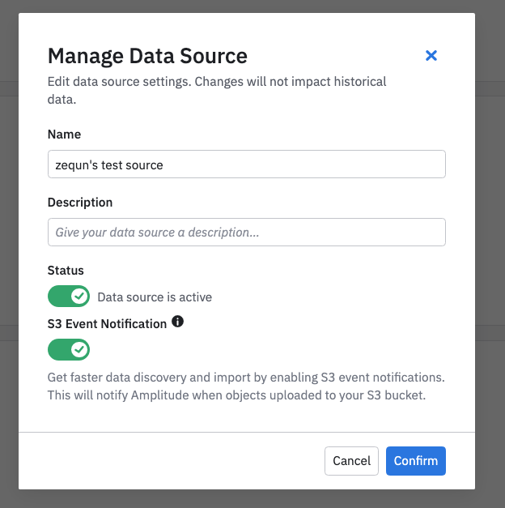
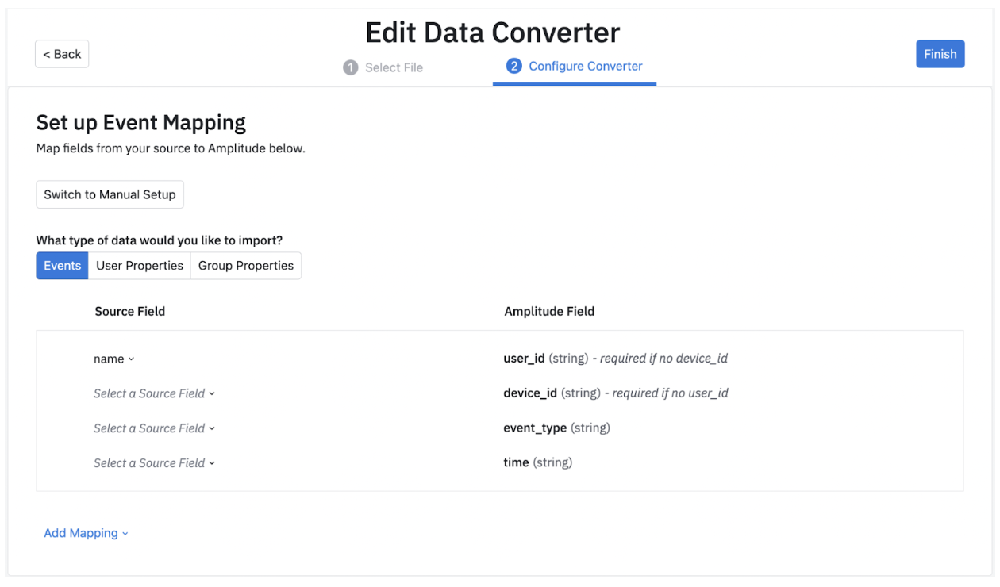
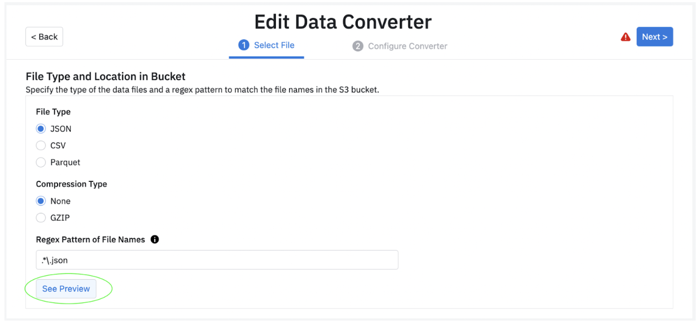
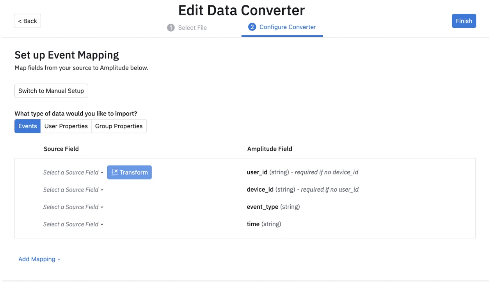
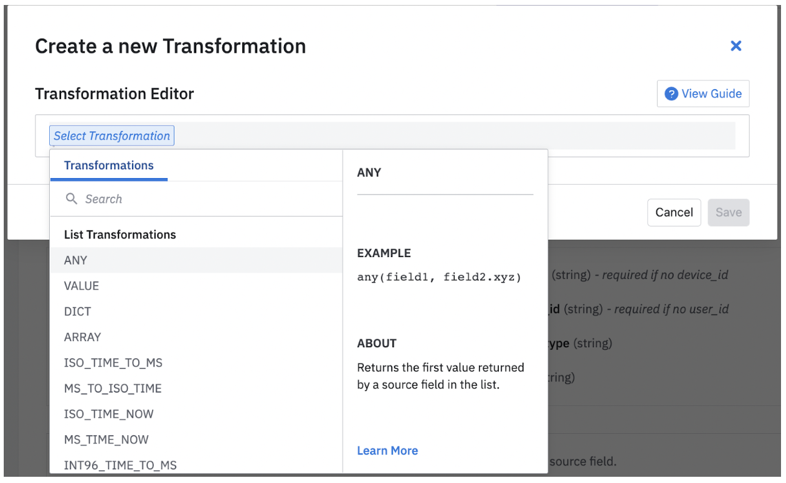
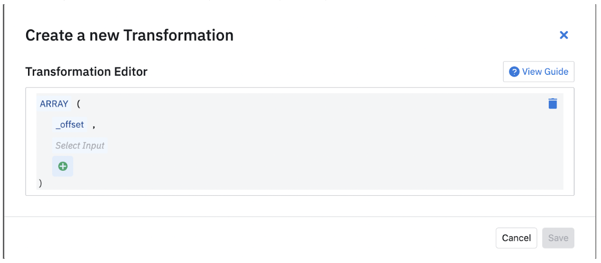
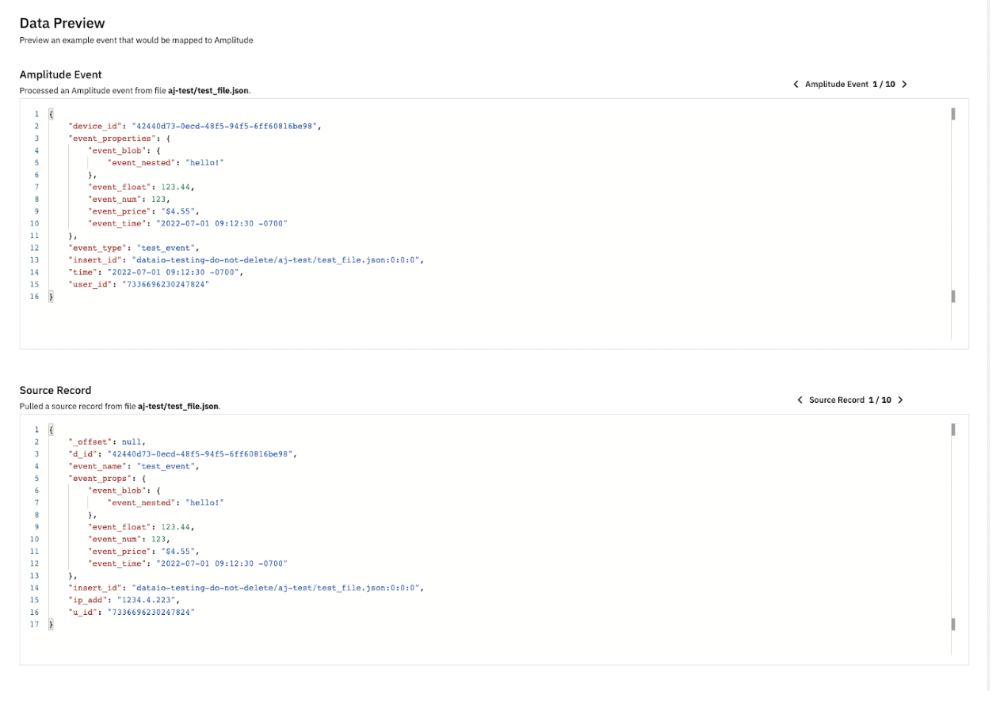

With Amplitude’s Amazon S3 Import, you can import event, group properties, or user properties into your Amplitude projects from an AWS S3 bucket.
 Use Amazon S3 Import to backfill large amounts of existing data, connect existing data pipelines to Amplitude, and ingest large volumes of data where you need high throughput and latency is less sensitive.

--8<-- "includes/editions-all-editions.md"

!!!note "Other Amplitude + Amazon S3 Integrations"

    This integration imports Amazon S3 data into Amplitude. Amplitude offers two other integrations with Amazon S3: 

    - [Send cohorts to Amazon S3](/data/destinations/amazon-s3-cohort)
    - [Send raw event data to Amazon S3 ](/data/destinations/amazon-s3)

During setup, you configure conversion rules to control how events are instrumented.
 After Amazon S3 Import is set up and enabled, Amplitude's ingestion service continuously discovers data files in S3 buckets and then converts and ingest events.

Amazon S3 Import setup has four main phases:

1. Examine your existing dataset.
2. Add a new Amazon S3 Import source in Amplitude.
3. Set up converter configuration.
4. Test.

## Getting started

### Prerequisites

Before you start, make sure you’ve taken care of some prerequisites.

- Make sure you have admin permissions for your Amplitude org.
- Make sure that a project exists to receive the data. If not, create a new project.
- Make sure your S3 bucket has data files ready for Amplitude to ingest. They must conform to the mappings that you outline in your converter file.

Before you can ingest data, review your dataset and consider best practices. Make sure your dataset contains the data you want to ingest, and any required fields.

### File requirements

The files you want to send to Amplitude must follow some basic requirements.

- Files contain events, with one event per line.
- Files are uploaded approximately in the events’ chronological order.
- Filenames are unique.
- The file wasn't ingested by the S3 import yet. After a file has been ingested by a S3 import source, the same S3 import source won’t process the file again, even if the file is updated.
- File size shall be greater than 1MB and smaller than 1GB.
- Files are compressed or uncompressed JSON, CSV, or parquet files.

### Limits

For each Amplitude project, AWS S3 import can ingest:

- Up to 50 files per second.
- Up to 30k events per second.

### Deduplication with `insert_id`

Amplitude uses a unique identifier, `insert_id`, to match against incoming events to prevent duplicates. If a new event with a specific `insert_id` is uploaded to Amplitude within 7 days of a previous event with the same `insert_id`, Amplitude drops the new event.

Amplitude highly recommends that you set a custom `insert_id` for each event to prevent duplication. To set a custom `insert_id`, create a field that holds unique values, like random alphanumeric strings, in your dataset. Map the field as an additional property named `insert_id` in the guided converter configuration.

## Set up Amazon S3 Import in Amplitude

When your dataset is ready for ingestion, you can set up Amazon S3 Import in Amplitude.

### Give Amplitude access to your S3 bucket

Follow these steps to give Amplitude read access to your AWS S3 bucket.

1. Create a new IAM role, for example: `AmplitudeReadRole`.
2. Go to **Trust Relationships** for the role and add Amplitude’s account to the trust relationship policy to allow Amplitude to assume the role. Using the following example, and update **{{}}** in highlighted text. 

    - **{{amplitude_account}}**: `358203115967` for Amplitude US data center. `202493300829` for Amplitude EU data center. 
    - **{{external_id}}**: unique identifiers used when Amplitude assumes the role. You can generate it with help from [third party tools](https://www.uuidgenerator.net/). Example external id can be `vzup2dfp-5gj9-8gxh-5294-sd9wsncks7dc`.

    ``` json hl_lines="7 12"
    {
      "Version": "2012-10-17",
      "Statement": [
        {
          "Effect": "Allow",
          "Principal": {
            "AWS": "arn:aws:iam::{{amplitude_account}}:root"
          },
          "Action": "sts:AssumeRole",
          "Condition": {
            "StringEquals": {
              "sts:ExternalId": "{{external_id}}"
            }
          }
        }
      ]
    }
    ```

3. Create a new IAM policy, for example, `AmplitudeS3ReadOnlyAccess`. Use the entire example code that follows, but be sure to update **{{}}** in highlighted text.

    - **{{bucket_name}}**: the s3 bucket name where your data is imported from.
    - **{{prefix}}**: the prefix of files that you want to import, for example `/prefix`. For folders, make sure prefix ends with `/`. But for root folder, keep prefix as empty.

    ```json hl_lines="16 30 41"
    {
      "Version":"2012-10-17",
      "Statement":[
        {
          "Sid":"AllowListingOfDataFolder",
          "Action":[
            "s3:ListBucket"
          ],
          "Effect":"Allow",
          "Resource":[
            "arn:aws:s3:::{{bucket_name}}"
          ],
          "Condition":{
            "StringLike":{
              "s3:prefix":[
                "{{prefix}}*"
              ]
            }
          }
        },
        {
          "Sid":"AllowAllS3ReadActionsInDataFolder",
          "Effect":"Allow",
          "Action":[
            "s3:Get*",
            "s3:List*"
          ],
          "Resource":[
            "arn:aws:s3:::{{bucket_name}}{{prefix}}*"
          ]
        },
        {
          "Sid":"AllowUpdateS3EventNotification",
          "Effect":"Allow",
          "Action":[
            "s3:PutBucketNotification",
            "s3:GetBucketNotification"
          ],
          "Resource":[
            "arn:aws:s3:::{{bucket_name}}"
          ]
        }
      ]
    }
    ```
   
4. Go to **Permissions** for the role. Attach the policy created in step3 to the role.

### Create Amazon S3 import source

In Amplitude, create the S3 Import source.

!!!tip "Use a test project"

    We recommend first loading your data into an Amplitude test project, so you can make adjustments before loading data into your production project.

To create the data source in Amplitude, gather information about your S3 bucket:

- IAM role ARN: The IAM role that Amplitude uses to access your S3 bucket. This is the role created in [Give Amplitude access to your S3 bucket](#give-amplitude-access-to-your-s3-bucket).
- IAM role external id: The external id for the IAM role that Amplitude uses to access your S3 bucket.
- S3 bucket name: The name of the S3 bucket with your data.
- S3 bucket prefix: The S3 folder with your data.
- S3 bucket region: The region where S3 bucket was created.

When you have your bucket details, create the Amazon S3 Import source.

1. In Amplitude Data, click **Catalog** and select the **Sources** tab.
2. In the Warehouse Sources section, click **Amazon S3**.
3. Select **Amazon S3**, then click **Next**. If this source doesn’t appear in the list, contact your Amplitude Solutions Architect.
4. Complete the **Configure S3 location** section on the Set up S3 Bucket page:

    - **Bucket Name**: Name of bucket you created to store the files. For example, `com-amplitude-vacuum-<customername>.` This tells Amplitude where to look for your files.
    - **Prefix**: Prefix of files to be imported. If it's a folder, prefix must end with "/". For example, dev/event-data/. For root folder, leave it as empty.
    - **AWS Role ARN**. Required.
    - **AWS External ID**. Required.
5. Optional: enable **S3 Event Notification**. See [Manage Event Notifications](#optional-manage-event-notifications) for more information.
6. Click **Test Credentials** after you’ve filled out all the values. You can’t edit these values from the UI after you create the source, so make sure that all the info is correct before clicking **Next**.
7. From the Enable Data Source page, enter a **Data Source Name** and a **Description** (optional) and save your source. You can edit these details from Settings.

A banner confirms you’ve created and enabled your source. Click **Finish** to go back to the list of data sources. Next, you must create your converter configuration.

Amplitude continuously scans buckets to discover new files as they're added. Data is available in charts within 30 seconds of ingestion.

### Optional: Manage event notifications

Event Notification lets the Amplitude ingestion service discover data in your S3 bucket faster.
 Compared to the current approach of scanning buckets, it discovers new data based on notifications published by S3. This feature reduces the time it takes to find new data.

Use this feature if you want to achieve near real-time import with Amplitude Amazon S3 import. Usually, Amplitude discovers new data files within 30 seconds.

#### Considerations

- The IAM role used must have required permission to configure S3 bucket event notifications.
- The bucket can’t already have existing event notifications This is a limitation on the Amazon S3 side.
- The notifications only apply to files uploaded after you enable event notifications.

To enable the feature, you can either enable it when you create the source, or manage the data source and toggle **S3 Event Notification**.



## Create the converter configuration

Your converter configuration gives the S3 vacuum this information:

- A pattern that tells Amplitude what a valid data file looks like. For example:**“\\w+\_\\d{4}-\\d{2}-\\d{2}.json.gz”**
- Whether the file is compressed, and if so, how.
- The file’s format. For example: CSV (with a particular delimiter), or lines of JSON objects.
- How to map each row from the file to an Amplitude event.

### Guided converter creation

You can create converters via Amplitude's new guided converter creation interface. This lets you map and transform fields visually, removing the need to manually write a JSON configuration file. Behind the scenes, the UI compiles down to the existing JSON configuration language used at Amplitude.

First, note the different data types you can import: **Event**, **User Property** and **Group Property** data.



**Note: Amplitude recommends selecting preview in step 1 of the Data Converter, where you see a sample source record before moving to the next step.**



After you have selected a particular field, you can choose to transform the field in your database. You can do this by clicking **Transform** and choosing the kind of transformation you would like to apply. You can find a short description for each transformation.



After you select a field, you can open the transformation modal and choose from a variety of Transformations.



Depending on the transformation you select, you may be prompted to include more fields. 



After you have all the fields needed for the transformation, you can save it. You can update these fields as needed when your requirements change.

You can include more fields by clicking the **Add Mapping** button. Here Amplitude supports 4 kinds of mappings: Event properties, User Properties, Group Properties and Additional Properties. 

After you have added all the fields you wish to bring into Amplitude, you can view samples of this configuration in the Data Preview section. Data Preview automatically updates as you include or remove fields and properties. In Data Preview, you can look at a few sample records based on the source records along with how that data is imported into Amplitude. This ensures that you are bringing in all the data points you need into Amplitude. You can look at 10 different sample source records and their corresponding Amplitude events.



!!!note
    The group properties import feature requires that groups are set in the [HTTP API event format](../../analytics/apis/http-v2-api.md). The converter expects a `groups` object and a `group_properties` object.
### Manual converter creation

The converter file tells Amplitude how to process the ingested files. Create it in two steps: first, configure the compression type, file name, and escape characters for your files.
 Then use JSON to describe the rules your converter follows.

The converter language describes extraction of a value given a JSON element. You specify this with a SOURCE_DESCRIPTION, which includes:

- BASIC_PATH
- LIST_OPERATOR
- JSON_OBJECT

!!!example "Example converters"

    See the [Converter Configuration reference](/data/converter-configuration-reference) for more help.

<!--See a collection of [example converters on GitHub](https://github.com/Amplitude-Developer-Docs/flexible-ingestion-examples/blob/main/README.md) to get inspired. -->

### Configure converter in Amplitude

1. Click **Edit Import Config** to configure the compression type, file name, and escape characters for your files. The boilerplate of your converter file pre-populates based on the selections made during this step. You can also test whether the configuration works by clicking **Pull File**.
2. Click **Next**.
3. Enter your converter rules in the text editor.
4. Test your conversion. Click **Test Convert**. Examine the conversion preview. Make adjustments to your converter configuration as needed.
5. Click **Finish**.

!!!note

    If you add new fields or change the source data format, you need to update your converter configuration. Note that the updated converter only applies to files `discovered_after_converter` updates are saved.

## Enable the source

After you’ve created the S3 Import source and the converter configuration, you must enable the source to begin importing data.

To enable the source:

1. Navigate to the source’s page, and click the **gear** icon to manage the data source.
2. Toggle **Status** to active.
3. Confirm your changes.
