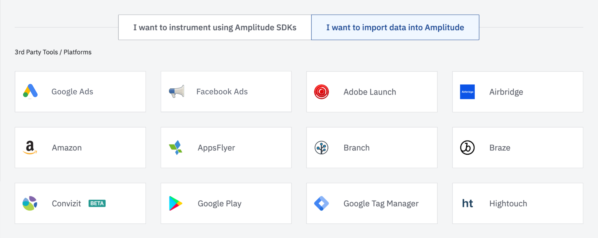
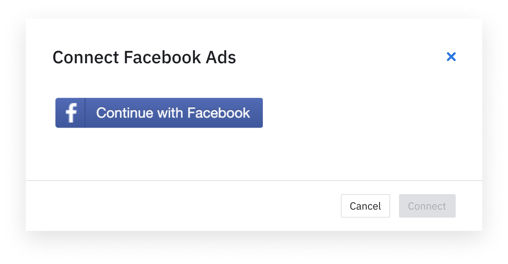
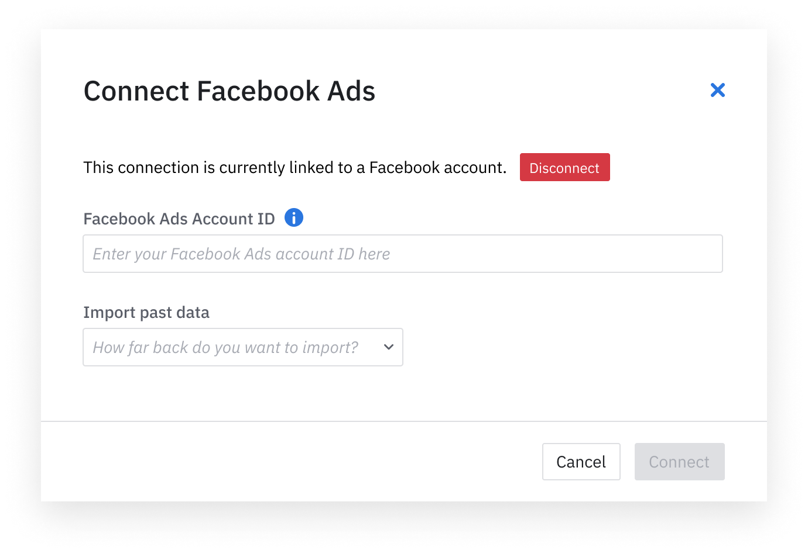
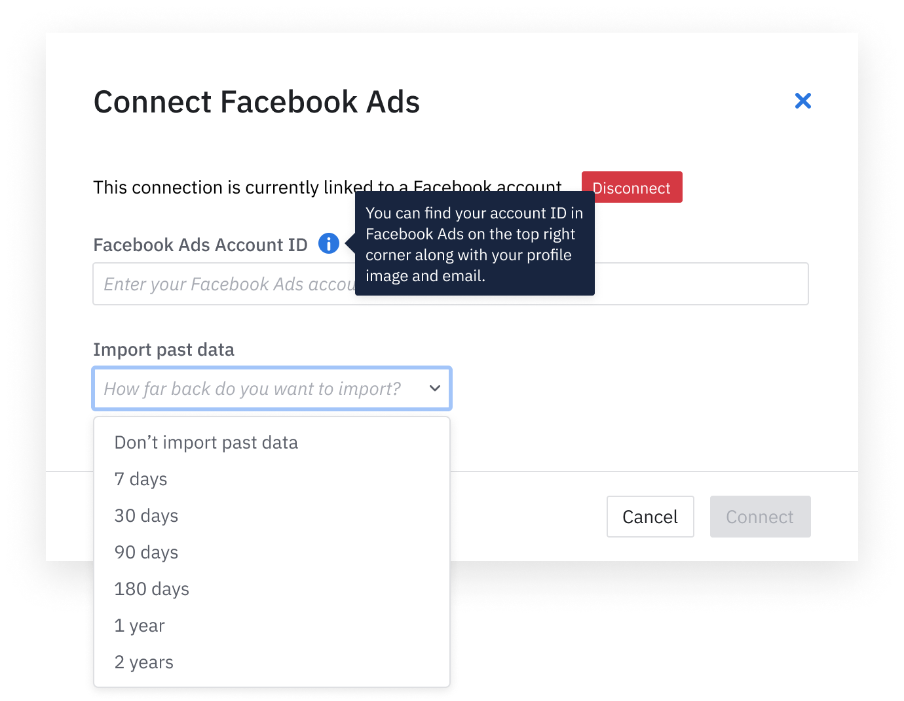

Amplitude Data's Facebook Ads integration lets you import your Facebook Ad spend, click and impression data with just a few clicks.

--8<-- "includes/closed-beta.md"

## Setup

### Prerequisites

To set up, you need the following: 

- `Facebook Ads Account ID` of the ad account you would like imported (https://www.facebook.com/business/help/1492627900875762)

### Amplitude setup 

1. In Amplitude, navigate to **Data Sources**, then find **Facebook Ad** in the **I want to import data into Amplitude** tab.

!!! note 
    This integration must be enabled on a per-project basis.

2. Log into Facebook and grant Amplitude permission in the consent form.

3. Enter the `Facebook Ads Account ID` for the ad account you would like to sync the data from.

4. [Optional] You also have the option to do a one time import on the historical data in the time period of your choice.

