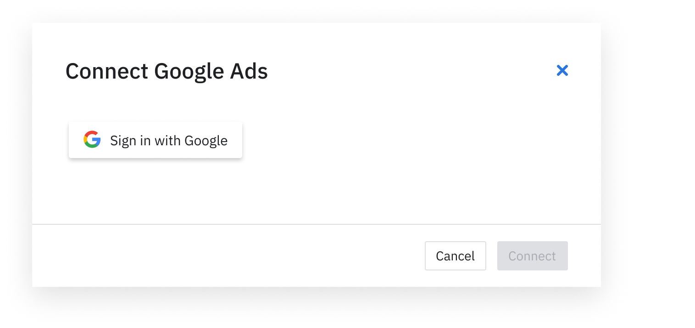
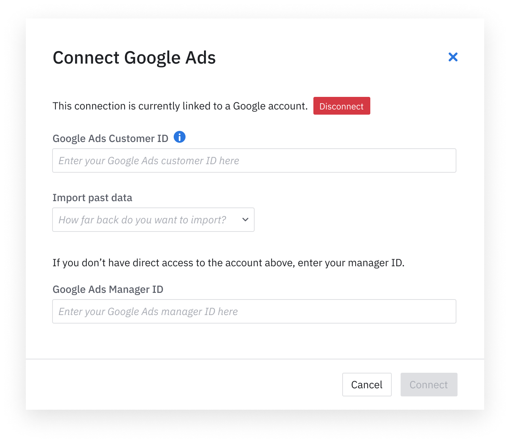

Amplitude Data's Google Ads integration lets you import your Google Ad spend, click and impression data with just a few clicks.

--8<-- "includes/closed-beta.md"

## Setup

### Prerequisites

To set up, you need the following: 

- `Google Ads customer ID` of the ad account you would like imported (https://support.google.com/google-ads/answer/1704344?hl=en)

### Amplitude setup 

1. In Amplitude, navigate to **Data Sources**, then find **Google Ad** in the **I want to import data into Amplitude** tab.

!!! note 
    This integration must be enabled on a per-project basis.

2. Log into Google and grant Amplitude permission in the consent form.

3. Enter the `Google Ads Account ID` for all the ad accounts you would like to sync the data.

4. [Optional] You also have the option to do a one time iimport on the historical data in the time period of your choice.

