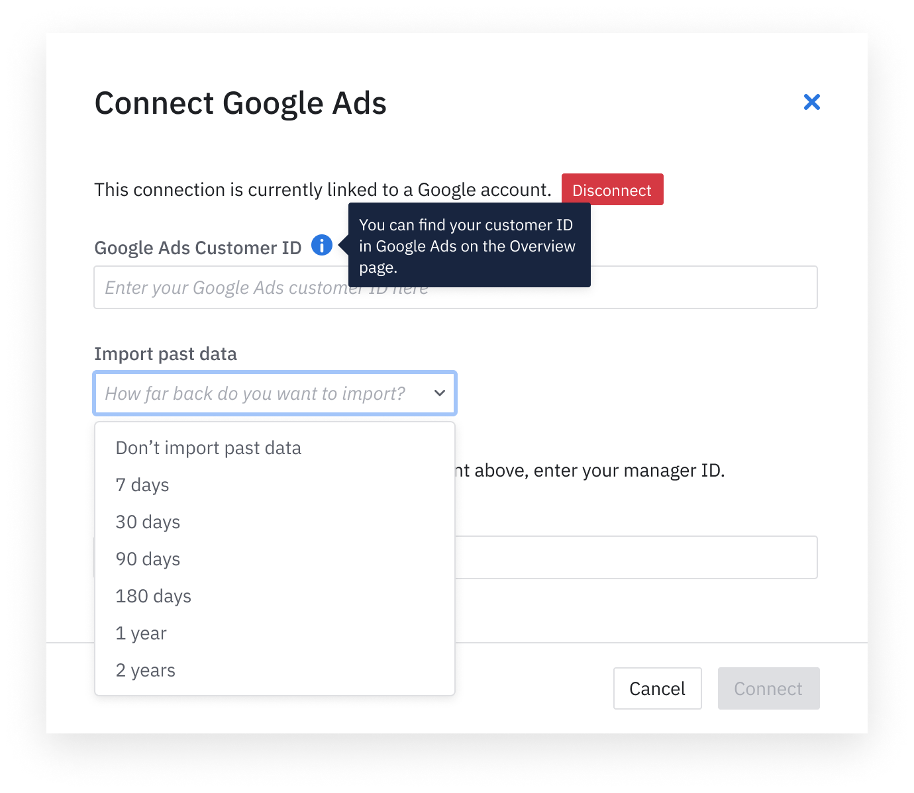

Amplitude Data's Google Ads integration lets you import your Google Ad spend, click, and impression data in just a few steps.

--8<-- "includes/closed-beta.md"

## Setup

### Prerequisites

To set up, you need the following: 

- [Google Ads Customer ID](https://support.google.com/google-ads/answer/1704344?hl=en) of the ad account you want to connect to.
- If you don't have direct access to the account, `Google Ads Manager ID` that you authorized access on which can view this ad account.

### Amplitude setup 

1. In Amplitude, navigate to **Data Sources**, then find **Google Ad** in the **I want to import data into Amplitude** tab.

!!! note 
    This integration must be enabled on a per-project basis.

2. Log into Google and grant Amplitude permission in the consent form.

3. Enter the `Google Ads Customer ID` for the ad account you would like to sync the data from.

4. If you don't have direct access to the account, enter the `Manager ID` that you authorized access on which can view this ad account.  Otherwise, just leave the field as blank.
5. [Optional] You also have the option to do a one time import on the historical data in the time period of your choice.

