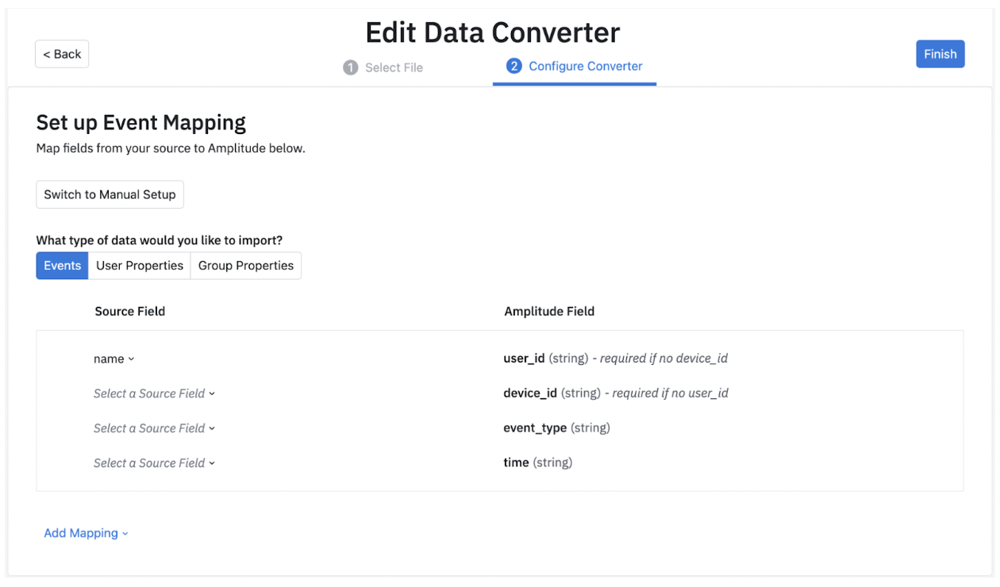
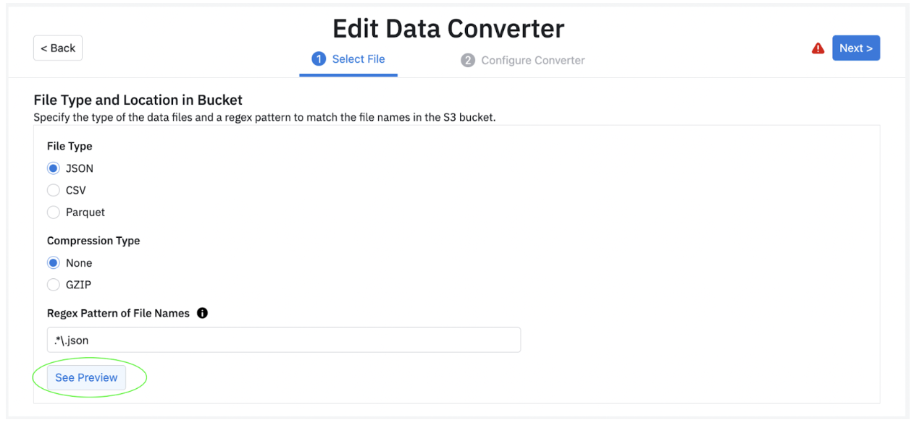
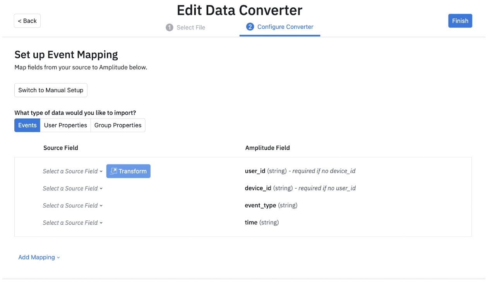

Amplitude's GCS Import feature lets you import event or user properties into your Amplitude projects from an GCS bucket. This article helps you quickly configure this data source within Amplitude.

--8<-- "includes/editions-all-paid-editions.md"

!!!note "Other Amplitude + Google Cloud Storage Integrations"

    This integration imports GCS data into Amplitude. Amplitude offers other integrations with Google Cloud Storage: 

    - [Send Amplitude Events to Google Cloud Storage](/data/destinations/google-cloud-storage)

## Getting started

### Prerequisites

Before you start, make sure you’ve taken care of some prerequisites.

- Make sure you have admin permissions for your Amplitude org.
- Make sure you have a GCS service account with the appopriate permissions. [Learn more](#create-a-gcs-service-account-and-set-permissions).
- Make sure that a project exists to receive the data. If not, create a new project.
- Make sure your GCS bucket has data files ready to be ingested. They must conform to the mappings that you outline in your converter file.
- Make sure the data in your GCS bucket follows the format outlined in [Amplitude's HTTP API v2 spec](https://developers.amplitude.com/docs/http-api-v2#keys-for-the-event-argument).

### Create a GCS service account and set permissions

If you haven't already, please [create a service account](https://cloud.google.com/iam/docs/creating-managing-service-account-keys) for Amplitude within the Google Cloud console. This will allow Amplitude to export your data to your Google Cloud project.

After you create a service account, generate and download the service account key file and upload it to Amplitude. **Make sure you export Amplitude's account key in JSON format**.

Add this service account as a member to the bucket you'd like to export data to and give this member the **storage admin** role to make sure Amplitude has the necessary permissions to export the data to your bucket.

You can also create your own role, if you prefer.

Keep in mind that the export process requires, at a minimum, the following permissions:

- `storage.buckets.get`
- `storage.objects.get`
- `storage.objects.create`
- `storage.objects.delete`
- `storage.objects.list`

## Add a new GCS Source

To add a new GCS data source for Amplitude to draw data from, follow these steps:

1. In Amplitude, navigate to *Data Sources* and select the desired project from the dropdown menu. Then click **I want to import data into Amplitude.**
2. Select *GCS*. If this source doesn't appear in your list, please contact the Amplitude team.
3. Upload your Service Account Key file. This gives Amplitude the permissions to pull data from your GCS bucket. You can find the permissions you need to give to the GCS Service Account[here](https://help.amplitude.com/hc/en-us/articles/360061685151#create-a-gcs-service-account-and-set-permissions).
4. After you've uploaded the Service Account Key file, enter the bucket name and folder where the data resides.
5. Click **Next** to test the credentials. If all your information checks out, Amplitude will display a success message. Click *Next >* to continue the process.
6. In the *Enable Data Source* panel, name your data source and give it a description. (You can edit this information later, via *Settings*.) Then click *Save Source*. Amplitude will confirm you've created and enabled your source.
7. Click *Finish* to go back to the list of data sources. If you've already configured the converter, the data import will start momentarily. Otherwise, it's time to create your data converter.

## Create the converter configuration

The final step in setting up Amplitude's GCS ingestion source is creating the converter file. Your converter configuration gives the integration this information:

- A pattern that tells Amplitude what a valid data file looks like. For example:**“\\w+\_\\d{4}-\\d{2}-\\d{2}.json.gz”**
- Whether the file is compressed, and if so, how.
- The file’s format. For example: CSV (with a particular delimiter), or lines of JSON objects.
- How to map each row from the file to an Amplitude event.

The converter file tells Amplitude how to process the ingested files. Create it in two steps: first, configure the compression type, file name, and escape characters for your files.
 Then use JSON to describe the rules your converter follows.

### Guided Converter Creation

Customers can now create converters via Amplitude's new **Guided** Converter creation interface. This allows customers to map and/or transform fields easily, removing the need to manually write a JSON configuration file. Behind the scenes, the UI compiles down to the existing JSON configuration language used at Amplitude.

First, let's look at the different data types you can import: **Event**, **User Property** and **Group Property** data.

**Note: We recommend selecting preview in step 1 of the Data Converter, where you see a sample source record before moving to the next step.**

Once you have selected a particular field, you can choose to transform the field in your database. You can do this by clicking on “Transform “ shown below and choosing the kind of transformation you would like to apply. You can find a short description for each transformation.

Once you select a field, you can open the transformation modal and choose from a variety of Transformations.

Depending on the transformation you select, you may be prompted to include additional fields. 

After you have all the fields needed for the transformation, you can save it. These can be updated as and when your requirements change.

Although Amplitude needs certain fields to bring data in, we also support additional fields which you can include by selecting the “Add Mapping” button. Here we support 4 kinds of mappings: Event properties, User Properties, Group Properties and Additional Properties. 

After you have added all the fields you wish to bring into Amplitude, you can view samples of this configuration in the Data Preview section. Data Preview will auto update as you include or remove fields and properties. In Data Preview, you can look at a few sample records based on the source records along with how that data will be imported into Amplitude. This ensures that you are bringing in all the data points you need into Amplitude. You can look at 10 different sample source records and their corresponding Amplitude events.

The converter language describes extraction of a value given a JSON element. This is specified by a SOURCE_DESCRIPTION, which includes:

- BASIC_PATH
- LIST_OPERATOR
- JSON_OBJECT

!!!example "Example converters"

    See the [Converter Configuration reference](../converter-configuration-reference/) for more help.

### Configure converter in Amplitude

1. Click **Edit Import Config** to configure the compression type, file name, and escape characters for your files. The boilerplate of your converter file pre-populates based on the selections made during this step. You can also test whether the configuration works by clicking **Pull File**.
2. Click **Next**.
3. Enter your converter rules in the text editor.
4. Test your conversion. Click **Test Convert**. Examine the conversion preview. Make adjustments to your converter configuration as needed.
5. Click **Finish**.

!!!note

    If you add new fields or change the source data format, you need to update your converter configuration. Note that the updated converter only applies to files `discovered_after_converter` updates are saved.

## Storage organization requirements

After the initial ingestion, your data organization must conform to this standard for subsequent imports:

`{bucket name}/{GCSPrefix}/{YYYY}/{MM}/{DD}/{HH}/{optional}/{additional}/ {folder}/{structure}/{file name}`

where:

- `{bucket name}` is the name of your GCS bucket;
- `{GCSPrefix}` is the source prefix folder specified in your source setup configuration;
- `{YYYY}/{MM}/{DD}/{HH}` is the required date prefix format to upload new files. You should organize files according to the time they're uploaded to the bucket, and not when the files are generated in your system. Also, you must always use two digits (as opposed to one) to represent the month, day, and hour;
- `{optional}/{additional}/{folder}/{structure} `is where you can add additional folder structure details. These details are strictly optional. If you do include them, an example file path might look like `{bucket name}/{GCSPrefix}/{YYYY}/{MM}/{DD}/{HH}/**cluster-01/node-25**/{file name}`.

!!!info

    These organizational requirements **apply only to new data** you want to import **after** the source is enabled. You don't have to reorganize any pre-existing files, as Amplitude's GCS Import captures the data they contain on the first ingestion scan. After the initial scan, new data uploaded to the bucket must conform to the requirements outlined here.
