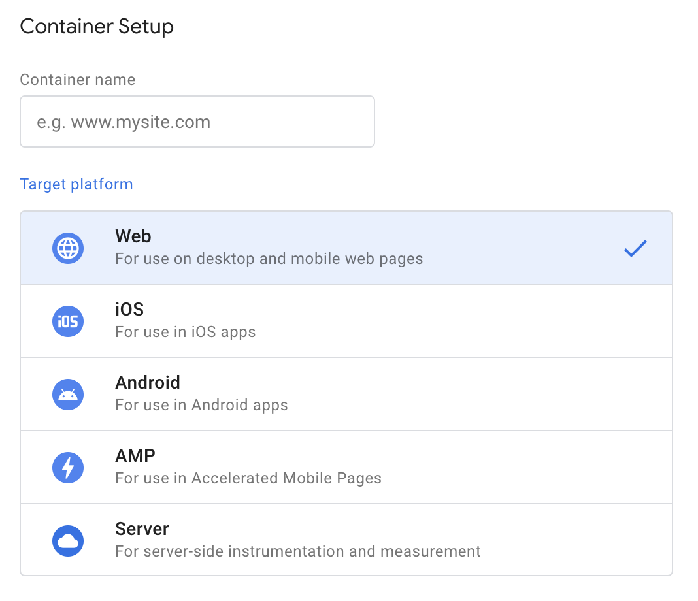
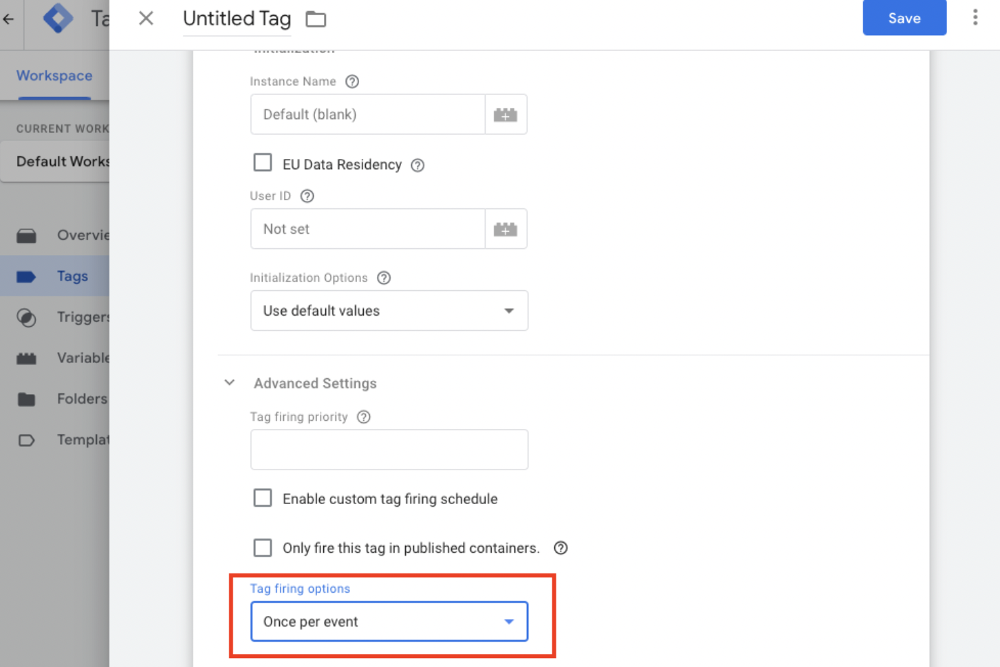

This is the client-side Google Tag Manager Template for Amplitude Analytics. The tag uses the [Amplitude Browser SDK 2.0](../../sdks/browser-2/) for data collection.

!!!info Resources
    [:simple-googletagmanager: GTM Template Gallery](https://tagmanager.google.com/gallery/#/owners/amplitude/templates/amplitude-browser-sdk-gtm-template) · [:material-github: GitHub](https://github.com/amplitude/amplitude-browser-sdk-gtm-template)

!!!warning "Breaking Changes Checklist from the version 240a7, Aug, 2023"
    Starting from the version 240a7, Aug, 2023, this template has been updated from using the [Marketing Analytics SDK(Deprecated)](../../sdks/marketing-analytics-browser/) to the [Amplitude Browser SDK 2.0](../../sdks/browser-2/), offering better support, enhanced functionality, and additional features. 
 
    While this updated template offers additional features and improvements,it may result in slightly different behavior that could potentially affect your existing analytics charts. However, we've made these changes configurable to maintain consistency. If you wish to retain the legacy behavior, it's essential to review the following [list of breaking changes](./#breaking-changes-checklist) and adjust your configuration accordingly.

--8<-- "includes/gtm/data-layer-messages-warning.md"

!!!warning
    Due to inherent limitations of GTM, certain features, such as plugins, are not supported in this GTM template. You are still able to add plugins using the Custom HTML tag, but because of how the SDK gets loaded in GTM, this could lead to missing data.

!!!note
    Ensure to consistently update your Amplitude GTM template to the latest version for an enhanced feature set, crucial bug fixes, and a significantly improved user experience.

## Workflow

### Container Setup

If you start from zero, you need to setup your container first. This Amplitude Analytics Browser SDK tag template can be found in **Web** target platform which for the uses on desktop and mobile web pages.

 

### Add Template

Create a new tag template by searching the gallery. Choose Amplitude Analytics Browser SDK and click the `add` button.
 

### Create Tags

Create tags for your amplitude browser SDK tracking. Click the `New` button to create your new tags.

#### Tag Configuration

Amplitude provides a list of tag types. You might also create a Custom HTML tag to do customization, like cross domain tracking or others.  For successful tracking in Amplitude, ensure that the Amplitude tag loads before the Custom HTML tag, which is being used to call Amplitude. The sequence in which the tags load can significantly influence the outcome. [Time sequence](https://support.google.com/tagmanager/answer/6238868) might be helpful in this case. Please check [this section](./#access-amplitude-instance) for accessing the amplitude instance in the Custom HTML tag. 

Note: We do *not* recommend installing amplitude through a Custom HTML tag.
 
#### API Key

Copy your amplitude project API Key in the API Key field. For EU residency, your project API Key is under [analytics.eu.amplitude.com](https://analytics.eu.amplitude.com/). Each project has different API Key, please make sure you are copy the API Key from the right project. Go to **Settings -> Projects -> click the right project name from the list** to find your project API Key. Check [here](https://www.docs.developers.amplitude.com/analytics/find-api-credentials/) for more details.

#### Instance Name

If you plan on running more than one Amplitude instance, each with distinct API keys or initialization options, you'll need to assign an `Instance Name` to each one. Tags with the same `Instance Name` are linked together and use the API key of the Initialization tag for that `Instance Name`.

!!!note
    This approach can also prevent missing events if different versions of the Amplitude SDK coexist in your system.

#### Access amplitude instance 

If you have a Custom HTML tag, you might need to access `amplitude` instance in your script tag.

##### With default Instance Name 

```js
// For amplitude-js-gtm@3.1.4 and above
amplitudeGTM.getDeviceId();

// Others
amplitude.getDeviceId();
```

##### With customized Instance Name

```js
// For amplitude-js-gtm@3.1.4 and above
amplitudeGTM._iq["yourInstanceName"].getDeviceId();

// Others
amplitude._iq["yourInstanceName"].getDeviceId();
```

### Select a Tag Type

A tag type allows you to specify what kind of action or event should be tracked in your application. The following tag types are supported in Amplitude GTM template.

#### init

!!!note
    `init` operates as a separate tag type. It's essential to create a tag for the init tag type. Although we provide defer initialization, events won't be sent to amplitude until the `init` tag has been activated.

Cookies are generated at the initialization stage. For more information on managing cookies, please refer to our [cookie management details](../../sdks/typescript-browser/#cookie-management). It is recommended to initialize after obtaining cookie consent. As we support deferred initialization, any event tracking that takes place before the init command will still be captured and won't be lost.

##### Track default Amplitude events

Check this checkbox to enable default event tracking and configure the following default tracking events

- Track Marketing Attribution

  The following configurations are available attribution options. [More details](../../sdks/browser-2/#tracking-marketing-attribution).

???config "Default Configurations"
    | <div class="big-column">Name</div>  | Description | Default Value |
    | --- | --- | --- |
    | `Initial Empty Value` | `string`. Customize the initial empty value for attribution related user properties to any string value. | `EMPTY`|
    | `Exclude Referrers`| `string` or `string1, string2`. The referrer_domain you want to exclude the attribution tracking. If you exclude a referring_domain, it won't fire any web attribution tracking. That means for the event fired from the exclude referring_domain won't have any web attribution user properties, it will maps to `(none)` in chart analysis. By default, it will also exclude referral section to track attribution of all subdomains of the input domain. [More Details](./#subdomain-attribution-tracking).  | `[]` | 
    | `Reset session on new campaign` | `boolean`. Enable this will broke the current session and create a new session if there has a new campaign is deleted. [More details](../../sdks/browser-2/#advanced-configuration-for-tracking-marketing-attribution). The session isn't reset in the case where the referrer is just a different subdomain of your site. | `false`|

- Track Page Views
- Track Sessions
- Track Form Interactions
- Track File Downloads

##### EU Data Residency

For EU data residency, you must set up your project inside Amplitude EU and use the API key from Amplitude EU. You can configure the server zone by checking the checkbox **EU Data Residency** under **Tag Configuration** -> **Initialization** of the `init` tag. The initialization section only shows up when tag type is set to `init`. [More details](../../sdks/browser-2/#eu-data-residency).

##### User ID

If the user ID is already available you can:

- Initialize the instance with it by inputting it in the "User ID" input box of the `init` tag
- Use the `setUserId` tag type to set the use ID at a later time. [More details](../../sdks/browser-2/#custom-user-id).

##### Configurations

- `Use default values`. The initialization is done with the default values.
--8<-- "includes/sdk-ts-browser/shared-configurations.md"
- `Set configuration manually`. By selecting the corresponding option. The following configurations are the available ones with the value type in GTM template. 
???config "GTM Configuration Options"
    | <div class="big-column">Name</div>  | Description | Default Value |
    | --- | --- | --- |
    |`flushIntervalMillis`| `number`. The amount of time waiting to upload the event to the server in milliseconds. | 1 second.|
    |`flushQueueSize`| `number`. The maximum number of events that can be stored locally before forcing an upload.  | 30 events. |
    |`flushMaxRetries`| `number`. The max retry limits. | 5 times.|
    |`logLevel`| `LogLevel.None` or `LogLevel.Error` or `LogLevel.Warn` or `LogLevel.Verbose` or `LogLevel.Debug`. The log level. | `LogLevel.Warn` |
    |`minIdLength`| `number`. Overrides the minimum length of `user_id` & `device_id` fields. | `5` |
    |`optOut`| `boolean`. If `optOut` is `true`, the event isn't sent to Amplitude's servers. | `false` |
    |`serverUrl`| `string`. The server url events upload to. | `https://api2.amplitude.com/2/httpapi` | 
    |`useBatch`| `boolean`. When `true`, uses the Batch API instead of the HTTP V2 API.| `false` |
    |`appVersion`| `string`. The current version of your application. For example: "1.0.0" | `null` |
    |`deviceId`| `string`. A device-specific identifier. | `UUID()` |
    |`cookieExpiration`| `number`. The days when the cookie expires. | 365 days. |
    |`cookieSameSite`| `string`. The SameSite attribute of the Set-Cookie HTTP response header. | `LAX` |
    |`cookieSecure`| `boolean`. If restrict access to cookies or not. A cookie with the Secure attribute is only sent to the server with an encrypted request over the HTTPS protocol. | `false` |
    |`disableCookies`| `boolean`. If disable cookies or not. If cookies is disable, using LocalStorage or MemoryStorage. | The cookies is enable by default. |
    |`domain`| `string`. Set the top level domain. | `null` |
    |`partnerId`| `string`. The partner Id value. Amplitude requires the customer who built an event ingestion integration to add the partner identifier to `partner_id`. | `null` |
    |`sessionTimeout`| `number`. How long one session expire. | `30` minutes. |
    |`userId`| `number`. ID for the user. Must have a minimum length of 5 characters unless overridden with the `min_id_length` option. | `undefined` |
    |`trackingOptions`| `TrackingOptions`. Please check the `Optional tracking` section for more tracking options configuration. | Enable all tracking options by default. |
    |`transport`| `TransportType.XHR` or `TransportType.SendBeacon` or `TransportType.Fetch`. Set the transport type. | `TransportType.Fetch` |
- `Select a **GTM variable** from the list`. It's necessary to return an object containing the key-value pairs you wish to use for instance configuration. Ensure that the keys are part of the available configurations.

##### (Legacy) Enable client side user agent enrichment

Starting with version 240a7 in Aug, 2023, we have upgraded this template to use the Amplitude Browser SDK 2.0 for data collection. In Amplitude Browser SDK 2.0, we have deprecated client-side user agent parsing in favor of server-side user agent parsing. [More details](https://github.com/amplitude/Amplitude-TypeScript/tree/v1.x/packages/plugin-user-agent-enrichment-browser).

To avoid breaking changes in chart analytics, we've added the option to enable client-side user agent parsing via the `(Legacy) Enable client side user agent enrichment` option. You can also choose which user agent field (OS name, OS version, device manufacture, and device model) you want to enrich by checking the checkbox accordingly.

If you are a new user, we highly recommend adopting server-side parsing by leaving this checkbox empty as the new enrichment strategy offers more accurate result.

###### Page View Tracking

Check this box to enable page view tracking. The following configurations are available page view tracking options. [More details](../../sdks/browser-2/#tracking-page-views).

???config "Default Configurations"
    | <div class="big-column">Name</div>  | Description | Default Value |
    | --- | --- | --- |
    | `Use the legacy page view properties` | `check box`. Whether use the legacy page view properties. [More Details](./#breaking-changes-checklist). | `Enabled`. Use the latest page view event type and properties as in [Amplitude Browser 2.0](../../sdks/browser-2/#tracking-page-views). |
    | `Page View Type` | `string`. The event type for page view event. | `[Amplitude] Page Viewed` |
    | `Page View trigger` | `Page Loads` or `Only with Attribution changes` or a `Variable Configuration`.  The trigger of page view event. A variable configuration can be either build-in or customized that returns a function with a true or false return value. If the function returns true, then Page Views are tracked automatically, if it returns false then Page Views are not tracked. [More details](../../sdks/browser-2/#advanced-configuration-for-tracking-page-views). | `Page Loads` if enable page view tracking. |
    | `Track history events automatically` | `All history changes` or `Only when page path changes`. Whether to track history events. This is for tracking page view on SPA. [More details](../../sdks/browser-2/#advanced-configuration-for-tracking-page-views). | `All history changes` |

###### Sessions Tracking

Check this box to enable sessions tracking. [More details](../../sdks/browser-2/#tracking-sessions).

###### Form Interactions Tracking

Check this box to enable form interactions tracking. [More details](../../sdks/browser-2/#tracking-form-interactions).

###### File Downloads Tracking

Check this box to enable file downloads tracking. [More details](../../sdks/browser-2/#tracking-file-downloads).
    
#### track

Events represent how users interact with your application. For example, "Button Clicked" may be an action you want to note.
The `track` tag type is for tracking an event under a specific trigger.

##### Event Type

| Name  | Description |
| --- | --- |
| `Event Type` | `string`. The name of the event. |

##### Event Properties

| Name  | Description |
| --- | --- |
| `Property Name` | `string`. The name of the event property. |
| `Property Value` | `string`. The value of the event property. |

##### Custom Timestamp 

| Name  | Description | Default Value |
| --- | --- | --- |
| `Custom Timestamp ` | `number` or `null`. timestamp in UNIX time (milliseconds). Leave empty to use current time. | Current timestamp. |

##### Track Groups

Set event level groups. With event-level groups, the group designation applies only to the specific event being logged, and doesn't persist on the user unless explicitly set with setGroup. [More details](../../sdks/browser-2/#user-groups).

| Name  | Description |
| --- | --- |
| `Group Type` | `string`. The name of the event. |
| `Group Name` | `string` or `string1,string2...`. The name of the group. The value can be a single group name (e.g. 15) or a comma-separated list (e.g. 2,12,24) of group names. | 

#### identify

!!!note 
    Identify calls *don't* appear in user look up. The identify calls will set the user properties, and those updated user properties will appear only after the next event fired by the user.

Add individual user property operations each as its own row in the table. You can add as many as you like, but note that you can only include a specific User Property in a single operation. The operations are executed in order. [More details](../../sdks/browser-2/#user-properties).

| Name  | Description |
| --- | --- |
| `Method Call` | `Add`, `Append`, `Prepend`, `Set`, `Set Once`, `Remove`, `Preinsert`, `Postinsert`, `Clear All`. The operation for the identify call. | 
| `User Property` | `string`. The key of user properties. |
| `Value` | `string` or others. The value of specific user property. If you want to pass other types, please use GTM variable(Data Layer Variable). |

#### setGroup

Amplitude supports assigning users to groups and performing queries, such as Count by Distinct, on those groups. If at least one member of the group has performed the specific event, then the count includes the group. [More details](../../sdks/browser-2/#user-groups).

| Name  | Description | Default Value |
| --- | --- | --- |
| `Group Type` | `string`. The group type. |
| `Group Name(s)` | `string` or `string,string...`. The group name(s) under the group type. You can add a single group name or a comma-separated list (e.g. 2,12,24) of group names.| |

#### groupIdentify

Use the Group Identify API to set or update the properties of particular groups. These updates only affect events going forward. [More details](../../sdks/browser-2/#user-properties).

| Name | Description |
| --- | --- |
| `Group Type` | `string`. The group type. |
| `Group Name(s)` | `string`. The group name(s) under the group type. |
| `Method Call` | `Add`, `Append`, `Prepend`, `Set`, `Set Once`, `Remove`, `Preinsert`, `Postinsert`, `Clear All`. The operation for the identify call. | 
| `User Property` | `string`. The key of user properties. |
| `Value` | `string` or others. The value of specific user property. If you want to pass other types, please use GTM variable(Data Layer Variable). |

#### revenue

Tracking the revenue event for a user. Revenue instances store each revenue transaction and allow you to define several special revenue properties (such as 'revenueType' and 'productIdentifier') that are used in Amplitude's Event Segmentation and Revenue LTV charts.

| <div class="big-column">Name</div>  | Description | Default Value |
| --- | --- | --- |
|`product_id` | Required. `string`. An identifier for the product. Amplitude recommend something like the Google Play Store product ID. | `` |
|`quantity` | Required. `number`. The quantity of products purchased. For version after marketing-analytics-browser-gtm 0.5.4 , we auto assign `revenue = quantity * price`. &&&&&& | `1` |
|`price` | Required. `number`. The price of the products purchased, and this can be negative. Note: revenue = quantity* price. | `null` |
|`revenue_type` | Optional, but required for revenue verification. `string`. The revenue type (for example, tax, refund, income). | `null` |
|`event properties`| Optional. `{ [key: string]: any }`. An object of event properties to include in the revenue event. | `null` |

#### flush

The flush method prompts the client to instantly send [buffered events](../../sdks/browser-2/#flush-the-event-buffer). There's no need to manually call the `flush `tag type, it will automatically be triggered based on either `flushIntervalMillis` or `flushQueueSize`, whichever comes first. To avoid event loss due to browser closure, consider enabling the `sendBeacon` transport in the configuration options, or set the transport type to `sendBeacon` when `pagehide`. Alternatively, you could reduce the `flushQueueSize` and `flushIntervalMillis` according to your event traffic load, ensuring events don't get stuck on the client.

#### setUserId

If you want to reset the userId and deviceId after logout, please check `reset` tag type instead.

| Name | Description | Default Value |
| --- | --- | --- |
| `User ID`| `undefined` or `string`. Set the userId. Leave empty if you want to set the userId to undefined. | `undefined` |

#### setDeviceId

If you want to reset the userId and deviceId after logout, please check `reset` tag type instead.

| Name | Description | Default Value |
| --- | --- | --- |
| `Device ID`| `string`. Set the deviceId for the current user. Amplitude will assign an unique identifier for the deviceId by default. For the cross domain use case, Amplitude will auto capture the `deviceId` from URL parameter and assign the value to deviceId. Otherwise, this is not recommended unless you know what you are doing. [More Details](../../sdks/browser-2/#custom-device-id) | `UUID` |

#### setSessionId

Session logic is auto handled by Amplitude. You might need to set the sessionId to `-1` if you want to out of session control. Please make sure the value is in milliseconds since epoch (Unix Timestamp) or `-1`. [More details](../../sdks/browser-2/#custom-session-id).

#### reset 

`reset` will be commonly used when a user has been logged out. It includes 2 operations which are `setUserId(undefined)` and `setDeviceId(UUID())`. [More details](../../sdks/browser-2/#reset-when-user-logs-out).

#### setOptOut

Check the `Opt current user out of tracking` checkbox to opt user out of tracking. [More details](../../sdks/browser-2/#opt-users-out-of-tracking).

### Define your trigger - Triggering

All tags fire based on events. Anytime Google Tag Manager registers an event, event triggers are evaluated and tags are fired accordingly. Please check [here](https://support.google.com/tagmanager/topic/7679108?sjid=4311393792871502449-NA) for available triggers in GTM. 

!!!note
    Typically `init` tag is the first thing you need to fire on the page. It's common to fire the `init` tag using `All Pages` or `Initialization - All Pages` triggers. You can also defer the `init` tag until you receive a signal and fire it using customized triggers, such as a consent grant. But notice that all other tags will wait for the `init` tag to fire before they can be sent to Amplitude. 

## Common Issues

These are common issues encountered with the GTM template. For further troubleshooting of your GTM instance, please refer to the GTM Help Center.

- [Troubleshoot issues](https://support.google.com/tagmanager/answer/6103683?hl=en)
- [Preview and debug containers](https://support.google.com/tagmanager/answer/6107056?hl=en)

### Does Amplitude GTM template support React Native (Android or iOS) apps?

No. The Amplitude Analytics Browser SDK only supports the web container, designed for desktop and mobile browsers. Amplitude does not provide support for GTM templates for mobile apps at this time. To request this feature, please submit a feature request [here](https://help.amplitude.com/hc/en-us/requests/new).

### Can we add some logic to Amplitude template?

Yes, but it's not recommended. Modified Community Gallery Templates will no longer receive updates provided by the developer but you can always restore the template to start receiving notifications again.

### Missing events?

- Please check if you have multiple versions of Amplitude browser SDK installed. There may be collision between different versions of SDKs. Please try giving a different instance name for your GTM instance. 
- If your website blocks script that our Template is trying to inject. Check your website’s Console or Network tab to see if any scripts are blocked or if you are getting any errors through **right click -> Inspect**:
- Init web attribution event is missing. If you have installed cookies consent, please check if the value of `document.referrer` has been updated to your current domain. The campaign from the current domain won't be tracked.
- Ensure that you have selected the appropriate Tag firing options. Choosing `Once per event` will cause your tag to fire each time a Trigger event is performed. On the other hand, selecting `Once per Page` will fire your Tag just once. This discrepancy could lead to events not being sent as expected.
 

### Overall user counts to increase?

Verify whether cookies have been altered or removed inadvertently. [Cookies](../../sdks/browser-2/#cookie-data) store critical user session data and marketing campaign information. If these cookies are deleted, it triggers a reset of user identifiers (such as user ID and device ID), invariably leading to a surge in the user count. Additionally, the erasure of last-viewed campaign parameters can result in an increase in organic/direct traffic, among other effects.

### Cross Domain Tracking?

To retain user identification across different domains, a custom HTML tag must be created to attach the user's deviceId to the domain link you wish to track. By appending `deviceId=YourDeviceId` to the URL, the Amplitude Analytics Browser SDK will utilize this deviceId from the URL parameter rather than generating a new one. Due to certain limitations in GTM, the [workaround](https://github.com/amplitude/GTM-cross-domain-script) is available to illustrate how to append URLs in the GTM template.

### How to pass other types for identify/groupIdentify value

If you hardcode the value in your tag, the input will be forced into a string type. To use other types such as `number` or `boolean`, please create a GTM variable, specifically a Data Layer Variable. This will accurately capture the types you've specified.

## Video Tutorial

This video tutorial walks through the implementation basics. 

<script src="https://fast.wistia.com/embed/medias/n337njhoot.jsonp" async></script><script src="https://fast.wistia.com/assets/external/E-v1.js" async></script><div class="wistia_responsive_padding" style="padding:56.25% 0 0 0;position:relative;"><div class="wistia_responsive_wrapper" style="height:100%;left:0;position:absolute;top:0;width:100%;"><div class="wistia_embed wistia_async_n337njhoot videoFoam=true" style="height:100%;position:relative;width:100%"><div class="wistia_swatch" style="height:100%;left:0;opacity:0;overflow:hidden;position:absolute;top:0;transition:opacity 200ms;width:100%;"></div></div></div></div>

## Breaking changes checklist

### Page View event's name and properties

The new template changes the default page view events to include `[Amplitude]` prefixes. If you want to continue using the older page view events check `Use legacy page view properties` checkbox. See full details in table. 

???Breaking change "Page View Tracking"
    | <div class="big-column">Before</div>  | Current |
    | --- | --- |
    | <ul><li>event name: `Page View`</li><li>properties: `page_location`, `page_path`, `page_title`. `page_url`</li></ul> | <ul><li>event name:  `[Amplitude] Page Viewed`</li><li>properties: `[Amplitude] Page Domain`, `[Amplitude] Page Location`, `[Amplitude] Page Path`, `[Amplitude] Page Title`, `[Amplitude] Page URL`</li></ul> |

### Subdomain attribution tracking 

Traffic from one subdomain to another (ie analytics.amplitude.com to experiment.amplitude.com) is not tracked by default. If you want to exclude the attribution tracking on `location.hostname`, but not other subdomains, add the string value of `location.hostname` in the `Exclude Referrers` input under the `Track marketing attribution` section. See full details in table. 

???Breaking change "Attribution Tracking"
    | <div class="big-column">Before</div>  | Current |
    | --- | --- |
    | Track attribution of all subdomains. | Excludes all subdomains of the same root domain as referrer. | 

### User agent parser

The new template changes the way to parse the device related info which might affect the value of OS, Device Type, Device Family (`event.os_name`, `event.os_version`, `event.device_model`, `event.device_manufacturer`), and related properties. If you want to continue using the older way to parse user agent, check `Enable client side user agent enrichment` checkbox.

???Breaking change "User Agent Parser"
    | <div class="big-column">Before</div>  | Current |
    | --- | --- |
    | [Client-side user agent parsing](https://github.com/amplitude/ua-parser-js).  | Server-side user agent parsing by Amplitude ingestion endpoints. |