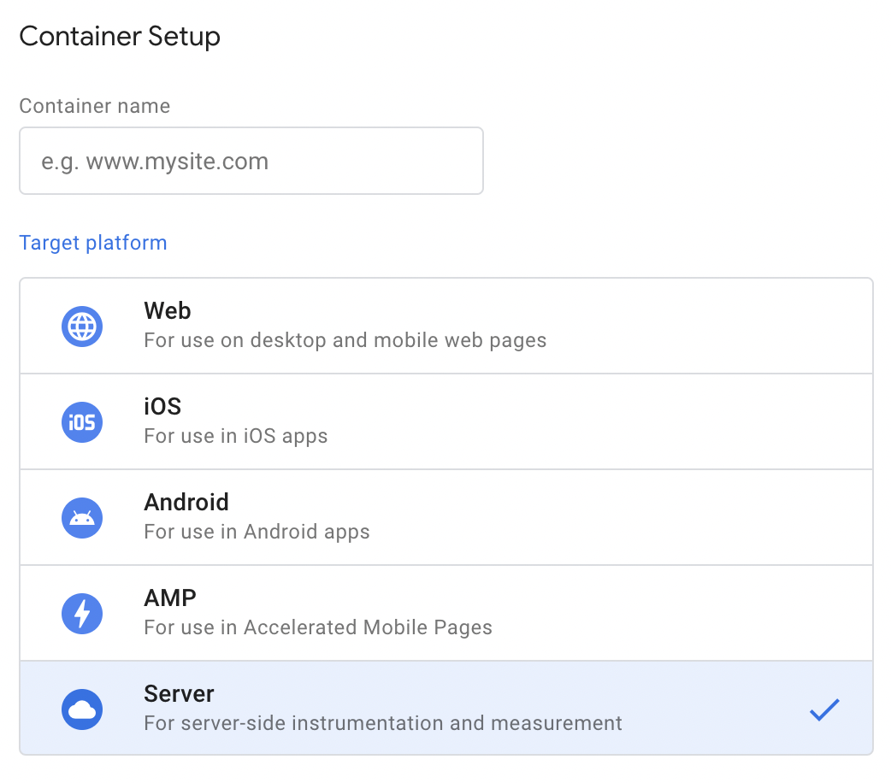
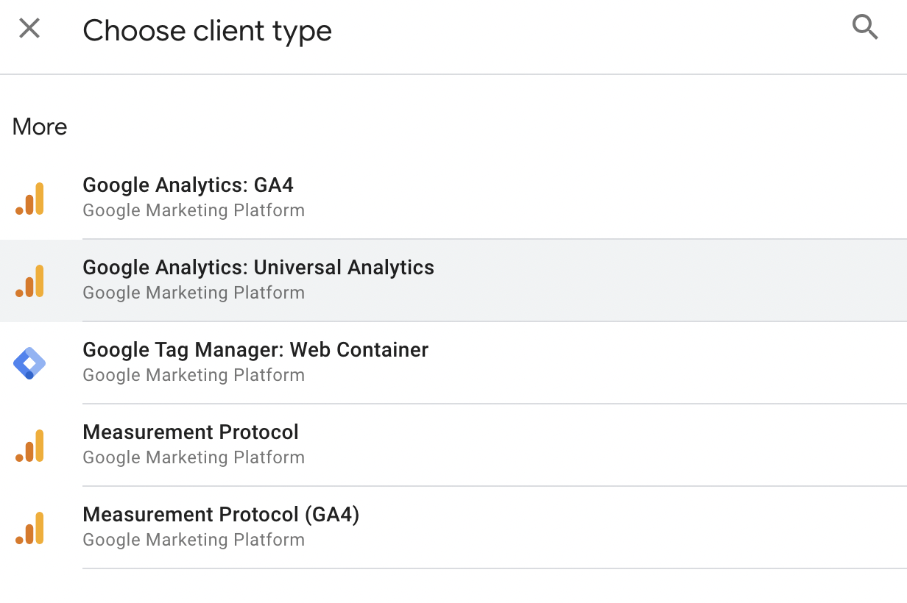
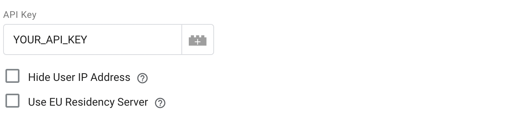
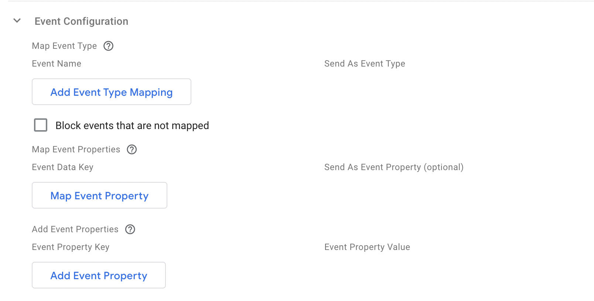
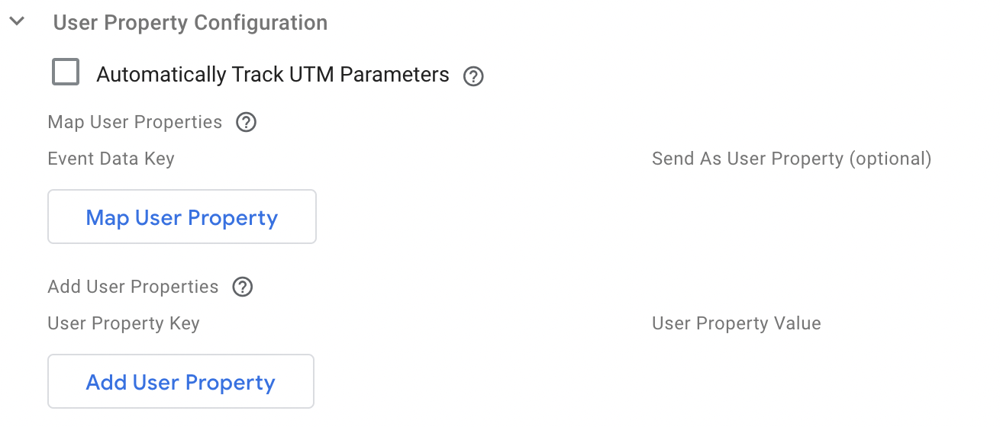
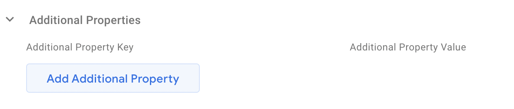

This is the server-side Google Tag Manager Template for Amplitude Analytics. The tag uses the [Amplitude HTTP V2 API](../../analytics/apis/http-v2-api.md) for data collection.

!!!info Resources
    [:simple-googletagmanager: GTM Template Gallery](https://tagmanager.google.com/gallery/#/owners/amplitude/templates/amplitude-server-gtm-template) · [:material-github: GitHub](https://github.com/amplitude/amplitude-server-gtm-template)

!!!note
    Ensure to consistently update your Amplitude GTM template to the latest version for an enhanced feature set, crucial bug fixes, and a significantly improved user experience.

## Workflow

### Container Setup

If you start from zero, you need to setup your conatiner first. This Amplitude Analytics tag template can be found in **Server** target platform which for the uses on desktop and mobile web pages.

### Add Template

Create a new tag template by searching the gallery. Choose Amplitude Analytics and click `add` button.

### Create a Client

Clients are responsible for getting and processing/adapting the data received by the GTM server-side container. Then it makes the data available to tags, triggers, and variables in that container. When you create a new server container, it creates two clients automatically, Universal Analytics, and GA4. You can also use your server-side template as a proxy for a web container or create your custom client template in the `Template` section.

### Create Tags

Create tags for your amplitude browser SDK tracking. Click the `New` button to create your new tags.

#### Tag Configuration

##### API Key

Copy your amplitude project API Key in the API Key field. For EU residency, please make sure your project API Key is under analytics.eu.amplitude.com. Each project has different API Key, please make sure you are copy the API Key from the right project.

##### Hide User IP Address

Check this box to make sure that the user's IP address is not forwarded to Amplitude servers.

- Check `Hide User IP Address` - We will use the IP collected from the HTTP request header, which is the IP from your server.
- Uncheck `Hide User IP Address` - We will get the IP address where the request originated, using [getRemoteAddress](https://developers.google.com/tag-platform/tag-manager/server-side/api#getremoteaddress) method. 

##### EU Data Residency

For EU data residency, you must set up your project inside Amplitude EU and use the API key from Amplitude EU. You can configure the server zone by and checking the checkbox Use **EU Data Residency** under **Tag Configuration**.

#### Event Configuration

The configurations related to the Event payload.

##### Map Event Type

In the table, add rows for each event name you want to map to an Amplitude Event Type. If you check `Block events that are not mapped`, only Event Data keys included in this table will be sent with the Amplitude request, other events not included in the table will be aborted.

| 
Name
  | Description |
| --- | --- |
| `Event Name` | Required. `string`.  The `event_name` this tag has received. |
| `Send As Event Type` | Required. `string`. The event type you want to map the event name to. This will be the name shown in Amplitude dashboard. |

##### Map Event Properties

Map keys in the Event Data object to event properties you want to send to Amplitude. If you don't specify an Event Property name, the Event Data key will be used instead.

| 
Name
  | Description |
| --- | --- |
| `Event Data Key` | Required. `string`.  They key, value pair in the Event Data object you want to include as an event property in the Amplitude event payload. |
| `Send As Event Property` | Optional. `string`.  This event property name, will be shown in Amplitude dashboard. If it's empty, `Event Data Key` will be used as event type instead. |

##### Add Event Properties

Use this table to add completely new event properties to the hit sent to Amplitude servers. Each property needs a key and a value.

| 
Name
  | Description |
| --- | --- |
| `Event Property Key` | Required. `string`.  The `event_name` in the Event Data object. |
| `Event Property Value` | OptionaRequiredl. `string`. The value of the event property key. |

#### User Property Configuration

##### Automatically Track UTM Parameters

We parse the `search_parameter` using [getEventData('page_location')](https://developers.google.com/tag-platform/tag-manager/server-side/api#geteventdata) for tracking the UTM parameters. 

Check the box to collect all UTM parameters, including `utm_source`, `utm_medium`, `utm_campaign`, `utm_term`, `utm_content`. All those values will be sent with other user properties along with the event been tracked.

##### Map User Properties

Map keys in the Event Data object to user properties you want to send to Amplitude. If you don't specify a User Property name, the Event Data key will be used instead. Only Event Data keys included in this table will be sent with the Amplitude request.

| 
Name
  | Description |
| --- | --- |
| `Event Data Key` | Required. `string`. They key in the Event Data object you want to include as a user property to send to Amplitude. |
| `Send As User Property` | Optional. `string`. The user property name you want to. This will be the name shown in Amplitude dashboard. If it's empty, `Event Data Key` will be used as the user property key instead. |

##### Add User Properties

Use this table to add completely new event properties to the hit sent to Amplitude servers. Each property needs a key and a value.

| 
Name
  | Description |
| --- | --- |
| `User Property Key` | Required. `string`. They key in the Event Data object you want to include as a user property to send to Amplitude. |
| `User Property Value` | Required. `string`. The value of a specific user property key. |

#### Additional Properties

Use this feature to add extra event properties. In case of any overlap, the new addition will replace the previous value. Each property needs a key and a value.

| 
Name
  | Description |
| --- | --- |
| `Additional Property Key` | Required. `string`. They key of the event property. |
| `Additional Property Value` | Required. `string`. The property value of the property key. |

### Other info  come along with tracking an event

| 
Name
  | Description | Default Value |
| --- | --- | --- |
| `user_id` |  The user Id.  | The value of `user_id` or `x-ga-mp2-user_properties.user_id` from the Event Object or `undefined`. |
| `device_id` | The device Id. | The value of `client_id` from the Event Object. |
| `time` | The a number that represents the current time in milliseconds. | [More details](https://developers.google.com/tag-platform/tag-manager/server-side/api#gettimestampmillis). |
| `session_id` | The session Id. |  The integer value of `ga_session_id` in Event Object + `000` |
| `insert_id` | The insert Id for deduplication purpose in Amplitude Server. | `device_id` + the eventName in Event Object + `time`. |
| `library` | The library for identifying the source of an event in Amplitude. | `S-GTM` | 

### Define your trigger - Triggering

All tags fire based on events. Anytime Google Tag Manager registers an event, event triggers are evaluated and tags are fired accordingly. The triggers in Server Tag is limited compared with Web container. The following triggers provided by GTM currently. Please check the GTM docs for more updates.

- Custom Trigger - When a Server Container Client accepts the incoming request, processes it, and makes its data available in the container for other tags, you can use a Custom trigger to fire a tag. You can choose if you want to fire the tag on all events or on a specific event.
- Page View Trigger - The trigger will be activated if the incoming request was processed by a client and generated a page_view event. That event should be visible in the preview mode of server GTM.
- Custom Event Trigger - Custom event trigger works in the exact same way as the Page View trigger. The only difference is that you can pick the name of the event on which you want to fire.

## Common Issues

### Why I cannot find Amplitude Analytics in the GTM Gallary

Please make sure you have selected a server container. Server-side tempalte will only exist in server container gallary. 

## Video Tutorial

This video tutorial walks through the implementation basics. 

Please check [here](https://developers.google.com/tag-platform/tag-manager/server-side/api) for more details realted with server-gtm API. 