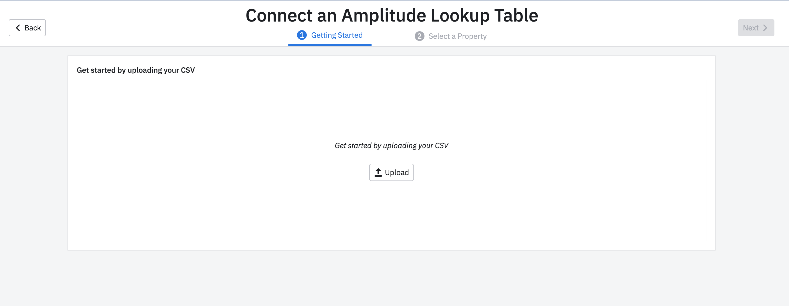
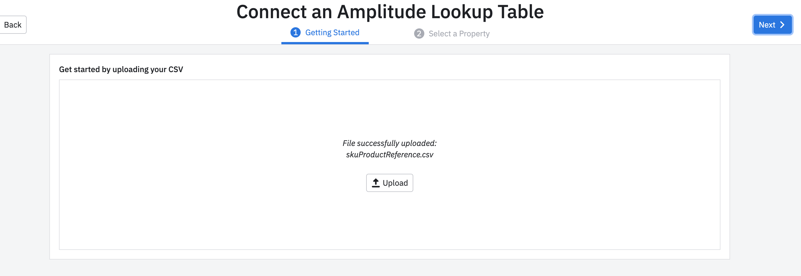
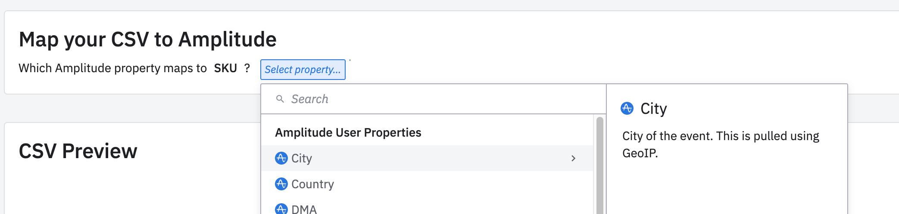
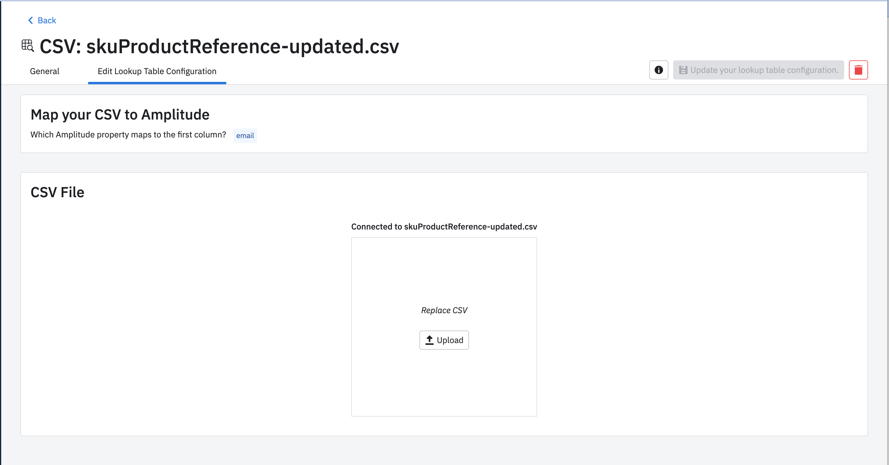
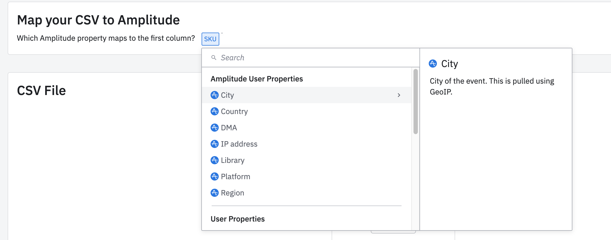
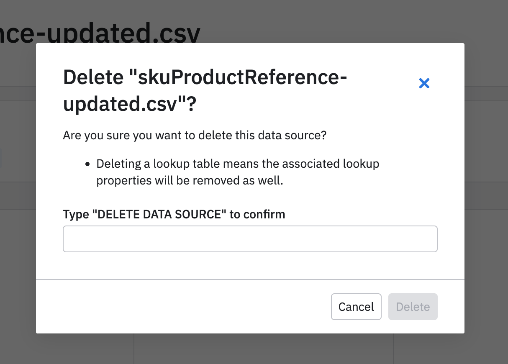

Amplitude's Lookup Table integration lets you import your own data and map it to ingested properties to have an enhanced set of properties.

-8<-- "includes/closed-beta.md"

## Setup

### Prerequisites

To setup this integration, you need the following:

+ An event property or user property to create a mapping from.
+ A CSV that contains the data you want to map to. The first column data must correspond to the mapping property value.

### Amplitude setup

In Amplitude, navigate to **Data Sources**, then find CSV in the **I want to import data into Amplitude** tab.

!!! note
    This source is on a per-project basis.

1. Upload the CSV

2. Click next

3. Select a property

4. Click finish

## Updates

If you want to create a new lookup property or that mapped property is incorrect, you can update the Lookup Table.

In Amplitude, navigate to Data Sources, then find the corresponding lookup table in the Sources table.

1. Navigate to "Edit Lookup Table Configuration"

2. (Optional) Update the mapping property.

3. (Optional) Update the CSV data by uploading the data.

4. Click "Update your lookup table configuration".

## Delete the lookup table and its properties

If a lookup table is no longer needed, you can delete it.

In Amplitude, navigate to Data Sources, then find the corresponding lookup table in the Sources table.

1. Navigate to "Edit Lookup Table Configuration"

2. Click the delete button.

3. Follow the steps in the modal.

