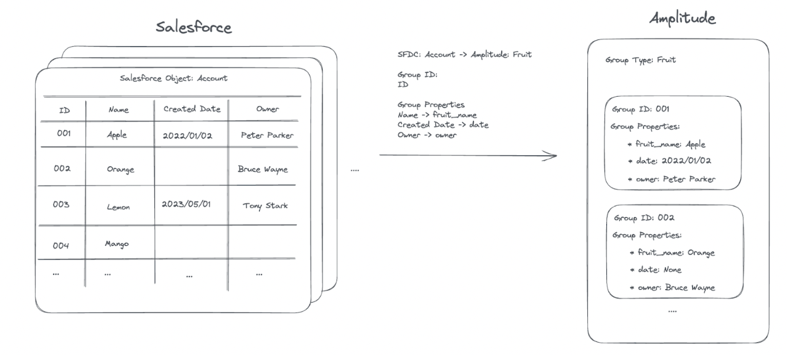
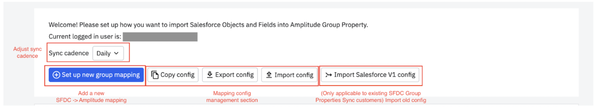
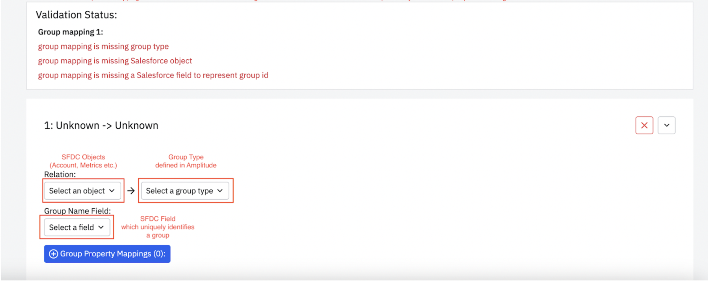
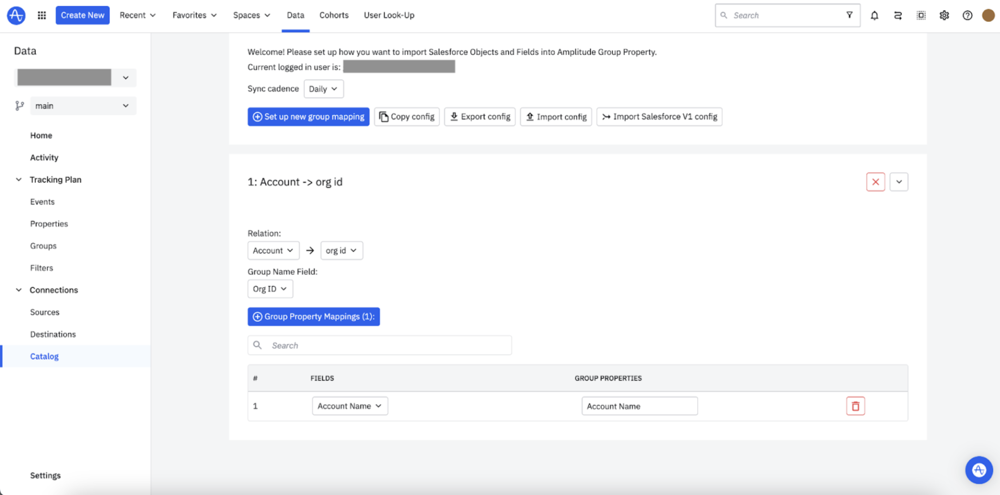

--8<-- "includes/editions-growth-enterprise-with-accounts.md"

Salesforce provides solutions that help unify marketing, sales, commerce, IT, and service. This Salesforce V2 integration lets you create group-level properties from [Salesforce](https://www.salesforce.com/) data by setting specific Salesforce fields as group-level properties and importing that into Amplitude. This can be useful when analyzing information about accounts that exist in Salesforce. 

## Overview

By default, Amplitude has a built-in process that runs once a day to update group properties that have pickup dates matching the current date. Additionally, the integration offers the option of an hourly schedule if you prefer more frequent updates with finer granularity.

## Mapping at a high level

In Salesforce, objects such as Account are structured as tables, where each field represents a column. Amplitude imports data from Salesforce using a predefined schema mapping, which establishes a connection between Salesforce objects and Amplitude groups. Each row of a table will be eventually transformed into a group under a certain group type in an Amplitude project. There are 3 key concepts that together form a valid mapping:

1. **Relation:** defines which Salesforce object maps to which Amplitude group type
2. **Group Name Field:** a column of the table that will be used as the group identifier. Typically this column should identify a row in the table uniquely
3. **Group Properties:** a list of columns that will be imported into Amplitude.

## Detailed setup instruction

### Part 1: Set up account-level reporting 

Verify that you have [account-level reporting](https://help.amplitude.com/hc/en-us/articles/5332668738331) set up in Amplitude.

### Part 2: Grant Amplitude access to your Salesforce data

1. In Amplitude Data, navigate to **Data Sources**.
2. Select the **Salesforce V2** tile.
3. Click on **Connect to** to initiate the authentication process. Once authenticated, you should see a valid email address associated with your Salesforce account.
4. Click on **Next** located at the top right corner to continue with the mapping setup.

### Part 3: Mapping Setup

1. Review your mapping setup option
    - **Sync Cadence:** This control the cadence of the sync job.
    - **Copy config:** This allows you to copy the existing mapping config to the clipboard
    - **Export config:** This downloads the current mapping config to your local machine (as a JSON file). This is useful when you want to recover a connection from the previous mapping config.
    - **Import config:** This loads in the config file from the local machine and populates the UI.

2. To create a new mapping, click **Set up new group mapping**. This should populate a new mapping section. Inside the section, fill in the following parts:
    - **Relation** (SFDC object to Amplitude Group Type)
    - **Group Name Field** (SFDC field that uniquely identifies a group/row)
    

3. Once you finish the above settings, click **Group Property Mapping** to define a list of Salesforce fields which you want to import into Amplitude as Group Properties. 

    !!!note
    
        To ensure the data quality, Amplitude performs various validation on the fly, this includes:
        - Ensuring all required fields are filled in
        - Ensuring a one-to-one relationship between SFDC field and Amplitude Group Property to avoid values being overwritten by each other.
        
        The setup page will display the current validation failures, and prevent proceeding until all of them are addressed. A valid mapping will look like the screenshot below.
   
   

4. After you finish defining the mapping and all validations pass, click on the **Next** button to move forward with the final verification process. 
5. Once the final verification passes, click the **Save** button to establish the connection. The established connection will be available in the Source page with the name “Salesforce V2”.
6. If needed, you can easily update the mapping configuration at any time by locating the connection on the Source page and clicking on it. This allows you to make changes to the mapping setup for the Salesforce integration.
