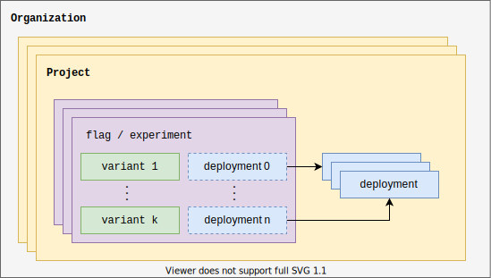

At the top level in Amplitude is your **organization**. Within an organization, Amplitude Experiment follows the **project** structure defined by Amplitude Analytics. In short, all Experiment data must be associated with an Amplitude Analytics project.

[Flags](#flags-and-experiments), [experiments](#flags-and-experiments), and [deployments](#deployments) all live within an Amplitude project.
<br />



## Projects

As a best practice, create a project per product and per environment. Because [flags](#flags-and-experiments), [experiments](#flags-and-experiments), and [deployments](#deployments) only exist within a single project, duplicate these objects across projects for the same product.

!!!tip "Copying a flag to another project"

    When developing a new feature with an experiment, you can create the experiment in the dev environment project to develop and test that the implementation is correct, then copy the experiment into the prod project to run the experiment in prod.

## Deployments

In Amplitude Experiment, a deployment serves a group of flags or experiments for use in an application. Deployments have an associated randomly generated **deployment key** (also known as an API key) which Experiment uses to identify the deployment and authorize requests to the evaluation servers. 

!!!info "Client vs Server Deployments"
    Deployments are either client or server deployments. Only server deployments can access flag configs for [local evaluation](./evaluation/local-evaluation.md), and shouldn't be shared to made public in any way.

Deployments live within Amplitude Analytics projects, and a project can have multiple deployments. 
Add deployments to [Flags and Experiments](../guides/getting-started/create-a-flag.md#add-a-deployment) in the same project. When Experiment's evaluation servers receive a request to fetch variants for a user, Experiment uses the deployment key to look up all associated flags and experiments for evaluation.

## Flags and experiments

Experiment uses feature flags and experiments to serve a variable experience to a user. They're identified by the **flag key**, associated with `0-n` [deployments](#deployments), and contains `1-k` [variants](#variants). The **evaluation mode** (local or remote) determines whether the flag or experiment can be [locally evaluated](evaluation/local-evaluation.md) and may limit the targeting capabilities for the flag if set to local. Local evaluation mode flags can't use advanced targeting features like behavioral cohorts.

### Comparison

Feature flags and experiments share the same underlying data model, and you can migrate from one to the other retroactively. The most visible difference comes in the product interface: experiments guide you through an experiment lifecycle and give you the ability to define success metrics and perform analysis. Flags are more bare-bones, and don't include special planning and analysis sections.

#### Flags

Used for standard feature flagging without user analysis. When created, comes with a default variant, `on`.

!!!example "Flag Use Cases"
    - Rolling out a feature to a subset of users (for example, beta customers).
    - Different experience for a behavioral cohort (for example, power users).

#### Experiments

Used for feature experimentation on users. When created, comes with two default variants, `control` and `treatment`.

!!!example "Experiment Use Cases"
    - Run an A/B test for a new feature in your application.
    - Experiment on multiple recommendation algorithms on your server.

## Variants

A variant exists within a flag or an experiment, and represents a variable experience for a user.

|<div class='med-column'> Property </div>| Requirement | Description |
| --- | --- | --- |
| `Value` | **Required** | A string which identifies the variant in the instrumentation. The value string is checked for equality when a variant is accessed from the SDK or [Evaluation REST API](../apis/evaluation-api.md). Format must be lowercase kebab-case or snake_case. |
| `Payload` | Optional | Dynamic JSON payload for sending arbitrary data down with the variant. For example, you could send down a hex code to change the color of a component in your application. |
| `Name` | Optional | Name for the variant. This is like `Value`, but doesn't have formatting limitations, and you can change it without breaking the instrumentation in your code base.|
| `Description` | Optional | A more detailed description of the variant. You can use this to describe what the user experiences when viewing the variable experience in more detail. |

!!!info "SDK Usage"
    Only the `Value` and `Payload` are available when accessing a variant from an SDK or the [Evaluation REST API](../apis/evaluation-api.md).

## Users

Experiment users map to a user within Amplitude Analytics. Alongside flag configurations, users are an input to [evaluation](evaluation/implementation.md). Flag and experiment targeted rules make use of user properties.

Pass users to evaluation via `fetch` requests for [remote evaluation](evaluation/remote-evaluation.md), or directly to the `evaluate` function for [local evaluation](evaluation/local-evaluation.md).

!!!warning
    **You must include either a user ID or device ID in the user object for evaluation to succeed.** For example, remote evaluation returns a 400 error if both the User ID and Device ID are null, empty, or missing.

| <div class='med-big-column'> Property </div> | Type | Description |
| --- | --- | --- |
| `user_id` | `string` | The [User ID](https://help.amplitude.com/hc/en-us/articles/206404628-Step-2-Identifying-your-users#h_533ee533-f04d-49d3-873f-5836945f43a6) is the primary identifier for the user, generally when the user is logged into an account within your system. Experiment uses the User ID when resolving the Amplitude ID on enrichment before [remote evaluation](evaluation/remote-evaluation.md) where the Amplitude ID is the default bucketing key. |
| `device_id` | `string` | The Device ID is the secondary identifier for the user. This is usually randomly generated by an analytics SDK on the client side or set in a cookie on the server side. The Device ID is also used when resolving the Amplitude ID on enrichment before [remote evaluation](evaluation/remote-evaluation.md) where the Amplitude ID is the default bucketing key. |
| `user_properties` | `object` | Optional object of custom properties used when evaluating the user during local or remote evaluation. |
| `groups` | `object` | :material-beta: Optional object that lists groups associated with this user. Format is an object where the key is the group type, and the value is an array of group value strings (for example, `{"org name":["Amplitude"]}`)  |
| `group_properties` | `object` | :material-beta: Optional object listing group properties associated with this user. Format is an nested object where the key is the group type, and the value is an object where the key is a the group value, and the value is an object of properties (for example,`{"org name":{"Amplitude":{"plan":"enterprise"}}}`) |

!!!beta "Group level bucketing & analysis"
    If your organization has purchased the [Accounts add-on](https://help.amplitude.com/hc/en-us/articles/115001765532-Account-level-reporting-in-Amplitude) you may perform bucketing and analysis on groups rather than users. Reach out to your representative to gain access to this beta feature.

    Groups must be included in the user sent with the fetch request (recommended), or identified with the user via a group identify call from the [Group Identify API](../../analytics/apis/group-identify-api.md) or via [`setGroup()` from an analytics SDK](../../data/sdks/typescript-browser/index.md#user-groups).

    Supported Experiment SDKs:

    * [:javascript-color: JavaScript](../sdks/javascript-sdk.md#fetch)

???abstract "Full User Definition"
    ```json
    {
        "user_id": string,
        "device_id": string,
        "country": string,
        "region": string,
        "city": string,
        "dma": string,
        "language": string,
        "platform": string,
        "version": string,
        "os": string,
        "device_manufacturer": string,
        "device_brand": string,
        "device_model": string,
        "carrier": string,
        "library": string,
        "user_properties": object,
        "groups": object,
        "group_properties": object
    }
    ```