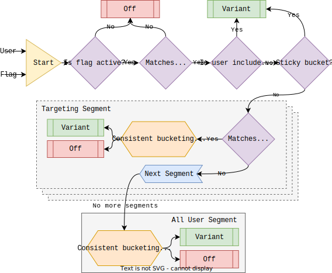

Evaluation refers to the act of determining which variant, if any, a user is bucketed into given a flag configuration. In short, evaluation is a function of a [user](../data-model.md#users) and a [flag](../data-model.md#flags-and-experiments) configuration which outputs a [variant](../data-model.md#variants).



## Pre-targeting

The pre-targeting steps may determine the evaluated variant prior to targeting segments.

### Activation

A flag may be active or inactive. Inactive flags will never return a variant as a result of evaluation.

!!!info "Best Practice"
    For simple on/off flags, we recommend using the [all users segment](#all-users-segment) allocation set to either 100% or 0% rather than using the activation toggle to control traffic. The activation toggle should be used to sunset a feature that has been been fully rolled out or rolled back after the flag's instrumentation has been removed.

### Individual inclusions

Inclusions allow you to force bucket specific users (identified by either their user ID or device ID) into a variant. This feature is primarily used for development purposes; for example if I am the developer on a new multi-variate feature and I want to test each variant in my application, I can add my user or device ID to the inclusions and refresh the application.

### Sticky bucketing

!!!warning
    Sticky bucketing should be used with care. Even if sticky bucketing is disabled, [consistent bucketing](#consistent-bucketing) means that  users will still be bucketed into the same variant given that the user and targeting rules remain static. Changing targeting rules on an active flag with sticky bucketing enabled may cause a [sample ratio mismatch (SRM)](../../guides/troubleshooting/sample-ratio-mismatch.md), which may skew experiment results.

If sticky bucketing is enabled, a user will always get evaluated to the same previously bucketed variant, regardless of the current targeting. Sticky bucketing does not apply if the user has not been bucketed into a variant.

## Targeting segments

!!!bug "Empty Target Segment"
    Adding a target segment without defining any rules (where clauses) will capture all users even though the estimates show 0 users.

A [flag or experiment](../data-model.md#flags-and-experiments) may have `0-n` targeting segments. Targeting segments are evaluated from top-to-bottom. If a user matches the segment targeting rule, then [consistent bucketing](#consistent-bucketing) based on the configured allocation percentage and variant distribution weights determines which variant, if any, the user is bucketed into.

## All users segment

The all users segment captures all users who do not match a [targeting segment](#targeting-segments) (if any are added). Users are bucketed into a variant (or no variant) via [consistent bucketing](#consistent-bucketing) based on the configured allocation percentage and variant distribution weights.

## Consistent bucketing

Amplitude Experiment's bucketing is consistent based on the user, bucketing key, bucketing salt, allocation percentage, and variant weights. In other words, given the same inputs, the output will remain constant.

| <div class='med-big-column'> Input </div> | Description |
| --- | --- |
| Bucketing Key | The key which determines which user property value to use as the bucketing value. The bucketing value is what is actually used as input to the [hashing](#hashing) function. |
| Bucketing Salt | A string which is concatenated to the bucketing value before [hashing](#hashing). The bucketing salt is randomly generated when the flag or experiment is created and used indefinitely unless explicitly updated. |
| Allocation | The percentage of all users included in the segment who should receive a variant. Used in the [allocation bucketing](#allocation-bucketing) step. |
| Variant Weights | A weight given for each variant. Applied only to the percentage included by the allocation percentage. Used in the [variant bucketing](#variant-bucketing) step. |

The bucketing logic is split into two steps. The first step, [allocation bucketing](#allocation-bucketing), determines if the user should be allocated a variant based on the allocation percentage. The second step, [variant bucketing](#variant-bucketing) runs only if the user has been allocated in step one. Both steps use the same consistent hash function in slightly different ways.

### Hashing

Amplitude Experiment's consistent bucketing utilizes the [`murmur3`](https://en.wikipedia.org/wiki/MurmurHash) consistent hashing algorithm on the value of the bucketing key for the given segment. If either the bucketing salt or the bucketing value changes

```text
murmur3_x86_32("bucketing_salt/bucketing_value")
```

### Allocation bucketing

A user is determined to be allocated if the [hash](#hashing) value modulo 100 is less than the allocation configured in the segment.

```text
murmur3_x86_32("bucketing_salt/bucketing_value") % 100
```

### Variant bucketing

Once a user is allocated, variant bucketing determines which variant the user should receive. Variants are associated with values between 0 and 42949672, based on their weights.

```text
floor(murmur3_x86_32("bucketing_salt/bucketing_value") / 100)
```

For example, if variant `A` has weight 1, and variant `B` has weight 1, `A` would be associated with values in the interval `[0, 21474835]`, and variant `B` would be associated with values in the interval `[21474836, 42949672]`.
