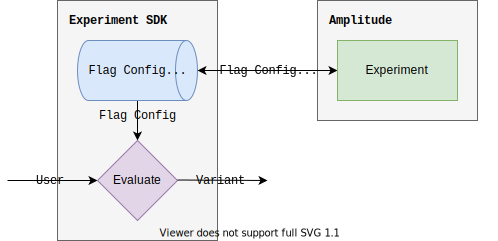

Server-side local evaluation runs [evaluation logic](./implementation.md) on your server, saving you the overhead incurred by making a network request per user evaluation. The [sub-millisecond evaluation](../performance-and-caching.md#local-evaluation) is perfect for latency-minded systems which need to be performant at scale.

!!!warning "Exposure Tracking"
    **Local evaluation does not automatically set experiment user properties**. If you use local evaluation and you want to run experiments where success metrics are analyzed, you will need to implement [exposure tracking](../exposure-tracking.md) (generally done on the client-side).

    To more easily track exposures on the client-side, [bootstrap](../../sdks/javascript-sdk.md#bootstrapping) the client-side SDK with the variants evaluated server-side and utilize [automatic exposure tracking](../exposure-tracking.md#automatic-exposure-tracking) using one of the [analytics SDK integrations](../../sdks/javascript-sdk.md#integrations).

## Targeting Capabilities

Because local evaluation happens outside of Amplitude, advanced targeting and identity resolution powered by Amplitude Analytics is not supported. That said, local evaluation allows you to perform consistent bucketing with target segments, which is sufficient in many cases.

| 
Feature
 | Remote Evaluation | Local Evaluation |
| --- | --- | --- |
| [Consistent bucketing](./implementation.md#consistent-bucketing) | :material-check-bold:{ .green } | :material-check-bold:{ .green } |
| [Individual inclusions](./implementation.md#individual-inclusions) | :material-check-bold:{ .green } | :material-check-bold:{ .green } |
| [Targeting segments](./implementation.md#targeting-segments) | :material-check-bold:{ .green } | :material-check-bold:{ .green } |
| [Amplitude ID resolution](./remote-evaluation.md#amplitude-id-resolution) | :material-check-bold:{ .green } | :material-close-thick:{ .red } |
| [User enrichment](./remote-evaluation.md#user-enrichment) | :material-check-bold:{ .green } | :material-close-thick:{ .red } |
| [Sticky bucketing](./implementation.md#sticky-bucketing) | :material-check-bold:{ .green } | :material-close-thick:{ .red } |

## Implementation

Local evaluation is just [evaluation](./implementation.md)--a function which takes a [user](../data-model.md#users) and a [flag](../data-model.md#flags-and-experiments) as input, and outputs a [variant](../data-model.md#variants).

The only non-local part of local evaluation is getting flag configurations from Amplitude Experiment, but this can happen at an interval, and flags can be cached in-memory on the server-side for zero latency access.

!!!tip "Edge Evaluation"
    The local evaluation Node.js SDK can be run in edge worker/functions which support javascript and a distributed store. Contact your representative or email [experiment@amplitude.com](mailto:experiment@amplitude.com) to learn more.

## SDKs

Local evaluation is only supported by server-side SDKs which have local evaluation implemented.

| SDK | Remote Evaluation | Local Evaluation | Version |
| --- | --- | --- | --- |
| [:material-nodejs: Node.js](../../sdks/nodejs-sdk.md) |  :material-check-bold:{ .green } | :material-check-bold:{ .green } | `1.1.0-alpha.8` |
| [:material-language-java: JVM (Beta)](../../sdks/jvm-sdk.md) |  :material-check-bold:{ .green } | :material-check-bold:{ .green } |  |
| [:fontawesome-brands-golang: Go (Beta)](../../sdks/go-sdk.md) |  :material-check-bold:{ .green } | :material-check-bold:{ .green } |  |
| [:material-language-ruby: Ruby (Beta)](../../sdks/ruby-sdk.md) |  :material-check-bold:{ .green } | :material-close-thick:{ .red } | - |
| [:material-language-python: Python (Beta)](../../sdks/python-sdk.md) |  :material-check-bold:{ .green } | :material-close-thick:{ .red } | - |

### Performance

The following results are for **a single flag evaluation**, and were collected over 10 executions of 10,000 iterations of evaluation with randomized user inputs evaluated for 1 flag configuration, selected at random out of 3 possible flag configurations.

| SDK | Average | Median | Cold Start |
| --- | --- | --- | --- |
| [:material-nodejs: Node.js](../../sdks/nodejs-sdk.md) | 0.025ms | 0.018ms | 3ms |
| [:fontawesome-brands-golang: Go](../../sdks/go-sdk.md) | 0.098ms | 0.071ms | 0.762ms |=
| [:material-language-java: JVM](../../sdks/go-sdk.md) | 0.098ms | 0.071ms | 0.762ms |

Cold Start: 6.413201
Average: 0.003698
Median: 0.001517