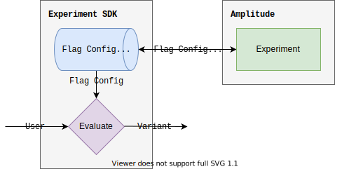

Local evaluation runs [evaluation logic](./implementation.md) in the SDK, saving you the overhead incurred by making a network request per user evaluation. The [sub-millisecond evaluation](../performance-and-caching.md#local-evaluation) is perfect for latency-minded systems which need to be performant at scale.

## Targeting capabilities

Local evaluation happens outside of Amplitude, which means advanced targeting and identity resolution powered by Amplitude Analytics isn't supported. That said, local evaluation allows you to perform consistent bucketing with target segments, which is often enough.

!!!warning "Client-side local evaluation data sensitivity"

    When using client-side local evaluation it is important to note that all data used in targeting is included in the flag configuration loaded on the client-side. For example, if you are targeting a specific user by their email, that email has effectively been leaked to all clients, regardless of user.

| 
Feature
 | Remote Evaluation | Local Evaluation |
| --- | --- | --- |
| [Consistent bucketing](./implementation.md#consistent-bucketing) | :material-check-bold:{ .green } | :material-check-bold:{ .green } |
| [Individual inclusions](./implementation.md#individual-inclusions) | :material-check-bold:{ .green } | :material-check-bold:{ .green } |
| [Targeting segments](./implementation.md#targeting-segments) | :material-check-bold:{ .green } | :material-check-bold:{ .green } |
| [Amplitude ID resolution](./remote-evaluation.md#amplitude-id-resolution) | :material-check-bold:{ .green } | :material-close-thick:{ .red } |
| [User enrichment](./remote-evaluation.md#user-enrichment) | :material-check-bold:{ .green } | :material-close-thick:{ .red } |
| [Sticky bucketing](./implementation.md#sticky-bucketing) | :material-check-bold:{ .green } | :material-close-thick:{ .red } |

## Implementation

Local evaluation is just [evaluation](./implementation.md)--a function which takes a [user](../data-model.md#users) and a [flag](../data-model.md#flags-and-experiments) as input, and outputs a [variant](../data-model.md#variants).

The SDK loads flag configuration updates from the server on startup and stores them in memory for access prior to each evaluation. After startup, the SDK begins polling for flag configuration updates from the server.

!!!tip "Edge Evaluation"
    The local evaluation Node.js SDK can be run in edge worker/functions which support JavaScript and a distributed store. Contact your representative or email [experiment@amplitude.com](mailto:experiment@amplitude.com) to learn more.

### Exposure and assignment tracking

Local evaluation SDKs track evaluations differently on the client-side vs on the server-side.

- Client-side SDKs track an [**exposure event**](../exposure-tracking.md) when the user is evaluated due to a variant being accessed from the SDK.
- Server-side SDKs track an **assignment event** (if configured to do so) when a user is evaluated.

Server-side local evaluation experiments often set the Assignment event as a heuristic for Exposure.

## SDKs

All server-side SDKs and some client-side (which have local evaluation enabled) support local evaluation.

### Client-side

| SDK | Remote Evaluation | Local Evaluation |
| --- | --- | --- |
| [:javascript-color: JavaScript](../../sdks/javascript-sdk.md) |  :material-check-bold:{ .green } | :material-check-bold:{ .green }  |
| [:android: Android](../../sdks/android-sdk.md) |  :material-check-bold:{ .green } | :material-close-thick:{ .red }  |
| [:material-apple-ios: iOS](../../sdks/ios-sdk.md) |  :material-check-bold:{ .green } | :material-close-thick:{ .red } |
| [:react: React Native](../../sdks/react-native-sdk.md) |  :material-check-bold:{ .green } | :material-close-thick:{ .red } |

### Server-side

| SDK | Remote Evaluation | Local Evaluation |
| --- | --- | --- |
| [:node: Node.js](../../sdks/nodejs-sdk.md) |  :material-check-bold:{ .green } | :material-check-bold:{ .green }  |
| [:ruby: Ruby](../../sdks/ruby-sdk.md) |  :material-check-bold:{ .green } | :material-check-bold:{ .green }  |
| [:java: JVM](../../sdks/jvm-sdk.md) |  :material-check-bold:{ .green } | :material-check-bold:{ .green } |
| [:golang: Go](../../sdks/go-sdk.md) |  :material-check-bold:{ .green } | :material-check-bold:{ .green } |
| [:python: Python](../../sdks/python-sdk.md) |  :material-check-bold:{ .green } | :material-check-bold:{ .green } |

### Performance

The following results are for **a single flag evaluation**, and were collected over 10 executions of 10,000 iterations of evaluation with randomized user inputs evaluated for 1 flag configuration, selected at random out of 3 possible flag configurations.

| SDK | Average | Median | Cold Start |
| --- | --- | --- | --- |
| [:material-nodejs: Node.js](../../sdks/nodejs-sdk.md) | 0.025ms | 0.018ms | 3ms |
| [:fontawesome-brands-golang: Go](../../sdks/go-sdk.md) | 0.098ms | 0.071ms | 0.7ms |
| [:material-language-java: JVM](../../sdks/go-sdk.md) | 0.007ms | 0.005ms | 6ms |
