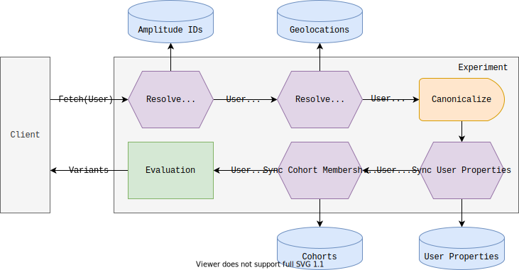

Remote evaluation involves making a request to Amplitude Experiment's evaluation servers to fetch variants for a user. Remote evaluation is the default way to evaluate users on client-side apps, but may also be used from a server-side environment.

**Client-side**

**Server-side**

## Targeting Capabilities

Remote evaluation targeting and identity resolution is powered by Amplitude Analytics' historical user data. This enables advanced features like Amplitude ID resolution, targeting behavioral cohorts, and utilizing historical user properties.

| 
Feature
 | Remote Evaluation | Local Evaluation |
| --- | --- | --- |
| [Consistent bucketing](./implementation.md#consistent-bucketing) | :material-check-bold:{ .green } | :material-check-bold:{ .green } |
| [Individual inclusions](./implementation.md#individual-inclusions) | :material-check-bold:{ .green } | :material-check-bold:{ .green } |
| [Targeting segments](./implementation.md#targeting-segments) | :material-check-bold:{ .green } | :material-check-bold:{ .green } |
| [Amplitude ID resolution](./remote-evaluation.md#amplitude-id-resolution) | :material-check-bold:{ .green } | :material-close-thick:{ .red } |
| [User enrichment](./remote-evaluation.md#user-enrichment) | :material-check-bold:{ .green } | :material-close-thick:{ .red } |
| [Sticky bucketing](./implementation.md#sticky-bucketing) | :material-check-bold:{ .green } | :material-close-thick:{ .red } |

## Implementation

Remote evaluation appends additional information to the user before passing the user object to the evaluation implementation.

### Amplitude ID resolution

Amplitude ID resolution happens before additional user enrichment, and is required if bucketing by Amplitude ID.

### User enrichment

#### Geolocation

If you use location based targeting in your flags, remote evaluation will automatically resolve location based on the client's IP and use a canonical `Country` user property to make targeting consistent and easy.

The following fields are resolved via IP geolocation:

* Country
* City
* Region
* DMA

#### Canonicalization

Remote evaluation canonicalizes inputs to make it easier to segment users by platform, OS, lanugage, country, etc, even if the devices report slightly different values. Canonicalization transforms various known device, language, and country inputs into canonical values which remain consistent even if the client reports different values.

The following fields are canonicalized on remote evaluation:

* Platform
* Device Family
* Device Type
* Language
* Country

#### User properties

!!!warning "Race Conditions"
    Targeting a recently set user property may cause a race between Amplitude Analytics ingesting and applying the user property, and Experiment accessing the user property. To avoid any races between a user property being set, and a remote evaluation accessing the user's properties, the user property should be sent explicitly in the remote fetch request.

 The [resolved Amplitude ID](#amplitude-id-resolution) is used to access the user's current user properties based on historical analytics data. These user properties are merged with any user properties sent explicitly in the fetch request and which are then passed in for [evaluation](./implementation.md).

!!!info "User Property Merge Priority"
    User properties sent explicitly in a remote fetch request are prioritized over user properties accessed from analytics.

#### Cohort membership

Remote evaluation gets the user's cohort membership from analytics which enables targeting by cohorts in [targeting segments](./implementation.md#targeting-segments).

!!!warning "Hourly Cohort Sync"
    Dynamic cohorts are synced hourly. Therefore, only use cohort targeting if the bucketing is not time sensitive. Time sensitive user targeting should use user properties passed explicitly to the remote fetch request.

## SDKs

Remote evaluation is supported by all SDKs, client-side and server-side.

### Client-side

-   [:material-language-javascript:{ .lg .middle } __JavaScript__](../../sdks/javascript-sdk.md)
-   [:material-apple-ios:{ .lg .middle } __iOS__](../../sdks/ios-sdk.md)
-   [:material-android:{ .lg .middle } __Android__](../../sdks/android-sdk.md)
-   [:material-react:{ .lg .middle } __React Native__](../../sdks/react-native-sdk.md)

### Server-side

-   [:material-nodejs:{ .lg .middle } __Node.js__](../../sdks/javascript-sdk.md)

## APIs