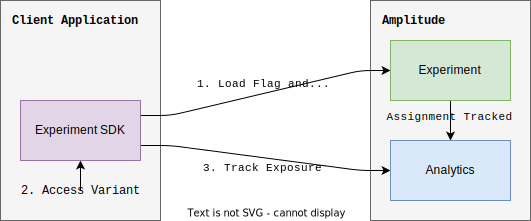

Remote evaluation involves making a request to Amplitude Experiment's evaluation servers to fetch variants for a user. Remote evaluation is the default way to evaluate users on client-side apps, but may also be used from a server-side environment.

**Client-side**

**Server-side**

## Targeting Capabilities

Remote evaluation targeting and identity resolution is powered by Amplitude Analytics' historical user data. This enables advanced features like Amplitude ID resolution, targeting behavioral cohorts, and utilizing historical user properties.

| 
Feature
 | Remote Evaluation | Local Evaluation |
| --- | --- | --- |
| [Consistent bucketing](./implementation.md#consistent-bucketing) | :material-check-bold:{ .green } | :material-check-bold:{ .green } |
| [Individual inclusions](./implementation.md#individual-inclusions) | :material-check-bold:{ .green } | :material-check-bold:{ .green } |
| [Targeting segments](./implementation.md#allocation-bucketing) | :material-check-bold:{ .green } | :material-check-bold:{ .green } |
| [Amplitude ID resolution](#TODO) | :material-check-bold:{ .green } | :material-close-thick:{ .red } |
| [User enrichment](#TODO) | :material-check-bold:{ .green } | :material-close-thick:{ .red } |
| [Sticky bucketing](./implementation#sticky-bucketing) | :material-check-bold:{ .green } | :material-close-thick:{ .red } |

## Amplitude ID resolution

## User enrichment

