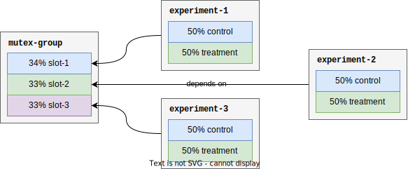
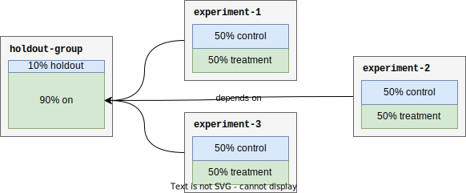

Flag dependencies define relationships between flags to ensure evaluation order. The result of each flag's evaluation is then passed to all subsequent evaluations to decide if dependent flags should [evaluate](./evaluation/implementation.md#flag-dependencies) based on the result of the dependency.

Flag dependencies are currently used to implement mutual exclusion and holdout groups.

## Mutual exclusion groups

!!!info "Learn more about [mutual exclusion group creation, management, and best practices](#TODO-link-to-help-center) at Amplitude's help center."

A mutual exclusion group ensures that, on evaluation, at most one of the experiments within the group is assigned. In Amplitude Experiment, a mutual exclusion group defines multiple slots, each with a percent of traffic allocated to that slot. The mutual exclusion group is actually just a flag with a variant for each slot. Experiments in the group add a dependency on one or more slots (variants) of the mutual exclusion group flag.

The variant result of a mutual exclusion group's evaluation isn't returned and not assigned as a user property.

## Holdout groups

!!!info "Learn more about [holdout group creation, management, and best practices](#TODO-link-to-help-center) at Amplitude's help center."

A holdout group withholds a percentage of traffic from a group of experiments, allowing measurement of the long-term and combined impact of multiple experiments. In Amplitude Experiment, a holdout group is implemented using a flag with two variants: `holdout` and `on`, where the `holdout` variant is allocated the holdout percentage defined on creation. Experiments in the group depend on the holdout group's variant `on`.

The variant result of a holdout group's evaluation isn't returned but is assigned as a user property to enable holdout analysis.
