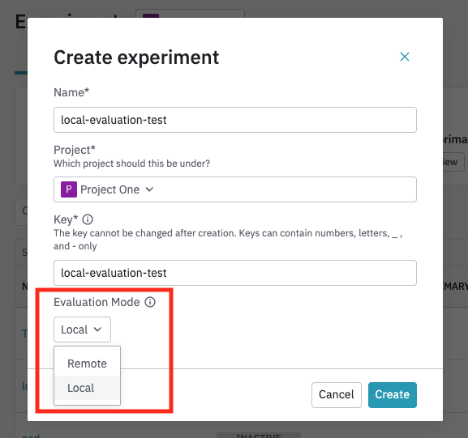
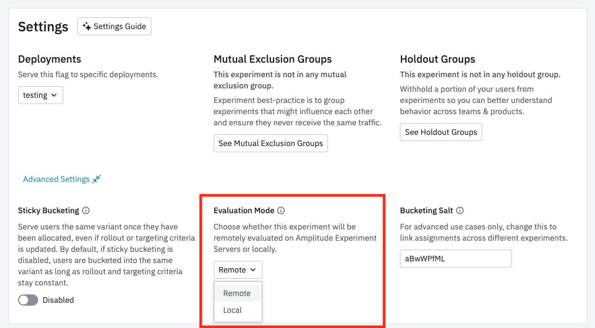
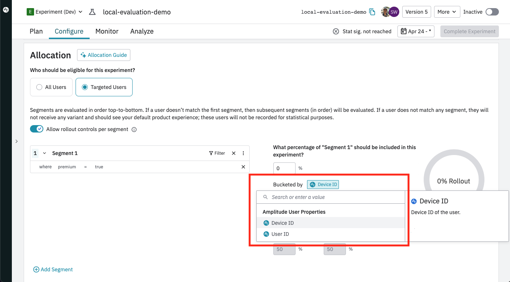

Guide to creating a local evaluation flag, or migrating an existing remote evaluation flag to local evaluation.

## Create a local evaluation flag or experiment

1. [Create a flag or experiment](./getting-started/create-a-flag.md) as you normally would, but select the **Local** option for the **Evaluation Mode** setting.

    

2. Within your new experiment, set your server-side deployment, configure the allocation (for example, target 100% of users), and activate your flag.

!!!done
    Your local evaluation experiment has been set up and is ready to  using a [local evaluation sdk](../general/evaluation/local-evaluation.md#sdks).

## Migrate an existing remote flag to local evaluation

You may retroactively transition a remote flag to local evaluation mode by changing the flag settings and updating the bucketing key from Amplitude ID to Device ID or User ID.

!!!warning
    Migrating a flag from remote to local evaluation mode will change the bucketing behavior. Before migrating, your flag will need to be inactive. You need to make sure that all targeting rules abide by the limitations of local evaluation.

1. Change the flag's "Evaluation Mode" setting to "Local" in the Advanced Settings section of the Configure tab.

    

2. Update the "bucketed by" setting from Amplitude ID to Device ID in each "Rule Based User Segment" and "All Non-Targeted Users" Section.

    
