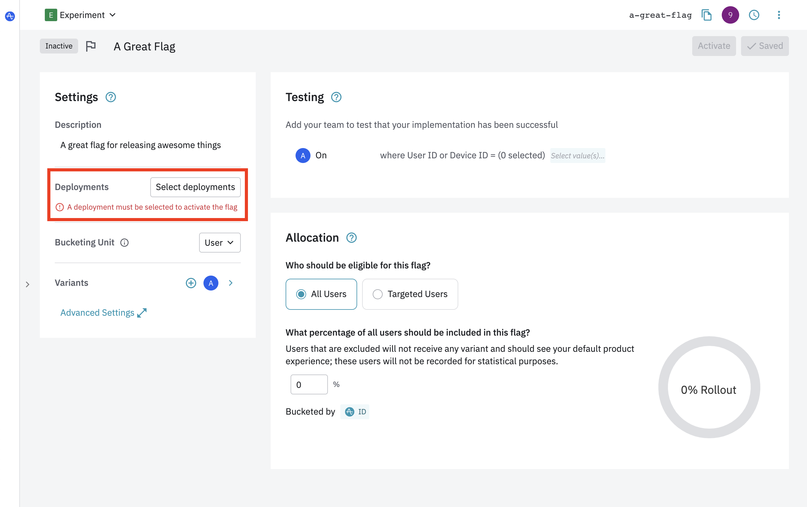
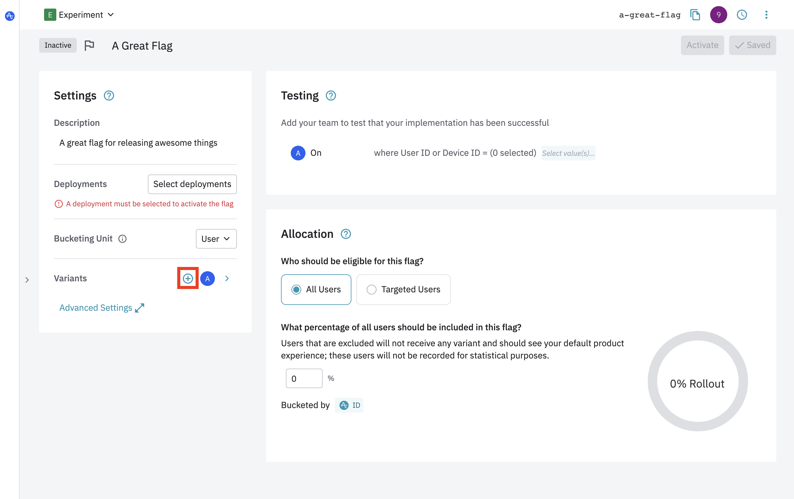
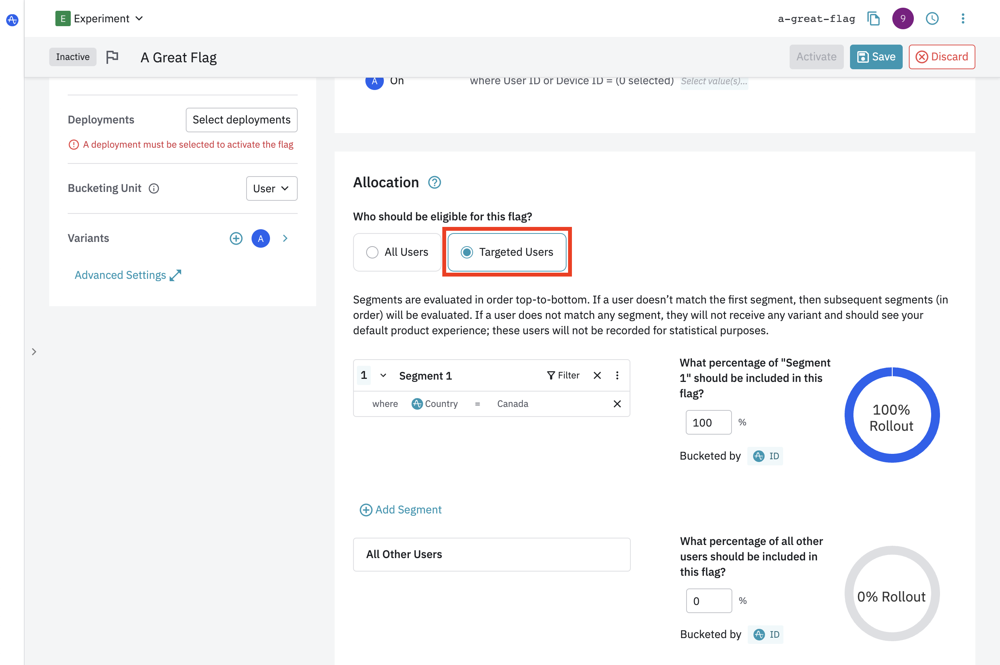

To create a [flag](../../general/data-model.md#flags-and-experiments), first navigate to the "Flags" screen in the left navigation bar.

1. From the Flags screen in Experiment, select your target project from the dropdowns.
2. Click **Create Flag**.
3. Enter a **Name** for the flag.
   1. Experiment will automatically generate a normalized **Key** for your flag/experiment. The key is the string which is used to access the variant in you application. You may choose to customize this key, as once the key is set it can't be changed.
4. (Optional) Enter a **Flag Description** to better describe the flag.
5. Save the experiment configuration. You can edit most fields from the flag's settings.

### Add a deployment

Once you've created the flag, you'll need to add a [deployment](../../general/data-model.md#deployments). Add one or more deployments using the Settings card on the Configure page.

!!!tip "Multiple Deployments"
    You may select multiple deployments in the dropdown if you want to target multiple deployments. For example, if you are running an experiment on both your iOS and Android apps, you should create separate deployments for each and select both in the multi-deployment experiment.

### Define variants

After you have created your flag, you are ready to define its [variants](../../general/data-model.md#variants). A flag will contain an initial variant, "on", by default. If you are rolling out more than one variant of a feature, add variants using the **Create Variant** button. Make sure to add descriptions to your variants so that your team members can follow along.

!!!info "Your flag must have at least one variant."

!!!tip "Experiment variants"
    By default, flags are created with a single "on" variant and experiments come with two default variants, "control" and "treatment".

### Configure targeting rules

Your flag won't target any users by default. To target users, set the **Percentage Rollout** to 100%. Now all evaluated users will be assigned the "on" variant for this feature flag.

If you would like to target specific segments of users instead of all users, switch to the "Targeted Users" view and create your segments.

If your flag has more than one variant, you will also be able to adjust distribution.

### Activate the flag

Once you're done configuring your flag, activate the flag using the toggle in the upper right corner and follow the instructions in the activation modal.

