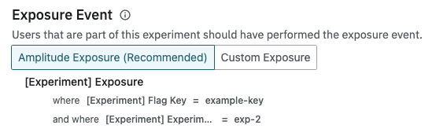

Restarting experiments can be useful if you had instrumentation issues that resulted in data quality issues and have fixed them. By restarting your experiment, you will be able to exclude any previous user data from the monitoring and analysis of your restarted experiment.

!!!beta "Restarting experiments in Beta"

    This feature is in Beta. If you would like to try out an early version, please reach out to us.

### Prerequisites

There are two primary requirements to be able to restart your experiment.

1. Your experiment must use Amplitude's default exposure tracking.
2. Your client SDK version must support experiment restarts.

| SDK | Minimum version |
| --- | --- |
| JavaScript | v1.8.0 |
| Android | v1.10.0 |
| iOS | v1.11.0 |
| React Native | v1.2.0 |

### Options when restarting

The following changes will be made to your experiment configuration when restarting:

| Property | How it will be changed after restart |
| --- | --- |
| [Experiment Key](#experiment-key) | Updated to a new value |
| Exposure Event | If your experiment is using a custom exposure event, it will be reset to the default Amplitude exposure event |
| Start Date | Updated to the date of the restart |
| End Date | (Optional) Updated to your selected value |
| Bucketing Salt | (Optional) If selected, randomized to a new value |
| Sticky Bucketing | If you selected the option to re-randomize users and sticky bucketing is on, it will be turned off |
| Decision | If you previously rolled out or rolled back your experiment, this decision will be erased |

### Experiment Key

The experiment key property is used by Amplitude exposure events to differentiate when your experiment has been restarted. 

When using the [Evaluation API](../../../apis/evaluation-api) , the response body will contain the experiment key of the currently running experiment.

```json
{
    "<flag_key>": {
        "key": "<variant_value>",
        "payload": <variant_payload>,
        "experiment_key": "exp-1",
    },
    // ...
}
```

Similarly this experiment key is available when using fetching variants using Experiment SDKs.

For example, for the Javascript SDK:
The [Variant](../../../sdks/javascript-sdk/#variant) object will contain the existing `value` and `payload` properties, along with a new `expKey` property.

### After restarting

After the experiment restart, the exposure event will be updated to use the new experiment key.



This new filter on the exposure event ensures that previously recorded exposure and metric data will not be included in your experiment analysis.