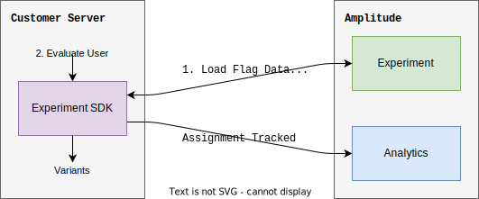

Welcome to Amplitude Experiment. This page acts as a quick reference as well as a high level system overview of Experiment's end-to-end feature-flagging and experimentation platform.

-   :material-book-open-variant:{ .lg .middle } __Getting started__

    ---

    Step-by-step guide to get started developing with Amplitude Experiment.

    [:octicons-arrow-right-24: Start developing](#getting-started)

-   :material-hexagon-multiple:{ .lg .middle } __System overview__

    ---

    Understand about how Amplitude Experiment works within your system.

    [:octicons-arrow-right-24: Learn more](#system-overview)

-   :material-code-braces:{ .lg .middle } __Experiment SDKs__

    ---

    Find the right Experiment SDK for your app.

    [:octicons-arrow-right-24: See the SDKs](#sdks)

-   :material-file-code-outline:{ .lg .middle } __Experiment REST APIs__

    ---

    Explore the APIs for Amplitude Experiment.

    [:octicons-arrow-right-24: See the APIs](#rest-apis)

## Getting started

Guide to getting started developing for Amplitude Experiment.

1. [Create a deployment](guides/getting-started/create-a-deployment.md)
2. [Create and configure a feature flag](guides/getting-started/create-a-flag.md)
3. [Fetch variants for a user](guides/getting-started/fetch-variants.md)
4. [Track an exposure event](guides/getting-started/track-exposure.md)

## SDKs

  <!--android-->
<a href="/experiment/sdks/android-sdk" class="sdk-icons"><svg xmlns="http://www.w3.org/2000/svg" viewBox="0 0 576 512"><!--! Font Awesome Free 6.1.1 by @fontawesome - https://fontawesome.com License - https://fontawesome.com/license/free (Icons: CC BY 4.0, Fonts: SIL OFL 1.1, Code: MIT License) Copyright 2022 Fonticons, Inc. --><path d="M420.55,301.93a24,24,0,1,1,24-24,24,24,0,0,1-24,24m-265.1,0a24,24,0,1,1,24-24,24,24,0,0,1-24,24m273.7-144.48,47.94-83a10,10,0,1,0-17.27-10h0l-48.54,84.07a301.25,301.25,0,0,0-246.56,0L116.18,64.45a10,10,0,1,0-17.27,10h0l47.94,83C64.53,202.22,8.24,285.55,0,384H576c-8.24-98.45-64.54-181.78-146.85-226.55"/></svg>Android</a>

  <!--ios-->
<a href="/experiment/sdks/ios-sdk" class="sdk-icons"><svg xmlns="http://www.w3.org/2000/svg" viewBox="0 0 24 24"><path d="M2.09 16.8h1.66V9.76H2.09m.83-.92a.9.9 0 0 0 .92-.9c0-.5-.4-.9-.92-.9a.9.9 0 0 0-.92.9c0 .5.4.9.92.9m6.33-1.78C6.46 7.06 4.7 8.96 4.7 12c0 3.06 1.76 4.96 4.55 4.96s4.55-1.9 4.55-4.96c0-3.04-1.76-4.94-4.55-4.94m0 1.44c1.71 0 2.8 1.37 2.8 3.5 0 2.15-1.09 3.5-2.8 3.5-1.71 0-2.79-1.35-2.79-3.5 0-2.13 1.08-3.5 2.79-3.5m5.25 5.61c.07 1.76 1.5 2.85 3.72 2.85 2.32 0 3.78-1.14 3.78-2.96 0-1.43-.82-2.23-2.77-2.68l-1.1-.25c-1.18-.28-1.66-.65-1.66-1.29 0-.78.73-1.33 1.81-1.33 1.1 0 1.85.55 1.93 1.44h1.63c-.04-1.69-1.43-2.83-3.55-2.83-2.08 0-3.56 1.15-3.56 2.85 0 1.37.83 2.22 2.6 2.62l1.24.29c1.21.29 1.7.68 1.7 1.38 0 .8-.8 1.37-1.96 1.37s-2.05-.57-2.15-1.46H14.5Z"/></svg>iOS</a>

  <!--JavaScript-->
<a href="/experiment/sdks/javascript-sdk" class="sdk-icons"><svg xmlns="http://www.w3.org/2000/svg" viewBox="0 0 448 512"><!--! Font Awesome Free 6.1.1 by @fontawesome - https://fontawesome.com License - https://fontawesome.com/license/free (Icons: CC BY 4.0, Fonts: SIL OFL 1.1, Code: MIT License) Copyright 2022 Fonticons, Inc. --><path d="M0 32v448h448V32H0zm243.8 349.4c0 43.6-25.6 63.5-62.9 63.5-33.7 0-53.2-17.4-63.2-38.5l34.3-20.7c6.6 11.7 12.6 21.6 27.1 21.6 13.8 0 22.6-5.4 22.6-26.5V237.7h42.1v143.7zm99.6 63.5c-39.1 0-64.4-18.6-76.7-43l34.3-19.8c9 14.7 20.8 25.6 41.5 25.6 17.4 0 28.6-8.7 28.6-20.8 0-14.4-11.4-19.5-30.7-28l-10.5-4.5c-30.4-12.9-50.5-29.2-50.5-63.5 0-31.6 24.1-55.6 61.6-55.6 26.8 0 46 9.3 59.8 33.7L368 290c-7.2-12.9-15-18-27.1-18-12.3 0-20.1 7.8-20.1 18 0 12.6 7.8 17.7 25.9 25.6l10.5 4.5c35.8 15.3 55.9 31 55.9 66.2 0 37.8-29.8 58.6-69.7 58.6z"/></svg>JavaScript</a>

  <!--node-->
<a href="/experiment/sdks/nodejs-sdk" class="sdk-icons"><svg xmlns="http://www.w3.org/2000/svg" viewBox="0 0 448 512"><!--! Font Awesome Free 6.1.1 by @fontawesome - https://fontawesome.com License - https://fontawesome.com/license/free (Icons: CC BY 4.0, Fonts: SIL OFL 1.1, Code: MIT License) Copyright 2022 Fonticons, Inc. --><path d="M224 508c-6.7 0-13.5-1.8-19.4-5.2l-61.7-36.5c-9.2-5.2-4.7-7-1.7-8 12.3-4.3 14.8-5.2 27.9-12.7 1.4-.8 3.2-.5 4.6.4l47.4 28.1c1.7 1 4.1 1 5.7 0l184.7-106.6c1.7-1 2.8-3 2.8-5V149.3c0-2.1-1.1-4-2.9-5.1L226.8 37.7c-1.7-1-4-1-5.7 0L36.6 144.3c-1.8 1-2.9 3-2.9 5.1v213.1c0 2 1.1 4 2.9 4.9l50.6 29.2c27.5 13.7 44.3-2.4 44.3-18.7V167.5c0-3 2.4-5.3 5.4-5.3h23.4c2.9 0 5.4 2.3 5.4 5.3V378c0 36.6-20 57.6-54.7 57.6-10.7 0-19.1 0-42.5-11.6l-48.4-27.9C8.1 389.2.7 376.3.7 362.4V149.3c0-13.8 7.4-26.8 19.4-33.7L204.6 9c11.7-6.6 27.2-6.6 38.8 0l184.7 106.7c12 6.9 19.4 19.8 19.4 33.7v213.1c0 13.8-7.4 26.7-19.4 33.7L243.4 502.8c-5.9 3.4-12.6 5.2-19.4 5.2zm149.1-210.1c0-39.9-27-50.5-83.7-58-57.4-7.6-63.2-11.5-63.2-24.9 0-11.1 4.9-25.9 47.4-25.9 37.9 0 51.9 8.2 57.7 33.8.5 2.4 2.7 4.2 5.2 4.2h24c1.5 0 2.9-.6 3.9-1.7s1.5-2.6 1.4-4.1c-3.7-44.1-33-64.6-92.2-64.6-52.7 0-84.1 22.2-84.1 59.5 0 40.4 31.3 51.6 81.8 56.6 60.5 5.9 65.2 14.8 65.2 26.7 0 20.6-16.6 29.4-55.5 29.4-48.9 0-59.6-12.3-63.2-36.6-.4-2.6-2.6-4.5-5.3-4.5h-23.9c-3 0-5.3 2.4-5.3 5.3 0 31.1 16.9 68.2 97.8 68.2 58.4-.1 92-23.2 92-63.4z"/></svg>Node.js</a>

  <!--ReactNative-->
<a href="/experiment/sdks/react-native-sdk" class="sdk-icons"><svg xmlns="http://www.w3.org/2000/svg" viewBox="0 0 512 512"><!--! Font Awesome Pro 6.1.1 by @fontawesome - https://fontawesome.com License - https://fontawesome.com/license (Commercial License) Copyright 2022 Fonticons, Inc. --><path d="M418.2 177.2c-5.4-1.8-10.8-3.5-16.2-5.1.9-3.7 1.7-7.4 2.5-11.1 12.3-59.6 4.2-107.5-23.1-123.3-26.3-15.1-69.2.6-112.6 38.4-4.3 3.7-8.5 7.6-12.5 11.5-2.7-2.6-5.5-5.2-8.3-7.7-45.5-40.4-91.1-57.4-118.4-41.5-26.2 15.2-34 60.3-23 116.7 1.1 5.6 2.3 11.1 3.7 16.7-6.4 1.8-12.7 3.8-18.6 5.9C38.3 196.2 0 225.4 0 255.6c0 31.2 40.8 62.5 96.3 81.5 4.5 1.5 9 3 13.6 4.3-1.5 6-2.8 11.9-4 18-10.5 55.5-2.3 99.5 23.9 114.6 27 15.6 72.4-.4 116.6-39.1 3.5-3.1 7-6.3 10.5-9.7 4.4 4.3 9 8.4 13.6 12.4 42.8 36.8 85.1 51.7 111.2 36.6 27-15.6 35.8-62.9 24.4-120.5-.9-4.4-1.9-8.9-3-13.5 3.2-.9 6.3-1.9 9.4-2.9 57.7-19.1 99.5-50 99.5-81.7 0-30.3-39.4-59.7-93.8-78.4zM282.9 92.3c37.2-32.4 71.9-45.1 87.7-36 16.9 9.7 23.4 48.9 12.8 100.4-.7 3.4-1.4 6.7-2.3 10-22.2-5-44.7-8.6-67.3-10.6-13-18.6-27.2-36.4-42.6-53.1 3.9-3.7 7.7-7.2 11.7-10.7zM167.2 307.5c5.1 8.7 10.3 17.4 15.8 25.9-15.6-1.7-31.1-4.2-46.4-7.5 4.4-14.4 9.9-29.3 16.3-44.5 4.6 8.8 9.3 17.5 14.3 26.1zm-30.3-120.3c14.4-3.2 29.7-5.8 45.6-7.8-5.3 8.3-10.5 16.8-15.4 25.4-4.9 8.5-9.7 17.2-14.2 26-6.3-14.9-11.6-29.5-16-43.6zm27.4 68.9c6.6-13.8 13.8-27.3 21.4-40.6s15.8-26.2 24.4-38.9c15-1.1 30.3-1.7 45.9-1.7s31 .6 45.9 1.7c8.5 12.6 16.6 25.5 24.3 38.7s14.9 26.7 21.7 40.4c-6.7 13.8-13.9 27.4-21.6 40.8-7.6 13.3-15.7 26.2-24.2 39-14.9 1.1-30.4 1.6-46.1 1.6s-30.9-.5-45.6-1.4c-8.7-12.7-16.9-25.7-24.6-39s-14.8-26.8-21.5-40.6zm180.6 51.2c5.1-8.8 9.9-17.7 14.6-26.7 6.4 14.5 12 29.2 16.9 44.3-15.5 3.5-31.2 6.2-47 8 5.4-8.4 10.5-17 15.5-25.6zm14.4-76.5c-4.7-8.8-9.5-17.6-14.5-26.2-4.9-8.5-10-16.9-15.3-25.2 16.1 2 31.5 4.7 45.9 8-4.6 14.8-10 29.2-16.1 43.4zM256.2 118.3c10.5 11.4 20.4 23.4 29.6 35.8-19.8-.9-39.7-.9-59.5 0 9.8-12.9 19.9-24.9 29.9-35.8zM140.2 57c16.8-9.8 54.1 4.2 93.4 39 2.5 2.2 5 4.6 7.6 7-15.5 16.7-29.8 34.5-42.9 53.1-22.6 2-45 5.5-67.2 10.4-1.3-5.1-2.4-10.3-3.5-15.5-9.4-48.4-3.2-84.9 12.6-94zm-24.5 263.6c-4.2-1.2-8.3-2.5-12.4-3.9-21.3-6.7-45.5-17.3-63-31.2-10.1-7-16.9-17.8-18.8-29.9 0-18.3 31.6-41.7 77.2-57.6 5.7-2 11.5-3.8 17.3-5.5 6.8 21.7 15 43 24.5 63.6-9.6 20.9-17.9 42.5-24.8 64.5zm116.6 98c-16.5 15.1-35.6 27.1-56.4 35.3-11.1 5.3-23.9 5.8-35.3 1.3-15.9-9.2-22.5-44.5-13.5-92 1.1-5.6 2.3-11.2 3.7-16.7 22.4 4.8 45 8.1 67.9 9.8 13.2 18.7 27.7 36.6 43.2 53.4-3.2 3.1-6.4 6.1-9.6 8.9zm24.5-24.3c-10.2-11-20.4-23.2-30.3-36.3 9.6.4 19.5.6 29.5.6 10.3 0 20.4-.2 30.4-.7-9.2 12.7-19.1 24.8-29.6 36.4zm130.7 30c-.9 12.2-6.9 23.6-16.5 31.3-15.9 9.2-49.8-2.8-86.4-34.2-4.2-3.6-8.4-7.5-12.7-11.5 15.3-16.9 29.4-34.8 42.2-53.6 22.9-1.9 45.7-5.4 68.2-10.5 1 4.1 1.9 8.2 2.7 12.2 4.9 21.6 5.7 44.1 2.5 66.3zm18.2-107.5c-2.8.9-5.6 1.8-8.5 2.6-7-21.8-15.6-43.1-25.5-63.8 9.6-20.4 17.7-41.4 24.5-62.9 5.2 1.5 10.2 3.1 15 4.7 46.6 16 79.3 39.8 79.3 58 0 19.6-34.9 44.9-84.8 61.4zm-149.7-15c25.3 0 45.8-20.5 45.8-45.8s-20.5-45.8-45.8-45.8c-25.3 0-45.8 20.5-45.8 45.8s20.5 45.8 45.8 45.8z"/></svg>React Native</a>

  <!--ruby-->
<a href="/experiment/sdks/ruby-sdk" class="sdk-icons"><svg xmlns="http://www.w3.org/2000/svg" aria-hidden="true" role="img" preserveAspectRatio="xMidYMid meet" viewBox="0 0 24 24"><path fill="currentColor" d="M18.8 2.07c2.52.43 3.24 2.16 3.2 3.97V6l-1.14 14.93l-14.78 1.01h.01c-1.23-.05-3.96-.17-4.09-3.99l1.37-2.5l2.77 6.46l2.36-7.62l-.05.01l.02-.02l7.71 2.46l-1.99-7.78l7.35-.46l-5.79-4.74l3.05-1.7v.01M2 17.91v.02v-.02M6.28 6.23c2.96-2.95 6.79-4.69 8.26-3.2c1.46 1.47-.08 5.09-3.04 8.03c-3 2.94-6.77 4.78-8.24 3.3c-1.47-1.49.04-5.19 3.01-8.13h.01Z"/></svg>Ruby</a>

  <!--Golang-->
<a href="/experiment/sdks/go-sdk" class="sdk-icons"><svg xmlns="http://www.w3.org/2000/svg" viewBox="0 0 640 512"><!--! Font Awesome Pro 6.1.1 by @fontawesome - https://fontawesome.com License - https://fontawesome.com/license (Commercial License) Copyright 2022 Fonticons, Inc. --><path d="M400.1 194.8C389.2 197.6 380.2 199.1 371 202.4C363.7 204.3 356.3 206.3 347.8 208.5L347.2 208.6C343 209.8 342.6 209.9 338.7 205.4C334 200.1 330.6 196.7 324.1 193.5C304.4 183.9 285.4 186.7 267.7 198.2C246.5 211.9 235.6 232.2 235.9 257.4C236.2 282.4 253.3 302.9 277.1 306.3C299.1 309.1 316.9 301.7 330.9 285.8C333 283.2 334.9 280.5 337 277.5V277.5L337 277.5C337.8 276.5 338.5 275.4 339.3 274.2H279.2C272.7 274.2 271.1 270.2 273.3 264.9C277.3 255.2 284.8 239 289.2 230.9C290.1 229.1 292.3 225.1 296.1 225.1H397.2C401.7 211.7 409 198.2 418.8 185.4C441.5 155.5 468.1 139.9 506 133.4C537.8 127.8 567.7 130.9 594.9 149.3C619.5 166.1 634.7 188.9 638.8 218.8C644.1 260.9 631.9 295.1 602.1 324.4C582.4 345.3 557.2 358.4 528.2 364.3C522.6 365.3 517.1 365.8 511.7 366.3C508.8 366.5 506 366.8 503.2 367.1C474.9 366.5 449 358.4 427.2 339.7C411.9 326.4 401.3 310.1 396.1 291.2C392.4 298.5 388.1 305.6 382.1 312.3C360.5 341.9 331.2 360.3 294.2 365.2C263.6 369.3 235.3 363.4 210.3 344.7C187.3 327.2 174.2 304.2 170.8 275.5C166.7 241.5 176.7 210.1 197.2 184.2C219.4 155.2 248.7 136.8 284.5 130.3C313.8 124.1 341.8 128.4 367.1 145.6C383.6 156.5 395.4 171.4 403.2 189.5C405.1 192.3 403.8 193.9 400.1 194.8zM48.3 200.4C47.05 200.4 46.74 199.8 47.36 198.8L53.91 190.4C54.53 189.5 56.09 188.9 57.34 188.9H168.6C169.8 188.9 170.1 189.8 169.5 190.7L164.2 198.8C163.6 199.8 162 200.7 161.1 200.7L48.3 200.4zM1.246 229.1C0 229.1-.3116 228.4 .3116 227.5L6.855 219.1C7.479 218.2 9.037 217.5 10.28 217.5H152.4C153.6 217.5 154.2 218.5 153.9 219.4L151.4 226.9C151.1 228.1 149.9 228.8 148.6 228.8L1.246 229.1zM75.72 255.9C75.1 256.8 75.41 257.7 76.65 257.7L144.6 258C145.5 258 146.8 257.1 146.8 255.9L147.4 248.4C147.4 247.1 146.8 246.2 145.5 246.2H83.2C81.95 246.2 80.71 247.1 80.08 248.1L75.72 255.9zM577.2 237.9C577 235.3 576.9 233.1 576.5 230.9C570.9 200.1 542.5 182.6 512.9 189.5C483.9 196 465.2 214.4 458.4 243.7C452.8 268 464.6 292.6 487 302.6C504.2 310.1 521.3 309.2 537.8 300.7C562.4 287.1 575.8 268 577.4 241.2C577.3 240 577.3 238.9 577.2 237.9z"/></svg>Go</a>

  <!--JVM-->
<a href="/experiment/sdks/jvm-sdk" class="sdk-icons"><svg xmlns="http://www.w3.org/2000/svg" viewBox="0 0 384 512"><!--! Font Awesome Pro 6.1.1 by @fontawesome - https://fontawesome.com License - https://fontawesome.com/license (Commercial License) Copyright 2022 Fonticons, Inc. --><path d="M277.74 312.9c9.8-6.7 23.4-12.5 23.4-12.5s-38.7 7-77.2 10.2c-47.1 3.9-97.7 4.7-123.1 1.3-60.1-8 33-30.1 33-30.1s-36.1-2.4-80.6 19c-52.5 25.4 130 37 224.5 12.1zm-85.4-32.1c-19-42.7-83.1-80.2 0-145.8C296 53.2 242.84 0 242.84 0c21.5 84.5-75.6 110.1-110.7 162.6-23.9 35.9 11.7 74.4 60.2 118.2zm114.6-176.2c.1 0-175.2 43.8-91.5 140.2 24.7 28.4-6.5 54-6.5 54s62.7-32.4 33.9-72.9c-26.9-37.8-47.5-56.6 64.1-121.3zm-6.1 270.5a12.19 12.19 0 0 1-2 2.6c128.3-33.7 81.1-118.9 19.8-97.3a17.33 17.33 0 0 0-8.2 6.3 70.45 70.45 0 0 1 11-3c31-6.5 75.5 41.5-20.6 91.4zM348 437.4s14.5 11.9-15.9 21.2c-57.9 17.5-240.8 22.8-291.6.7-18.3-7.9 16-19 26.8-21.3 11.2-2.4 17.7-2 17.7-2-20.3-14.3-131.3 28.1-56.4 40.2C232.84 509.4 401 461.3 348 437.4zM124.44 396c-78.7 22 47.9 67.4 148.1 24.5a185.89 185.89 0 0 1-28.2-13.8c-44.7 8.5-65.4 9.1-106 4.5-33.5-3.8-13.9-15.2-13.9-15.2zm179.8 97.2c-78.7 14.8-175.8 13.1-233.3 3.6 0-.1 11.8 9.7 72.4 13.6 92.2 5.9 233.8-3.3 237.1-46.9 0 0-6.4 16.5-76.2 29.7zM260.64 353c-59.2 11.4-93.5 11.1-136.8 6.6-33.5-3.5-11.6-19.7-11.6-19.7-86.8 28.8 48.2 61.4 169.5 25.9a60.37 60.37 0 0 1-21.1-12.8z"/></svg>JVM</a>

## REST APIs
| API | Description |
| --- | --- |
| [Evaluation API](apis/evaluation-api.md) | Evaluate a user for the feature flags and experiments assigned to the deployment used to authorize the request |
| [Management API (Beta)](apis/management-api.md) | Manage or list flags and experiments within your organization. |

## System overview

When it comes to feature flag delivery and experimentation, one size does _not_ fit all. Amplitude Experiment is built for flexibility in order to fit in with any architecture and a variety of needs.

That said, we can generally split experimentation and feature-flagging systems into [client-side](#client-side) and [server-side](#server-side) architectures.

### Client-side

!!!done "Easiest way to get started delivering flag and experimenting on your client side application."

Client-side experimentation and feature-flagging involves the client making a request to fetch flags and experiments from Amplitude's [remote evaluation](./general/evaluation/remote-evaluation.md) servers when the application is initialized.

### Server-side

#### Remote evaluation

!!!info "Simple and flexible API & SDKs made to fit into any system."

<!-- !!!caution "May have trouble scaling in high volume systems." -->

Server-side [remote evaluation](./general/evaluation/remote-evaluation.md) involves making a request from your server to Amplitude Experiment's evaluation servers to fetch variants for a user. The resulting variants may be used directly on the server or passed back for use on the client (or any other part of your system).

#### Local evaluation (alpha)

!!!tip "Fast evaluation for performance minded systems."

<!-- !!!caution "Unable to utilized advanced targeting powered by historical analytics data." -->

Server-side [local evaluation](./general/evaluation/local-evaluation.md) runs [evaluation logic](./general/evaluation/implementation.md) on your server, saving you the overhead incurred by making a network request per user evaluation. The [sub-millisecond evaluation](./general/performance-and-caching.md#local-evaluation) is perfect for latency-minded systems which need to be performant at scale. However, since evaluation happens outside of Amplitude, advanced targeting and identity resolution powered by Amplitude Analytics is not possible.

