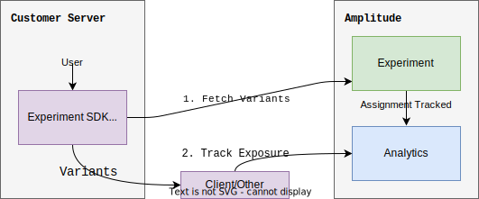

Welcome to Amplitude Experiment. This page acts as a quick reference as well as a high level system overview of Experiment's end-to-end feature-flagging and experimentation platform.

- :material-book-open-variant:{ .lg .middle } __Getting started__

    ---

    Step-by-step guide to get started developing with Amplitude Experiment.

    [:octicons-arrow-right-24: Start developing](#getting-started)

- :material-hexagon-multiple:{ .lg .middle } __System overview__

    ---

    Understand about how Amplitude Experiment works within your system.

    [:octicons-arrow-right-24: Learn more](#system-overview)

- :material-code-braces:{ .lg .middle } __Experiment SDKs__

    ---

    Find the right Experiment SDK for your app.

    [:octicons-arrow-right-24: See the SDKs](#sdks)

- :material-file-code-outline:{ .lg .middle } __Experiment REST APIs__

    ---

    Explore the APIs for Amplitude Experiment.

    [:octicons-arrow-right-24: See the APIs](#rest-apis)

## Getting started

Guide to getting started developing for Amplitude Experiment.

1. [Create a deployment](guides/getting-started/create-a-deployment.md)
2. [Create and configure a feature flag](guides/getting-started/create-a-flag.md)
3. [Fetch variants for a user](guides/getting-started/fetch-variants.md)
4. [Track an exposure event](guides/getting-started/track-exposure.md)

## SDKs

Client-side SDKs work in a single-user context. Server-side SDKs work in a multi-user context.

### Client-side

--8<-- "includes/experiment-client-sdks.md"

### Server-side

--8<-- "includes/experiment-server-sdks.md"

## REST APIs

| API | Description |
| --- | --- |
| [Evaluation API](apis/evaluation-api.md) | Evaluate a user for the feature flags and experiments assigned to the deployment used to authorize the request |
| [Management API (Beta)](apis/management-api.md) | Manage or list flags and experiments within your organization. |

## System overview
<!-- vale Amplitude.Contractions = NO-->
When it comes to feature flag delivery and experimentation, one size does _not_ fit all. Amplitude Experiment is built for flexibility to fit in with any architecture and a variety of needs.
<!-- vale Amplitude.Contractions = YES-->
That said, you can generally split experimentation and feature-flagging systems into [client-side](#client-side) and [server-side](#server-side) architectures.

### Client-side

!!!done "Easiest way to get started delivering flag and experimenting on your client side application."

Client-side experimentation and feature-flagging involves the client making a request to fetch flags and experiments from Amplitude's [remote evaluation](./general/evaluation/remote-evaluation.md) servers when the application is initialized.

### Server-side

#### Remote evaluation

!!!info "Simple and flexible API & SDKs made to fit into any system."

<!-- !!!caution "May have trouble scaling in high volume systems." -->

Server-side [remote evaluation](./general/evaluation/remote-evaluation.md) involves making a request from your server to Amplitude Experiment's evaluation servers to fetch variants for a user. Use the resulting variants directly on the server or passed back for use on the client (or any other part of your system).

#### Local evaluation

!!!tip "Fast evaluation for performance minded systems."

<!-- !!!caution "Unable to utilized advanced targeting powered by historical analytics data." -->

Server-side [local evaluation](./general/evaluation/local-evaluation.md) runs [evaluation logic](./general/evaluation/implementation.md) on your server, saving you the overhead incurred by making a network request per user evaluation. The [sub-millisecond evaluation](./general/performance-and-caching.md#local-evaluation) is perfect for latency-minded systems which need to be performant at scale. However, because evaluation happens outside of Amplitude, advanced targeting and identity resolution powered by Amplitude Analytics isn't possible.

