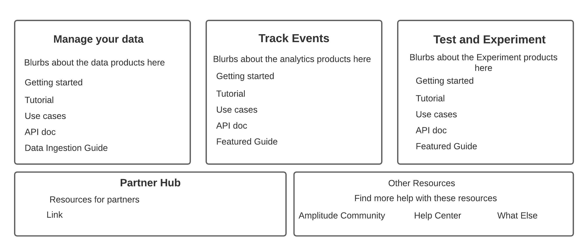

---
hide:
  - navigation
  - toc
  - feedback
title: Amplitude Developer Center

---

Maybe the home page could look something like this? 

Someone with design skills can make this look good. The cookie settings thing clearly won't be on the home page, I mostly envision some neat tiles here that take you to the different resources we have. 

[Go to the Community](https://community.amplitude.com){ .md-button }
[Go to Some Other Place](https://community.amplitude.com){ .md-button }
[Go to the Help Doc](https://help.amplitude.com){ .md-button }
[Change cookie settings](#__consent){ .md-button }
