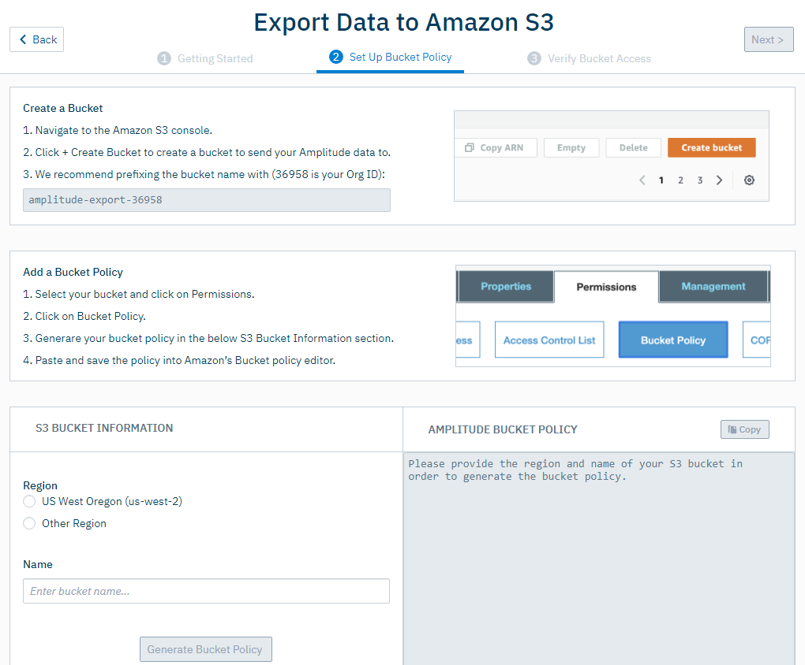
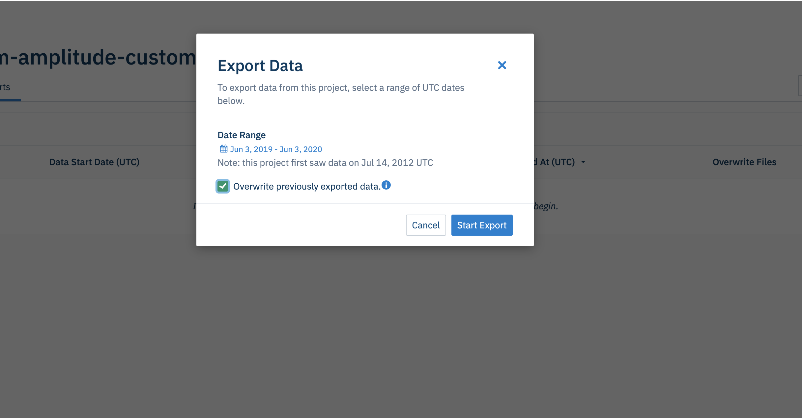
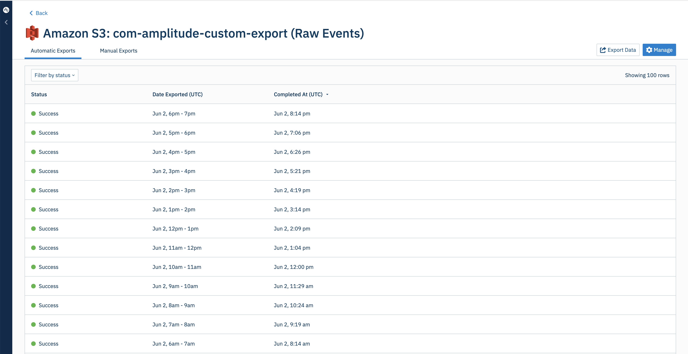
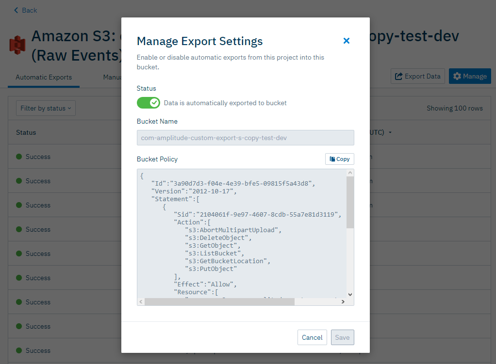

--8<-- "includes/editions-all-paid-editions.md"

Often, business needs dictate that behavioral data be analyzed alongside other organizational sources of data that aren't captured within Amplitude. 
By integrating Amplitude with Amazon S3, you can easily export your Amplitude data to an Amazon S3 bucket, enabling you to analyze your Amplitude data sets side-by-side with the rest of your data.

Because the export works on a per-project basis, teams have the flexibility to set up data from one project for delivery to multiple buckets, or use multiple projects in the same organization to export
 event data into a single Amazon S3 bucket. 
However, each bucket can only be accessed by a single organization.

!!!info

    Portfolio projects can't be used as data sources for the Amazon S3 export.

## Considerations

- The export finishes within one hour after the currently exported hour. The export time is typically between one and 10 minutes.
- The only potential error is an accessibility error. This can happen if you have changed any configurations on the receiving end and Amplitude is unable to access to your bucket. 
In this case, the export fails after several tries, and the admin and the user who created the S3 export are notified via email.
- Troubleshooting information is included in the error email. It isn't available within the Amplitude UI. Because accessibility is the only error possible, the email includes information on which permission is missing.
- There isn't a size or date range limit when [backfilling historical event data](https://help.amplitude.com/hc/en-us/articles/360044561111-Integrate-Amplitude-with-Amazon-S3#h_01EEXY9TJHVAYEVPXXSAA4ZAZY) via manual exports. If you can't export a certain date range, first confirm that you have event data for that date range. Then [submit a ticket](https://help.amplitude.com/hc/en-us/requests/new) to the support team.

## Set up the integration

To set up the Amazon S3 integration, follow these steps:

1. Navigate to the **Data Destinations** panel, then click **Amazon S3 - Raw Events**.
2. Choose which data you'd like to include in this export: *Export events ingested today and moving forward*, *Export all merged Amplitude IDs*, or export both.
3. Click **Next**.
4. In the **Set Up Bucket Policy** tab, go through the steps listed in the *Create a Bucket* and *Add a Bucket Policy* sections. Then fill out the required information in the *S3 Bucket Information* section.

    

5. Click **Generate Bucket Policy**, then click **Next**.

Amplitude verifies your bucket access. After access is verified, Amplitude immediately starts hourly exports.

## Run a manual export

You can backfill historical data to S3 by manually exporting data.

1. Manage the Amazon S3 destination.
2. Click **Export Data**.
3. Select the desired date range. 
4. Click **Start Export**. 

****

After setup is complete, check the status of your exports from the integration. 

## Disable automatic exports

To disable automatic exports, open the integration and click **Manage**. You can toggle exports from the *Manage Export Settings* modal.

