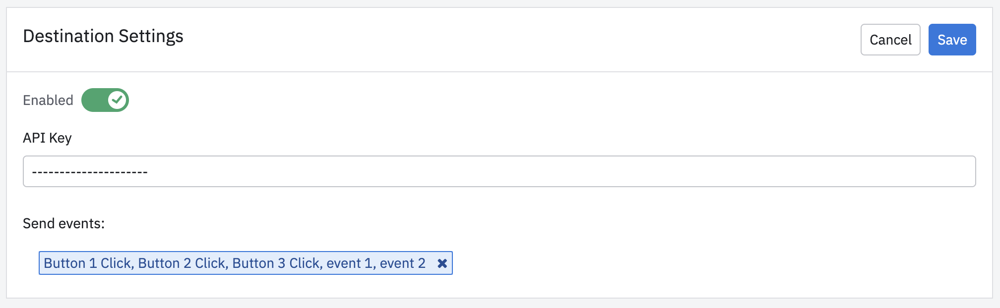

--8<-- "includes/beta.md"

Amplitude Data's Intercom integration lets you stream your Amplitude event data straight to Intercom with just a few clicks.

## Considerations

Keep these considerations in mind when streaming events to Intercom.

- Amplitude sends the `user_id`, `created_at`, and `event_name` to Intercom.
- A user must exist in Intercom in order to send events for them. Amplitude sends the event data with the `user_id`, which Intercom uses to associate the event with an existing user within Intercom. Make sure that the Intercom `user_id` and the Amplitude `user_id` match.
- Intercom has a limit of 120 Event Types and 20 metadata (which are event properties) per Event Types. Be sure to select the events you want to forward to Intercom using the Event Filter while creating or editing the Event Streaming connection in Amplitude.
- "[Intercom] event.created" is triggered whenever an event is created in Intercom, including through Amplitude's Event Streaming integration. If you don't want these to be stored in Amplitude, use [Block & Drop filters](https://help.amplitude.com/hc/en-us/articles/5078869299099-Filter-events-with-block-filters-and-drop-filters) to remove this event data from Amplitude.

## Authentication & Configuration Instructions

This integration requires configuration in Intercom and Amplitude.

### Intercom setup

!!!tip "More documentation"

    See [Intercom's documentation](https://developers.intercom.com/building-apps/docs/get-started-developing-on-intercom#create-an-app) for more detailed instructions on creating an app.

1. From the [Intercom Developer Hub](https://developers.intercom.com/), click on **Your Apps**.
2. Click **New App**.
3. Enter a name and workspace, then choose _Internal integration_.
4. After you've created the app, click it and go to the Authentication page. Copy the Access Token.

### Amplitude setup

1. In Amplitude, navigate to **Data Destinations** then click **View all Destinations**.
2. Click **Intercom - Event Stream**.
3. Enter a sync name, then click **Create Sync**.
4. Click **Edit**, then paste your Intercom app's access token in the **API Key** box.
5. Use the _Send events_ filter to select the events you want to send. Intercom has a limit of 120 Event Types.
6. When finished, enable the destination and save.

