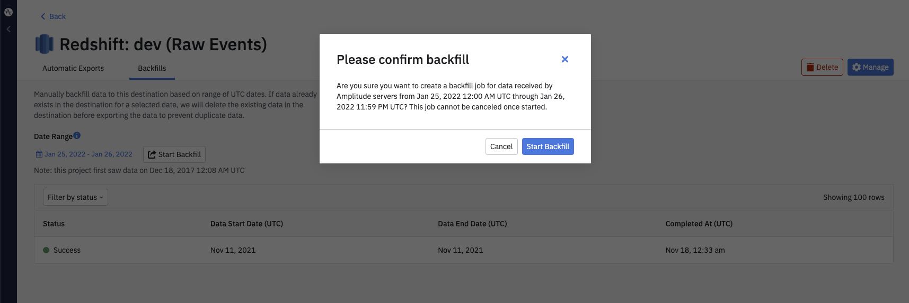

Upload your Amplitude event data into their Redshift account. You can set up recurring syncs through the Amplitude UI, as well as manually initiate a sync of your historical data.

## Set up a recurring data export to Redshift

Creating a recurring data export is a simple, three-step process you can handle yourself. Each sync will complete within five to ten minutes, you will be able to monitor the status of each job.

To set up a recurring export of your Amplitude data to Redshift, follow these steps:

!!!note

    You will need admin privileges in Amplitude, as well as a role that allows you to enable resources in Redshift.

1. Navigate to the *Data Destinations* page from the bottom of the left side panel.
2. Under *Add More Destinations ...*, click the Redshift panel. The *Export Data to Redshift* page will open to the *Getting Started* tab.
3. Under *Export Data to Redshift*, select the data you'd like to export. You can export event data, merged Amplitude IDs, or both.
4. Review the Event table and Merge IDs table schemas and click *Next >*. The *Set Up Export* tab will open.
5. In the *Redshift Credentials For Amplitude* section, enter the following information:

     - **User**: The Redshift user account that Amplitude will use to connect to your Redshift instance.
     - **Password**: The password associated with the User.
     - **Database**: The database where the data will be exported to and stored. We recommend dedicating a database for Amplitude data.
     - **Cluster Host Address**: This is the address of the endpoint of the cluster that hosts your database.
     - **Port**: The port of the Cluster Host Address.  This may only contain digits. The default value is 5439.

    !!!warning 

        These credentials are case-sensitive, so keep that in mind.

6. Next to the credentials section, Amplitude will dynamically create the query it will use to create Redshift objects. To copy it to the clipboard, click *Copy*. You can now paste it into the Redshift CLI.
7. Click *Next >*. Amplitude will try to upload test data using the credentials you entered. If the upload is successful, click *Finish*.

All future events are automatically sent to Redshift.

From here, Amplitude generates micro-batch files at five-minute intervals and loads them to customer-owned Redshift accounts directly every 10 minutes. You can see the data in your Redshift accounts within 20 minutes after Amplitude receives the events.

## Export historical Amplitude data to Redshift

To export your historical data from Amplitude into Redshift, navigate to the *Backfills* tab, select a date range, and click **Start Backfill**.

This process can take anywhere from a single day to several weeks, depending on your data volume, warehouse size, cluster count, network bandwidth, and number of concurrent historical data exports you currently have, among other factors.

## Redshift Export Format

The **Event** table schema will include the following columns:

| 
Column
| Type | Description |
|---|---|---|
| `Adid` | String | (Android) Google Play Services advertising ID (AdID). Example: AEBE52E7-03EE-455A-B3C4-E57283966239 |
| `amplitude_event_type` | VARCHAR(1677721) | Amplitude specific identifiers based on events Amplitude generates. This is a legacy field so event_type should suffice for all queries  |
| `amplitude_id` | BIGNUMERIC | The original Amplitude ID for the user. Use this field to automatically handle merged users. Example: 2234540891 |
| `app` | INT64 | Project ID found in your project's Settings page. Example: 123456 |
| `city` | STRING | City | “San Francisco” |
| `client_event_time` | TIMESTAMP | Local timestamp (UTC) of when the device logged the event. Example: `2015-08-10T12:00:00.000000` |
| `client_upload_time` | TIMESTAMP | The local timestamp (UTC) of when the device uploaded the event. Example: `2015-08-10T12:00:00.000000` |
| `country` | STRING | Country. Example: "United States" |
| `data` | STRING | Dictionary where certain fields such as first_event and merged_amplitude_id are stored |   |
| `device_brand` | STRING | Device brand. Example: Apple |
| `device_carrier` | STRING | Device Carrier. Example: Verizon |
| `device_family` | STRING | Device family. Example: Apple iPhone |
| `device_id` | STRING | The device specific identifier. Example: C8F9E604-F01A-4BD9-95C6-8E5357DF265D |
| `device_manufacturer` | STRING | Device manufacturer. Example: Apple |
| `device_model` | STRING | Device model. Example: iPad Mini |
| `device_type` | STRING | Device type. Example: Apple iPhone 5s |
| `dma` | STRING | Designated marketing area (DMA). Example; San Francisco-Oakland-San Jose, CA |
| `event_id` | INT64 | A counter that distinguishes events. Example: 1 |
| `event_properties` | STRING |    |
| `event_time` | TIMESTAMP | Amplitude timestamp (UTC) which is the client_event_time adjusted by the difference between server_received_time and client_upload_time, specifically: event_time = client_event_time + (server_received_time - client_upload_time)   Amplitude uses this timestamp is used to organize events on Amplitude charts. NOTE: If the difference between server_received_time and client_upload_time is less than 60 seconds, the event_time will not be adjusted and will equal the client_event_time. Example: `2015-08-10T12:00:00.000000` |
| `followed_an_identify` | BOOL | True if there was an identify event between this current SDK event and the last SDK event seen. Example: `True` |
| `group_properties` | STRING |    |
| `groups` | STRING | Group types. See the Accounts documentation for more information.   |
| `idfa` | STRING | (iOS) Identifier for Advertiser. Example: AEBE52E7-03EE-455A-B3C4-E57283966239 |
| `ip_address` | STRING | IP address. Example: "123.11.111.11" |
| `is_attribution_event` | BOOL |     |
| `language` | STRING |     |
| `library` | STRING |     |
| `location_lat` | FLOAT64 | Latitude. Example: 12.3456789 |
| `location_lng` | FLOAT64 | Longitude. Example: -123.4567890 |
| `os_name` | STRING | OS name. Example: ios |
| `os_version` | STRING | OS version. | 1.0 |
| `paying` | STRING | True if the user has ever logged any revenue, otherwise (none).   Note: The property value can be modified via the Identify API. Example: true |
| `platform` | STRING |    |
| `processed_time` | TIMESTAMP |    |
| `region` | STRING | Region. Example: California |
| `sample_rate` | BIGNUMERIC |    |
| `server_received_time` | TIMESTAMP |    |
| `server_upload_time` | TIMESTAMP | Amplitude timestamp (UTC) of when our servers received the event. Example:  `2015-08-10T12:00:00.000000` |
| `session_id` | BIGNUMERIC | The session start time in milliseconds since epoch. Example: 1396381378123 |
| `start_version` | STRING | App version the user was first tracked on. Example: 1.0.0 |
| `user_creation_time` | TIMESTAMP | Event_time (UTC) of the user's first event. Example: `2015-08-10T12:00:00.000000` |
| `user_id` | STRING | A readable ID specified by you. Should be something that will not change; for that reason, using the user's email address is not recommended.  |
| `user_properties` | STRING |    |
| `uuid` | STRING | A unique identifier per row (event sent). Example: bf0b9b2a-304d-11e6-934f-22000b56058f |
| `version_name` | STRING | The app version. Example: 1.0.0 |
