--8<-- "includes/partners/partner-portal-prereq.md"

This guide walks through the basics of creating a cohort syncing integration with Amplitude. 

This doc uses a list-based integration in its examples. If you create a property-based cohort integration, some steps may be slightly different than you see here. 

--8<-- "includes/partners/partner-portal-connection-info.md"

## Integration setup

The first step is to configure the integration tile that appears on the **Destinations** page in Amplitude after your integration is validated. You also need to decide between a **List-based cohort integration** or a **Property-based cohort integration**. See this [doc](https://www.docs.developers.amplitude.com/partners/sending-cohorts/) for more information.

1. From the Integration Portal page (**Settings > Developer Portal**), click **Add New Destination**.
2. Choose the target connection from the *Select Connection Information* dropdown*.
3. Choose whether you are building a list-based or property-based cohort integration:
      - **List-based cohort integration**: A list-based cohort integration works best if a cohort is represented as a list of user identifiers in the target system. A call to a list creation API is needed on the first sync, then subsequent calls to add API and remove API are made to keep the list membership up to date.
      - **Property-based cohort integration**: A property-based cohort integration works best with systems that represent cohort membership as a custom user property, such as a boolean flag or a tag. Amplitude invokes the update API when cohort membership changes to update the user property. Although you don't need to use the list creation API, some manual steps may be required to create the customer user property.
4. Click **Next** to configure the destination.

## Configuration

The configuration page has two sections.  

- The **Configuration** section on the left is where you configure your payload and what you expect to receive from Amplitude.
- The **Testing Integration** section summarizes your configurations, including your setup modal screen for your integrations, variables, and payload.

<figure markdown>
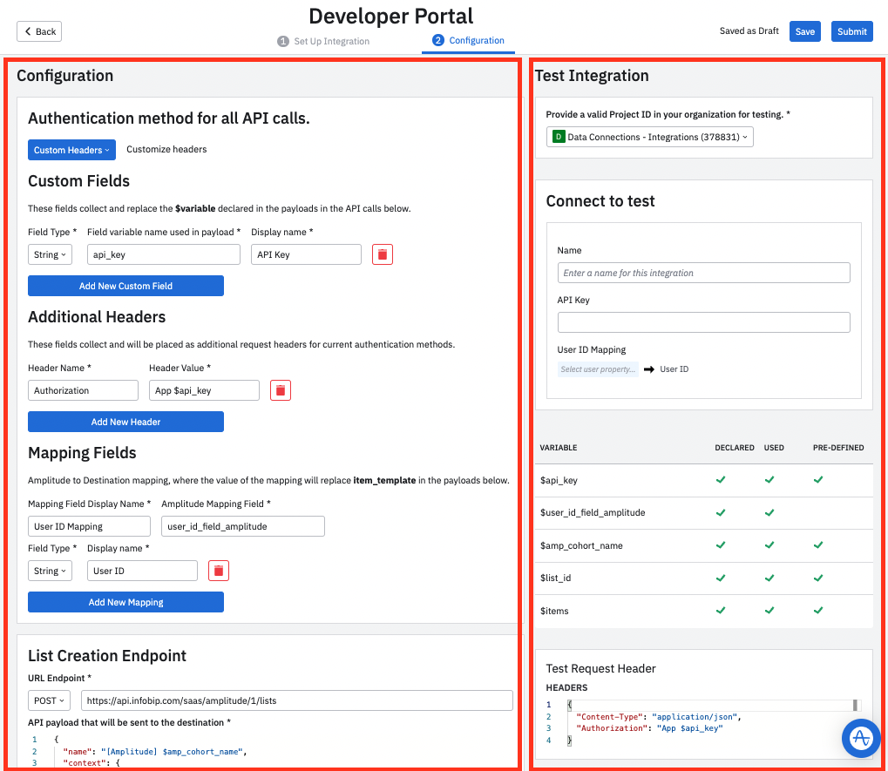{ width="500" }
  <figcaption>Configuration options are on the left, and testing options are on the right.</figcaption>
</figure>

The next several sections walk through configuration and testing options.

### Set authentication method

The first step is determining how you plan to authenticate the API call between Amplitude and your company.

Click **Custom Headers**,  choose from the following:

- **No authentication**: No Authentication header is needed.
- **Basic Authentication**: Use API key and API Secret (optional) as authentication headers.
- **Authentication Header**: Authenticate with API key.
- **Bearer Token**: User Bearer Token as an Authorization header.

### Create custom fields

These fields collect and replace the `$variable` declared in the payloads in the API calls, and build the modal customers use to enable your integration. Fields you add here are required fields when your users set up the integration.

- **Field Type**: You can specify the field type (String, Single Select, Button Group)
- **Field variable name used in the payload**: By default, this matches your authentication choice. For example, if you choose Bearer Token as the authentication method, it's "bearer_token."
- **Display name**: The name your users see in the setup modal for your integration. By default, this matches your authentication choice. For example, if you choose Bearer Token as the authentication method, it has a placeholder display name called "Bearer Token."
- **Add New Custom Field**: If you need to add another identifier required for the payload, you can add custom fields such as String, Single Select, and Button Group.

!!!note

    Amplitude recommends using an underscore "_" instead of a dash in the Header Values. for example, `$api_key` instead of `$api-key`.

### Map fields

Map fields to specify how Amplitude fields connect to the fields in your system. The value of the mapping replaces `item_template` in the payloads.

<figure markdown>
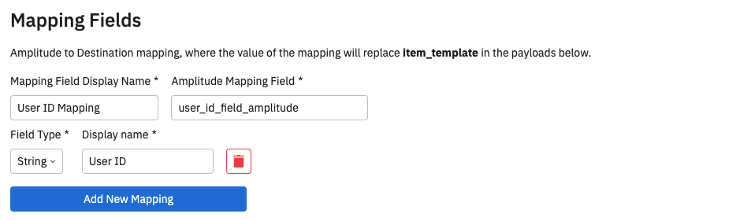{ width="500" }
  <figcaption>Field mapping options</figcaption>
</figure>

- **Mapping Field Display Name**: Amplitude recommends setting this as this as "Key," "Identifier," or "User ID Mapping."
- **Amplitude Mapping Field**:  The field name in Amplitude. For example, `user_id_field_amplitude`.
- **Field Type**: Either "String" or "Single Select."
- **Display name**: This is fully customizable, so use something descriptive. For example, User ID or Email.
- **Add New Mapping**: Add more mappings if required such as String, Single Select, Button Group

???example "Example: Bearer Token authorization (click to expand)"

    Here is an example for a simple configuration using Bearer Token authentication. The configuration on the left is used to the payload and the setup modal. On the right, the panel titled "Connect to Amplitude" shows the modal that the user sees when setting up your integration in Amplitude.

    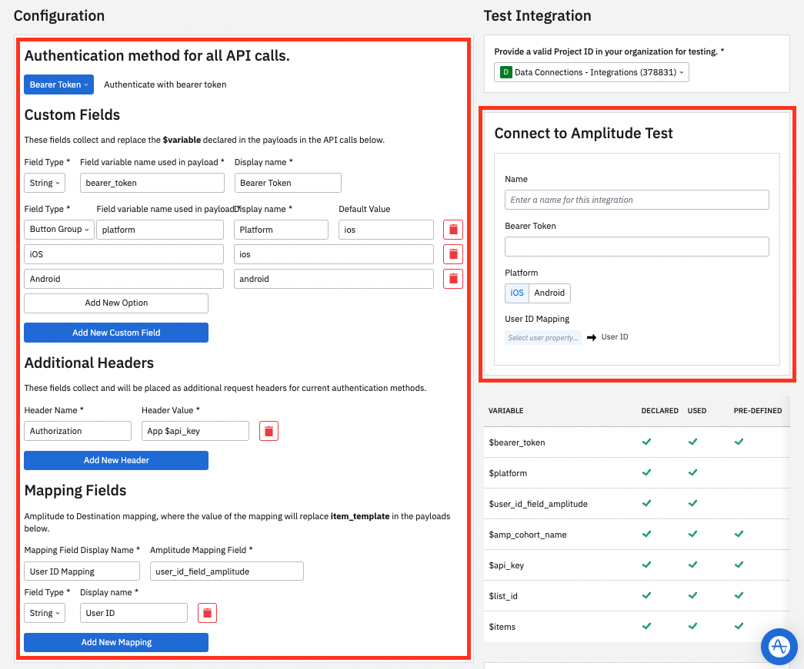

???example "Example: Install modal using Basic Authentication (click to expand)"
    
    This is an example of what a built-out modal would look like in Amplitude after you've finalized your configuration. This would be part of the user's setup process when setting up your integration. Note this example shown is using "Basic Authentication".

    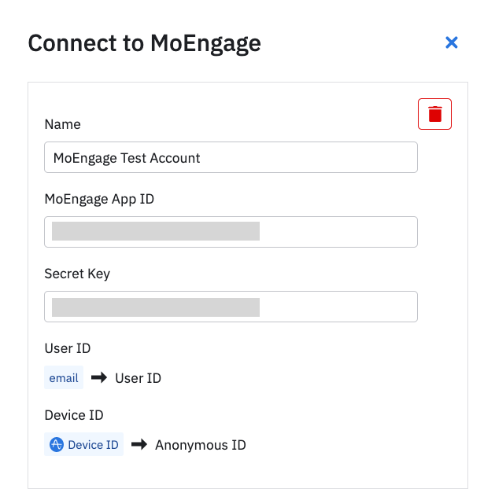{ width="500" }

### Slugify Amplitude cohort name

You can slugify cohort names to standardize them. This is helpful if your system doesn't support special characters or foreign characters. This option converts your cohort name to a URL slug by replacing the Unicode special characters and spaces with ASCII and hyphens. This feature is only available when the variable `$amplitude_cohort_name` appears in the payload of the endpoints. The slugify rule is as follows:

- Convert the original cohort name to normalization form KD (NFKD), which is compatibility decomposition.
- Substitute hyphens for the characters except for the alphabets (a-z, A-Z), the numbers (0-9) and the underscores (_).
- Limit the slug to 100 characters.

!!!example

    This option turns a cohort named `Saturday's cohort & héllo` to  `Saturday-s-cohort-he-llo`

### List creation endpoint

You need to call three different APIs for a list-based integration. The first one is the list creation endpoint. When a cohort syncs for the first time, Amplitude calls this API, and creates a list on your platform. Amplitude expects your app to send a response with the unique identifier for `listID`. From that response, Amplitude stores the `listID` uses the ID as part of the payload for list updates.

<figure markdown>
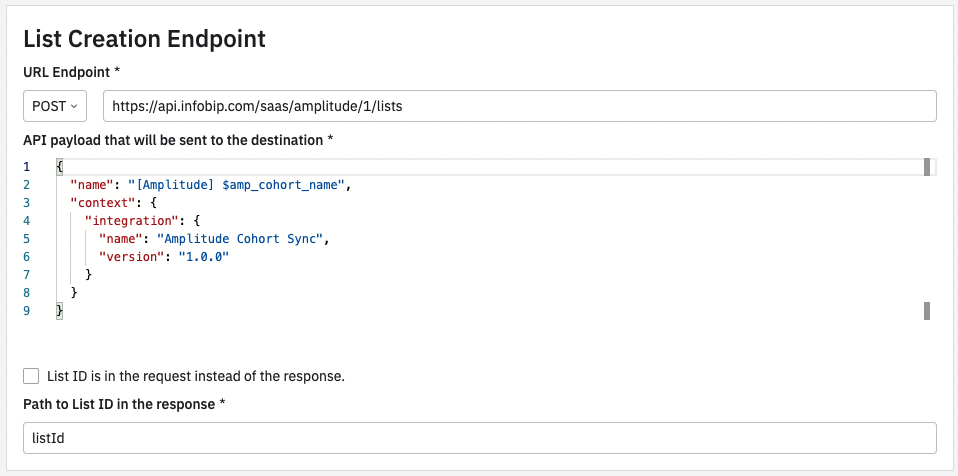
<figcaption>Configure the list creation call by selecting an endpoint, and adding a payload </figcaption>
</figure>

- **URL Endpoint**: This is the endpoint that you'll define. for example, https://api.yourapp.com/list. Choose which method to use in the call.
- **API payload that will be sent to the destination**: Customize and define this payload to fit your needs.
- **Path to List ID in the response**: N/A

!!!note "Payload editor"

    The payload editor is a developer-friendly JSON editor tool. Type `$` to find created variables easily.

#### Errors for the list creation endpoint

Add error status code and error messages for every endpoint so that end users can debug and get faster help. 

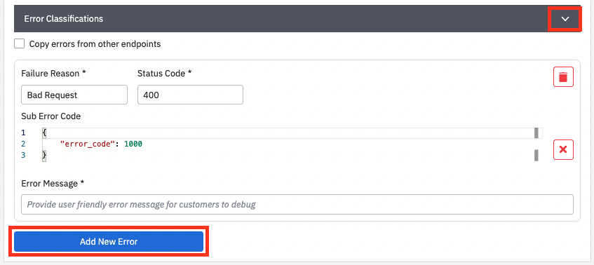

Expand **Error Classifications**, and click **Add New Error** to add more status codes. Amplitude recommends including as many status codes and sub error codes (1) as you need to. These codes and messages make debugging much faster for your end users.
{ .annotate }

1. Amplitude recommends using sub error codes if you use the same status code for multiple errors.

Here are some common examples of status codes that most partners include:

- 200: Success
- 400: Invalid request
- 401: Unauthorized (bad api_key)
- 404: Invalid User ID
- 429: Throttling/rate limiting

Amplitude highly suggests giving a clear Failure Reason (Description) and Error Message in case cohort sync fails. Clear messages drastically improve your end user's experience and can help deflect support issues and frustration.

See example below for an example within Amplitude web app that shows what happens when a user syncs a cohort but has the wrong API key.

!!!example "API Key error"

    In this example, a user can navigate to the cohort dashboard panel to investigate the errors in more detail after the cohort export to ModuleApps failed. The user is able to quickly understand that the error is due to an API key.

    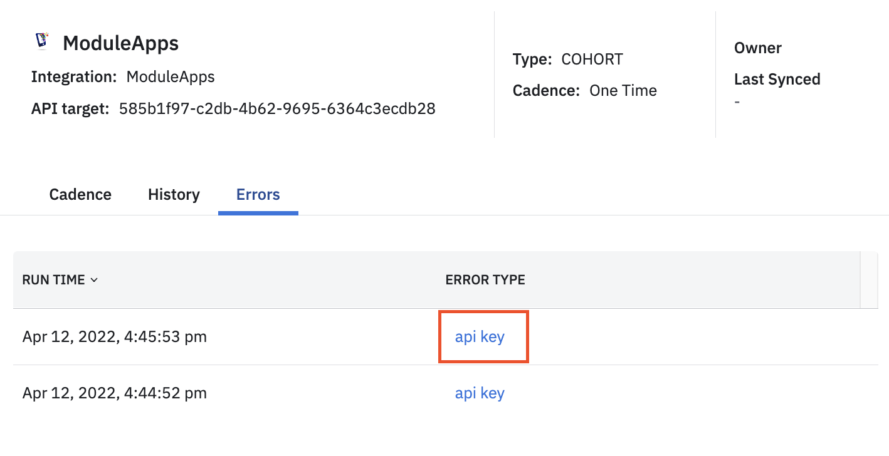

    The user can click the error and read a full error message. This is a great place to explain the cause of and solution to an error. 

    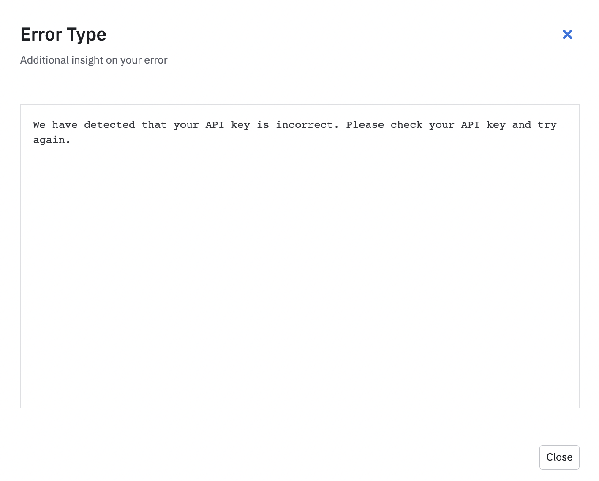

!!!note "How Amplitude handles undefined status codes"

    For any error response code that's "undefined" at the point of configuration (without failure reason or status code), Amplitude will by default show an "unclassified" error type with the following error eessage:

    "This cohort sync has encountered an unidentified kind of error for this integration. Please contact support or your CSM to create a ticket and ask for help in solving this issue."

### Add users endpoint

The add users API is called every time a cohort syncs from Amplitude to your app. This could be hourly or daily. This call calculates the difference in the current cohort size compared to the last successful sync.

<figure markdown>

<figcaption>Configure the add user call by selecting an endpoint, and adding a payload, a value for `$items`, and setting a batch max for the API. </figcaption>
</figure>

- **URL Endpoint**: There is a `$list_Id` placeholder in the URL but it's not required. You can design your API to place this in the payload if you want, for example: "https://your.domain/lists/$listId/add".
- **API payload that will be sent to the destination**: You can customize and define whether this payload is a batch. The important key here is the `$items` variable which is replaced by the contents of _An array of items that replaces the $items variable in the payload_ 
This `$items` variable is usually the identifier for every user in a cohort. For example, there are 20 new users to add to your existing cohort. The Batch object contains a collection (a list of 20 users) so these 20 objects are sent to your endpoint. Your payload might look something like this: 

    ```json
    {
      "userIds": $items,
      "context": {
        "integration":{
          "name": "Amplitude Cohort Sync",
          "version": "1.0.0"
        }
      }
    }
    ```

- **Maximum number of items in each API call (batch size)**: The default is 10,000, but you can specify this. Amplitude's recommendation is to have a 10,000 user per cohort batch.
- **An array of items that replaces the `$items` variable in the payload**: Specify the format of object that replaces the `$item` variable in the payload. For example, `"$user_id_field_amplitude"`.

Avoid rate limiting if possible. If you do have rate limits, for example, 90 requests per second, make the them explicit in your user documentation. Amplitude sends out 4 requests in parallel with each request having up to 10,000 users.

#### Errors for add users endpoint

Instead of creating every single status code, failure reasons, error message, and sub error code again, Amplitude recommends using the same set of error codes from your list creation endpoint. Just select **Copy errors from other endpoints** and select an endpoint you've written errors for.

### Remove users endpoint

The remove users API is called every time a cohort syncs from Amplitude to your app. This could be hourly or daily. This call calculates the difference in the current cohort size compared to the last successful sync.

<figure markdown>
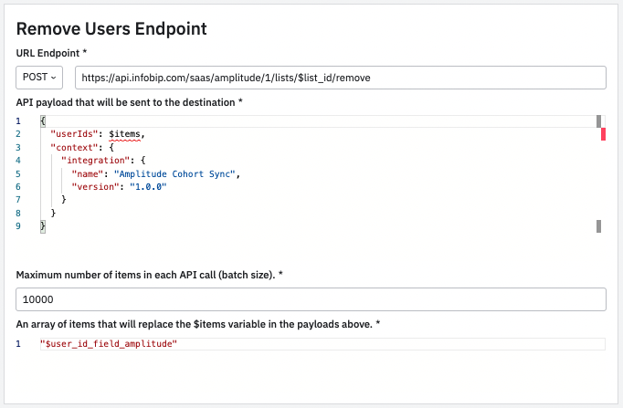
<figcaption>Configure the remove user call by selecting an endpoint, and adding a payload, a value for `$items`, and setting a batch max for the API. </figcaption>
</figure>

- **URL Endpoint**: There is a `$listId` placeholder in the URL but it's not required. You can design your API to place this in the payload if you want, for example: "https://your.domain/lists/$listId/remove".
- **API payload that will be sent to the destination**: You can customize and define whether this payload is a batch. The important key here is the `$items` variable which is replaced by the contents of _An array of items that replaces the $items variable in the payload_ 
This `$items` variable is usually the identifier for every user in a cohort. For example, there are 20 new users to remove from your existing cohort. The Batch object contains a collection (a list of 20 users) so these 20 objects are sent to your endpoint. Your payload might look something like this: 

    ```json
    {
      "userIds": $items,
      "context": {
        "integration":{
          "name": "Amplitude Cohort Sync",
          "version": "1.0.0"
        }
      }
    }
    ```

- **Maximum number of items in each API call (batch size)**: The default is 10,000, but you can specify this. Amplitude's recommendation is to have a 10,000 user per cohort batch.
- **An array of items that replaces the `$items` variable in the payload**: Specify the format of object that replaces the `$item` variable in the payload. For example, `"$user_id_field_amplitude"`.

#### Errors for remove users endpoint

Instead of creating every single status code, failure reasons, error message, and sub error code again, Amplitude recommends using the same set of error codes from your list creation endpoint. Just select **Copy errors from other endpoints** and select an endpoint you've written errors for.

### Preview & Test Endpoint

Before submitting your configuration for review, test the mock payload that you expect to receive from Amplitude. On the right side of the configuration page, follow these steps to preview and test your configuration.

Configure the test integration instance: 

1. **Provide a valid Project ID in your organization for testing**: Select your project.
2. **Name**: Enter a name for the integration. This is just for testing this instance of the integration and won't change your integration's public name. 
3. **API Key**: Enter the API key from the Amplitude project.
4. **Key**: Choose which Amplitude User Properties to map to your target ID.

Check the variables table to make sure all variables are accounted for and resolve any errors. 

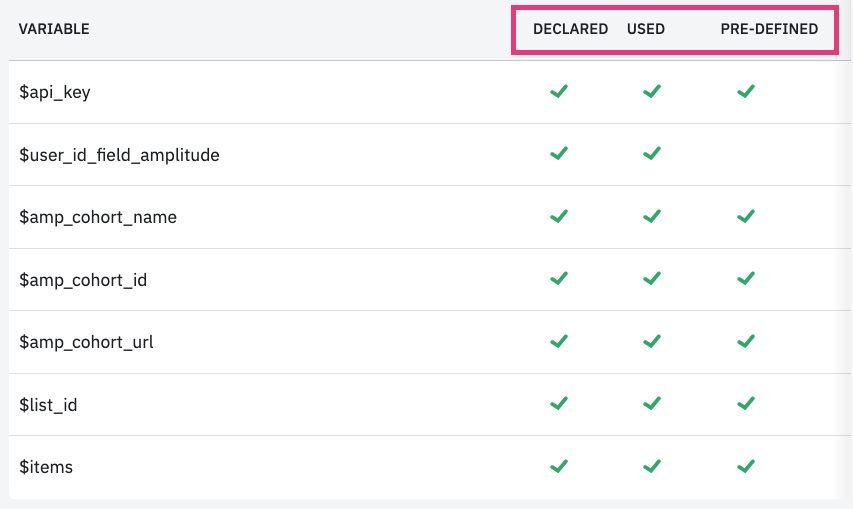

- **DECLARED**: All declared variables in the "Authentication calls, Custom Fields and Mapping Fields section"
- **USED**:  All variables that are used either in the list users endpoint, add users endpoint, and remove users endpoint.
- **PRE-DEFINED**: There are some pre-defined variables that Amplitude replaces values for.

Check your headers and payloads and when ready, click **Test Endpoint** to send a test API call to the predefined endpoint. You can also see the response/error for easy debugging.

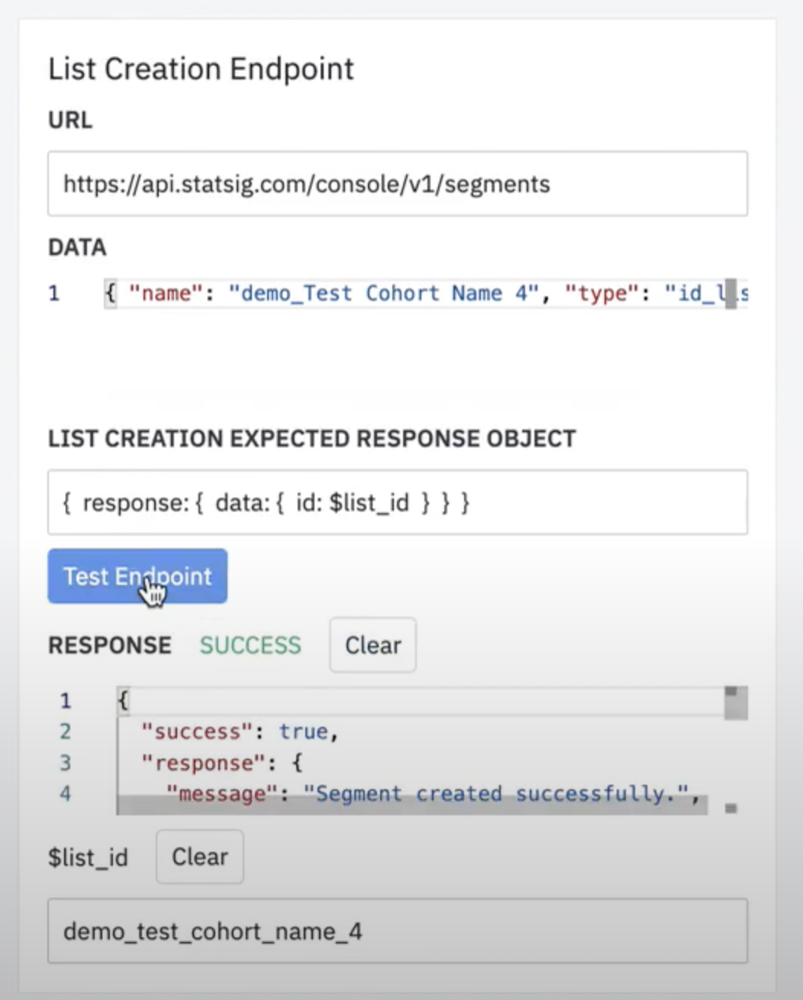

After you click **Test Endpoint**, you should get a success response. Retrieve the `$list_id` here and then Amplitude uses the `$list_id` for the "Add Users Endpoint".

The `{listId: $list_id}` is the expected response for list creation API call. To change the structure, change the _Path to List ID in the response_ value in the list creation configuration.

Use the `$list_id` you retrieved to test the add to add users and remove users endpoints.

### Submit your Integration

After you have finalized your testing, click **Submit** to submit your integration to the Amplitude team. The review process should take about one week. When Amplitude approves you integration, you'll get notified via email and be able to see your integration tile in the Destination section of Amplitude.