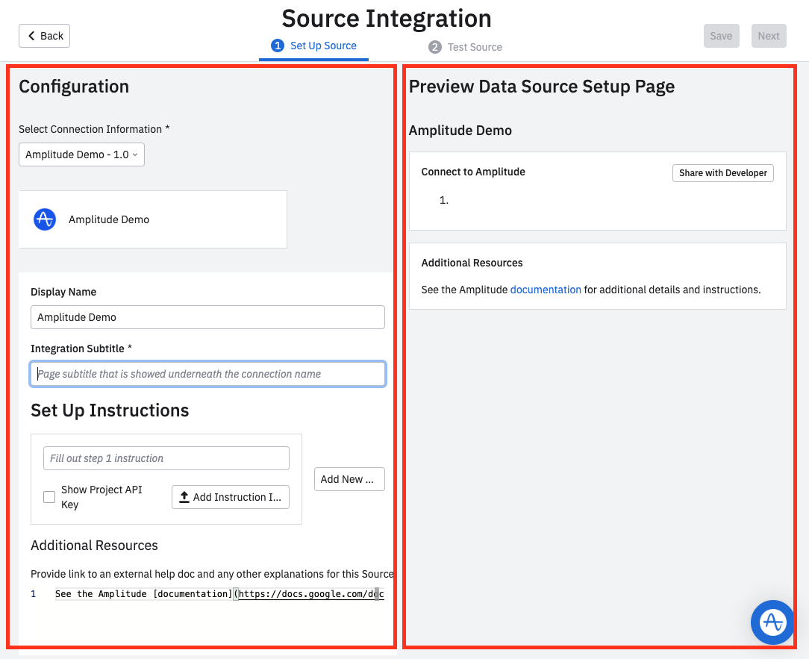

--8<-- "includes/partners/partner-portal-prereq.md"

This guide walks through the basics of creating an event ingestion integration in Amplitude. This guide doesn't cover any steps to building your integration or sending events to Amplitude. For information about how to send events to Amplitude see the [HTTP v2 API](../../analytics/apis/http-v2-api) documentation.

--8<-- "includes/partners/partner-portal-connection-info.md"

## Integration setup

Configure the integration tile that appears on the **Sources** page in Amplitude after your integration is validated.

<figure markdown>
{ width="500" }
  <figcaption>The **Add New Source page**</figcaption>
</figure>

Notice that this page is divided into two sections:

**Left Panel**: The *Configuration* section on the left is where you create the setup instructions for your data source and configure your integration tile.

**Right Panel**: The *Preview Data Source Setup Page* section provides a preview of what your setup instructions look like for a user.

1. From the Integration Portal page (**Settings > Developer Portal**), click **Add New Source**.
2. The Display Name is controlled by the Connection Information section.
3. Enter a subtitle. This appears under the title when the user sets up the integration. 

    !!!example "Example subtitles"
        
          - If you use Braze, you can now send events to Amplitude.
          - If you're using RudderStack to ingest data, you can import events into Amplitude with a few simple steps.
          - If you use Split for feature flagging and experimentation, you can track data into Amplitude with a simple configuration.

4. Add as many setup steps as you need, but aim for no more than 5-8. You can include images that help orient your users. Mark **Show Project API Key** to automatically pull the relevant Project API on behalf of the user. Remember that all Sources & Destinations for Amplitude are configured on the [project level](https://help.amplitude.com/hc/en-us/articles/360058073772-Create-and-manage-organizations-and-projects), not the organization level.

    ???example "See example setup steps in Amplitude (click to expand)"

        Navigate to **Data Sources** and click **I want to import data into Amplitude**. From there, you can click any integration tile to see their setup instructions.
  
5. In **Additional Resources**, add a link to your documentation. For example: *See the Amplitude [documentation](https://docs.developers.amplitude.com) for additional details and instructions.*
6. When finished, click **Next** to go to the testing tab.

## Test and submit the integration

After you've configured your source information, you can test it and finally submit it for review.

1. From the **Test Source** tab, select the Amplitude project to test the integration with.
2. Copy the value in **Assigned Partner ID for this Source Integration**. You must include this value in a `partner_id` parameter when sending events to Amplitude. Amplitude needs this to track events coming from partners and validate the number of integration users.
3. Send a test event from your system.

    ???example "Example event payload (click to expand)"

        ```json

              POST https://api2.amplitude.com/2/httpapi

              {
                "api_key": "2a0d30356cbb278eee1a69b2bbe81c37",
                "events": [
                  {
                    "user_id": "test@example.com",
                    "partner_id": "integration_name",
                    "event_type": "Product Viewed",
                    "time": 1663940508564,
                    "event_properties": {
                      "message_type": "push",
                      "message_title": "Sample Message title",
                      "message_id": "68b32868-b6ab-4511-b552-cf668a1c0e59",
                      "message_contents": "Sample message content"
                    }
                  }
                ]
              }

        ```

4. Wait for Amplitude to verify the event. 

After you have finished your testing, click **Submit** to submit your integration to the Amplitude team. The review process should take about one week. When Amplitude approves your integration, you are notified via email and are able to see your integration tile in the Sources section of Amplitude.