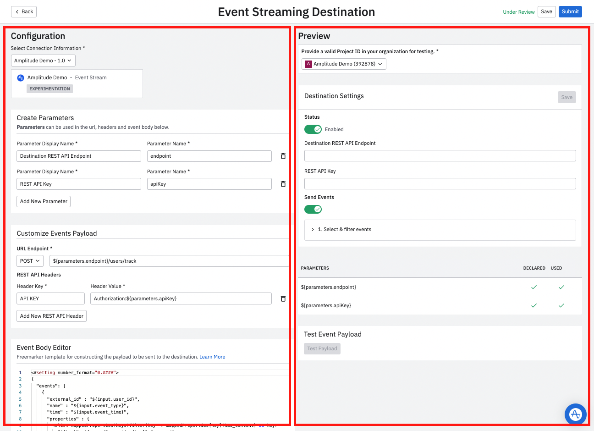

--8<-- "includes/partners/partner-portal-prereq.md"

This guide walks through the basics of creating your own Event Streaming tile in Amplitude to let your users to forward events in real-time from Amplitude.

## Considerations

### Supported features

- **Event Forwarding:**  Event forwarding is the concept of forwarding Amplitude Track calls to a destination. Amplitude forwards both the 'raw' event and merged or [transformed events](https://help.amplitude.com/hc/en-us/articles/5913315221915-Transformations-Retroactively-modify-your-event-data-structure). Amplitude also sends the `user_id`, `event_name`, and `created_at` to your destination.
- **User Properties Types:** Amplitude sends all user, event, and group properties along with the event.
- **Event Selective Property Forwarding:** Amplitude has fine-grain filtering options that allow you to choose which events to send based on selecting event types and property conditions.

### Limitations

- **User selective property forwarding:** Forwarding certain event, group, or user properties from an event based on an allow-list isn't supported.
- **User identifiers:** The only currently supported user identifier is the Amplitude `user_id`.
- **Mapping fields:** You can't currently map fields.
- **Forwarding arrays or object type properties:** You can't currently arrays or object type properties. For example, you can't forward a property called cities which is an array of cities
- **Regular User Identify Forwarding (creating and updating a user):**  Currently, Identify calls aren't forwarded. See the [Identify documentation](../analytics/apis/identify-api) for more information.
- **Change-based user Identify Forwarding:** Currently, Amplitude won't automatically generate and forward an identify event when there's a user property change during the event ingestion.
- **Property Value Transformation:** You can't currently transform a property value or type to another value or type for example, Amplitude int `user_id` -> Destination string `user_id`, formatting such as encoding and datetime format transformations.
- **OAuth Authentication:** Amplitude doesn't support OAuth, so partners need to generate you API key.
- **Event Category name:** Amplitude doesn't send the Event Category name.

## Preparation tips

1. **Freemarker:** Familiarize yourself with [Freemarker](https://freemarker.apache.org/) is the template that Amplitude uses to send events.
2. **Rate limits:** Make sure your rate limits are as high as possible to minimize throttling. For example, Amplitude respects the rate limit that [Braze](../destinations/braze/) communicates: 50,000 requests per minute for event tracking. Amplitude has a retry mechanism w/ exponential backoff that tries 9 times over 4 hours. Temporary throttling should be resolved through this process.
3. **Event limits:** Make sure that your event size limit is flexible enough for customer use cases. 
   
    ???example "Event limits example (click to expand)"

        For example, [Customer.io](../destinations/customerio/) events have the following limits:

        - Maximum length of Customer ID: 150 bytes
        - Maximum number of Unique Identify attributes: 300
        - Maximum size of event data: 100K bytes
        
        For example, [Intercom](../destinations/intercom/) has a limit of 120 Event Types and 20 meta (which are event properties) per event types. Currently you must use the event filter to select the specific events they want to forward from Amplitude to Intercom.

4. **Authentication method:** Amplitude doesn't support OAuth, so partners need to generate their API key.
5. **Make sure the endpoint is flexible to ingest objects in a specific format:** Amplitude generates a list of objects in this specific format. You need to make sure your endpoint handles this specific payload structure. See the next section for a payload example.


## Integration setup

The first step is to configure the integration tile that appears on the Destinations page in Amplitude. 

1. From the Integration Portal page (**Settings > Developer Portal**), click **Add New Destination**.
2. Under **Select Destination Type**, choose **Event Streaming**.

### Example setup modal 

To see an example of what a finished setup modal looks like in Amplitude, navigate to **Data Destinations** in Amplitude, and add any integration marked with Event Streaming. 

## Configuration

The configuration page has two sections.  

- The **Configuration** section on the left is where you configure your payload and what you expect to receive from Amplitude.
- The **Preview Integration** section summarizes your configurations, including your setup modal screen for your integration, parameters, and payload.



## Select connection information

You must add connection information before you can configure the specifics of your integration.

1. In Amplitude, navigate to **Settings > Developer Portal**.
2. Click **Add Connection Info**.
3. Enter the connection info:

      - **Display Name:** The display name of the integration. This is the name that appears in the Integration Catalog and on your integration tile.
      - **Category:** Choose a category. The Integration Catalog uses the category in filters.
      - **Summary:** A brief overview of your product.
      - **Full Description:** Detailed description of your integration. Include some common use cases so users understand why they should use the integration.
      - **Integration Logo:** Upload your integration logo in PNG format.

## Create parameters

This section allows you to define the parameters that can be used in the URL, headers and event body.

- **Parameter Display Name:** This is fully customizable, so use something descriptive because this is the display name in Amplitude. For example, "REST API Endpoint & REST API Key".

## Customize events payload

Use the Customize Events Payload section to customize what's included in your payload.

  { width="500" }

- **URL Endpoint:** Depending on your endpoint, you can choose between the following methods PUT, POST or PATCH.
- **REST API Headers:** You can customize the API headers type to suit your use case. Some examples include:
    - **Authorization:** Contains the authentication credentials for HTTP authentication.
    - **Content-Type:** Tells the client what media type the response is sent in. For example `application/json` or `application/javascript`. This is an important header field that helps the client know how to process the response body correctly.
    - **WWW-Authenticate:** The server may send this as an initial response if it needs some form of authentication before responding with the actual requested resource. Often following this header is the response code 401, which means “unauthorized”.
    - **Accept-Charset:** This header is set with the request and tells the server which character sets (for example, UTF-8, ISO-8859-1, Windows-1251, etc.) are acceptable by the client.
    - **Cache-Control:** The cache policy defined by the server for this response, the client stores a cached response and reuses it until the time defined by the Cache-Control header.
- **Header Key & Header Value:** This is fully customizable, so use something descriptive. For example, "API Key". This isn't included in the payload.

### Example payload structure

```json

{
  "external_id": "some user id",
  "app_id": "some app id",
  "name": "test_event_type",
  "time": "2022-01-06T17:29:04Z",
  "properties" : {
        "test_nested_property": "some nested property",
        "library": "some library",
        "user_property_1": "some user property value 1"
  },
  "_update_existing_only": false // this is a Braze option
},

```

## Event body editor

This section is a Freemarker template that allows you to construct the payload that's sent to your destination. 


- **Input:** This object includes the forwarded event and its fields, and is enriched with the user’s other events and user properties. These fields aren't guaranteed and rely on the way each user has instrumented their events. Amplitude suggests keeping the input fields usage to minimum and just use the most common ones such as: `user_id`, `event_type`, `event_time`.
- **MappedProperties:** A key-value pair of event or user properties that the customer might want to forward to your destination. For example, they may be tracking a property `email: example@example.com` and may want to forward that to your platform. These properties are only forwarded if the user selects them in the UI under **Specify event properties to send**.

## Preview and test

1. Before submitting your configuration for review, test the mock payload that you expect to receive from Amplitude. On the right side of the configuration page, follow these steps to preview and test your configuration. 
    Configure the test integration instance and hit **Save**:
      - **API Endpoint:** `https://localhost:3000`
      - **REST API Key:** Enter the API key from the Amplitude project.

    !!!note

        If you would like to disable *Specify event properties to be sent (optional)*, send an email to integrations@amplitude.com.
           


     
2. Click on the **Test Payload** to generate a CURL command. Copy and paste this CURL command into your Command Line Interface (CLI).
3. If you see any errors, check the parameters table to make sure all declared parameters are used.

      - **DECLARED:** All declared parameters in the *Create Parameters* section.
      - **USED:** All parameters used either in the URL, headers and event body.

## Submit

After you have finished testing, click **Submit** to submit your integration to the Amplitude team. The review process should take about one week. When Amplitude approves you integration, you'll get notified via email and be able to see your integration tile in the Destination section of Amplitude.
