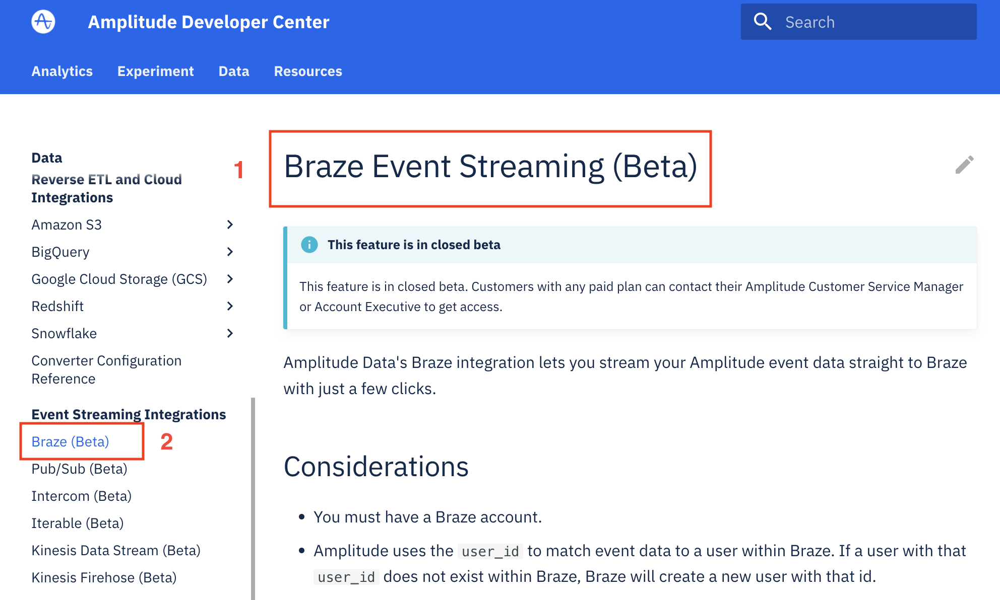
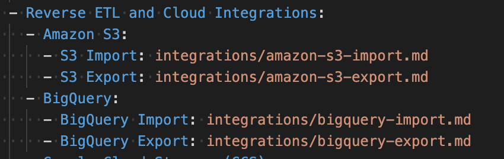

<!-- markdownlint-disable-file -->
<!-- markdown-link-check-disable -->
<!-- vale off -->

# Formatting Cheatsheet

Abbreviations
-------------

If you're working with a doc that has a lot of acronyms or initialisms, add `--8<-- "includes/abbreviations.md"` to the bottom of the doc, and add the abbreviations to `includes/abbreviations.md`

[Learn more](https://squidfunk.github.io/mkdocs-material/reference/abbreviations "https://squidfunk.github.io/mkdocs-material/reference/abbreviations")

Admonitions (callouts, notes, warnings)
---------------------------------------

Admonitions are the note blocks.
The syntax for these is:

```
!!! note 
    Here's the note. Notice the content is indented 4 spaces?
```

Content must be indented four spaces.

If you use hard tabs instead of spaces, the markdown linter will throw errors. You can set your text editor's tab key to spaces, or just use the space key.

Admonition types we use:

- **note**: Use to provide helpful context. For example: recommendations or explaining counter intuitive app behavior.
- **info**: For helpful information. For example: links available resources or supported versions.
- **warning**: to warn about potential data loss or security issues. Example: warn users about irreversible actions.
- **example**: for examples that need a lot of context. For example: providing a narrative-based example about a complicated process.
- **tip**: a tip or trick that makes using the product easier. For example: quickstarts, helpful settings. 
- **alpha**: Custom. Used for alpha notices.
- **beta**: Custom. Used for beta notices.
- **deprecated**: Custom. Used for deprecation notices.


To make a block collapsible, use `???` instead of `!!!`

[Learn more](https://squidfunk.github.io/mkdocs-material/reference/admonitions/ "https://squidfunk.github.io/mkdocs-material/reference/admonitions/")

Annotations
-----------

This is an Insiders-only feature, and won't build locally if you don't have Insiders. Annotations will render like footnote for you locally. Be sure to check the preview site when you push to staging.

Annotations have 3 parts:

1. The marker, which is the annotation number in parentheses.

2. the `{ .annotate }` declaration at the end of the block.

3. The annotation contents, located after the declaration.

`1Lorem ipsum dolor sit amet, (1) consectetur adipiscing elit (2). 2{ .annotate } 3 41\. :man_raising_hand: I'm an annotation! I can contain `code`, __formatted 5 text__, images, ... basically anything that can be expressed in Markdown. 62\. I'm an annotation!`

You can do a lot of wild stuff with annotations, so be sure to check out Material's documentation.

**Tables**: Annotations aren't supported in tables. Use Footnotes instead.

[Learn more](https://squidfunk.github.io/mkdocs-material/reference/annotations "https://squidfunk.github.io/mkdocs-material/reference/annotations")

Code blocks
-----------

### Creating code blocks

The syntax for code blocks is:

~~~
```language-name

my example code
```
~~~

For example:

~~~
```js 

some javascript code 
```
~~~

### Adding titles to code blocks

To add a title to a code block, add `"My title"` after the language declaration.

~~~
```js "Code block title" 

Your code here

```
~~~

This renders a title.

[Learn more](https://squidfunk.github.io/mkdocs-material/reference/code-blocks/#adding-a-title "https://squidfunk.github.io/mkdocs-material/reference/code-blocks/#adding-a-title")

### Highlighting lines in code

Highlight specific lines in code by adding `h1_lines="line nums"` after your language declaration. This example highlights line 2 and 3.

~~~
``` py hl_lines="2 3" 
def bubble_sort(items):
    for i in range(len(items)):
        for j in range(len(items) - 1 - i):
            if items[j] > items[j + 1]:
                items[j], items[j + 1] = items[j + 1], items[j]
```
~~~

[Learn more](https://squidfunk.github.io/mkdocs-material/reference/code-blocks/#highlighting-specific-lines "https://squidfunk.github.io/mkdocs-material/reference/code-blocks/#highlighting-specific-lines")

### Annotating code

Code annotations can be placed anywhere in a code block where a comment for the language of the block can be placed, e.g. for JavaScript in `// ...` and `/* ... */`, for YAML in `# ...`, etc.\
It works similarly to footnotes. Use the comment characters for the language, put a number in parentheses, then list the annotations under the code block. After the closing parentheses, add a `!` character to strip the comment from the example.

Stripping the comment characters from the output is an Insiders-only feature. Your local builds will still contain the comment characters, so be sure to check the staging site when you open a PR to make sure your content is formatted properly.

~~~
``` yaml
theme:
  features:
    - content.code.annotate # (1)!
```

1.  I'm an annotation!
~~~

[Learn more](https://squidfunk.github.io/mkdocs-material/reference/code-blocks/#adding-annotations "https://squidfunk.github.io/mkdocs-material/reference/code-blocks/#adding-annotations")

Content tabs
------------

These are the neat tabs you see with code samples frequently.

The syntax for these is `===` followed by a space, then the name of the tab in double quotes. The tab's content must be indented by four spaces.

**Example**:

~~~
=== "C"
    ``` c
    #include <stdio.h>
    
    int main(void) {
      printf("Hello world!\n");
      return 0;
    }
    ```
=== "C++"

    ``` c++
    #include <iostream>
    
    int main(void) {
      std::cout << "Hello world!" << std::endl;
      return 0;
    }
    ```
~~~

If you use tabs instead of spaces, the markdown linter will throw errors. You can set your text editor's tab key to spaces, or just use the space key.

[Learn more](https://squidfunk.github.io/mkdocs-material/reference/content-tabs "https://squidfunk.github.io/mkdocs-material/reference/content-tabs")

Diagrams
--------

Material has out-of-the-box support for some Mermaid.js diagrams. Flowcharts, sequence diagrams, state diagrams, class diagrams, and entity-relationship diagrams are automatically branded using our site's theme.

You can use other diagram types, but their appearance can be unpredictable and I don't recommend it for now. Material's documentation for this feature is a bit thin, so check out the Mermaid.js docs when writing diagrams for more details.

If you need something beyond what Mermaid.js is capable of, use [Flowchart Maker & Online Diagram Software](http://draw.io/). If you're using VS Code, install the [Draw.io Extension](https://marketplace.visualstudio.com/items?itemName=hediet.vscode-drawio) to edit diagrams in .svg format without leaving VS Code.

[Learn more](https://squidfunk.github.io/mkdocs-material/reference/diagrams "https://squidfunk.github.io/mkdocs-material/reference/diagrams") (Material docs)

[Learn more](https://mermaid-js.github.io/mermaid "https://mermaid-js.github.io/mermaid") (Mermaid.js docs)

[Learn more](http://draw.io/ "http://draw.io") (draw.io)

Footnotes
---------

Use footnotes to add extra information without overwhelming the reader.

Reserve footnotes for tables. Use Annotations where supported.

To add footnotes, bracket the footnote number prepended with a caret:

`Lorem ipsum[^1] dolor sit amet, consectetur adipiscing elit.[^2]`

Footnote content can be inserted anywhere in the document. Use the same syntax for creating the footnote, followed by a colon and your note. To include a paragraph, indent the content 4 spaces.

~~~
[^1]: Lorem ipsum dolor sit amet, consectetur adipiscing elit.
[^2]: 
    Lorem ipsum dolor sit amet, consectetur adipiscing elit. 
    Nulla et euismod nulla. Curabitur feugiat, tortor non consequat finibus, 
    justo purus auctor massa, nec semper lorem quam in massa.
~~~

[Learn more](https://squidfunk.github.io/mkdocs-material/reference/footnotes/ "https://squidfunk.github.io/mkdocs-material/reference/footnotes/")

Guides (previous and next buttons)
----------------------------------

You can add the next page and previous page buttons to guides that you intend readers to go through in a particular order, one page at a time. For example, the Experiment Getting Started Guide (experiment/guides/getting-started/create-a-deployment/).

On the first page, set the page's `template` metadata to `guide-first.html`.

~~~
---
title: Create a Deployment
description: How to create a deployment for delivering your feature flags and experiments.
template: guide-first.html
---
~~~

On each additional page, set the page's `template` metadata to `guide.html`

~~~
---
title: Create a Flag
description: How to create a feature flag, add a deployment, configure targeting rules, and activate the feature flag.
template: guide.html
---
~~~

On the last page of the guide, set the page's `template` metadata to `guide-last.html`

~~~
---
title: Track Exposure
description: How to track an exposure event for the variant which a user has been exposed to.
template: guide-last.html
---
~~~

Images
------

Add your image file to `docs/assets/images`. Prefix image filenames with the product they belong to (for example `experiment-dashboard.png`).

Add your image to the doc:

``

[Learn more](https://squidfunk.github.io/mkdocs-material/reference/images/?h=images "https://squidfunk.github.io/mkdocs-material/reference/images/?h=images")

Page Titles (and Nav Titles)
----------------------------

You can set different titles for a page -- its page title and it's nav title. This is useful if your doc might have a similar name to docs for other Amplitude products, such as "JavaScript SDK". You can set a longer, more descriptive page title to help with SEO and site search and a shorter title to keep the nav looking clean.



1. Page title
2.  Nav title

Set the page title in the `title` metadata on each page. You can set the title that appears in the left nav separately in mkdocs.yml by entering the name before the file path like `- Page Title: path/to/page.md`



In this example, the manually-set nav titles are S3 Import, S3 Export, BigQuery Import, BigQuery Export.

Snippets
--------

Snippets let you embed arbitrary content (including markdown) in other documents. They're used frequently in our project to embed content that's repeated, such as beta notices, tables that are reused, and required Amplitude plans.

To use Snippets, add a file with the content in the `/includes` directory. In the target file, add this syntax where you want the content to appear:

`--8<-- "includes/your-filename.md"`

[Learn more](https://squidfunk.github.io/mkdocs-material/setup/extensions/python-markdown-extensions/?h=snippets#snippets "https://squidfunk.github.io/mkdocs-material/setup/extensions/python-markdown-extensions/?h=snippets#snippets") (Material docs)

[Learn more](https://facelessuser.github.io/pymdown-extensions/extensions/snippets/ "https://facelessuser.github.io/pymdown-extensions/extensions/snippets/") (Snippets docs)

Tables
------

Tables are created with markdown. If the items in the first column have unwanted line breaks, wrap the table head with one of the following:

- `<div class="big-column">`: Sets the column width to 180px

- `<div class="med-column">`: Sets the column to 100px

Markdown tables are fairly straightforward.

Accessibility note: Don't use markdown tables for formatting, only for tabular data. Also, avoid merging cells. [Learn more about table accessibility](https://www.w3.org/WAI/tutorials/tables/ "https://www.w3.org/WAI/tutorials/tables/")

[Learn more](https://squidfunk.github.io/mkdocs-material/reference/data-tables/ "https://squidfunk.github.io/mkdocs-material/reference/data-tables/")

Toolips
-------

Tooltips display plain text when you hover over an element. Use them with links or icons, never with headings or bare text. Tooltips can be added to data tables, and are a great alternative for annotations (which aren't supported in tables), or where a footnote doesn't make sense. 

### Link tooltips

Add a title in double quotes after the link. 

```txt
[Hover me](https://example.com "I'm a tooltip!")
```

### Icon tooltips

Add a tooltip to an info icon: 

```text
:material-information-outline:{ title="Important information" }
```


[Learn more](https://squidfunk.github.io/mkdocs-material/reference/tooltips)